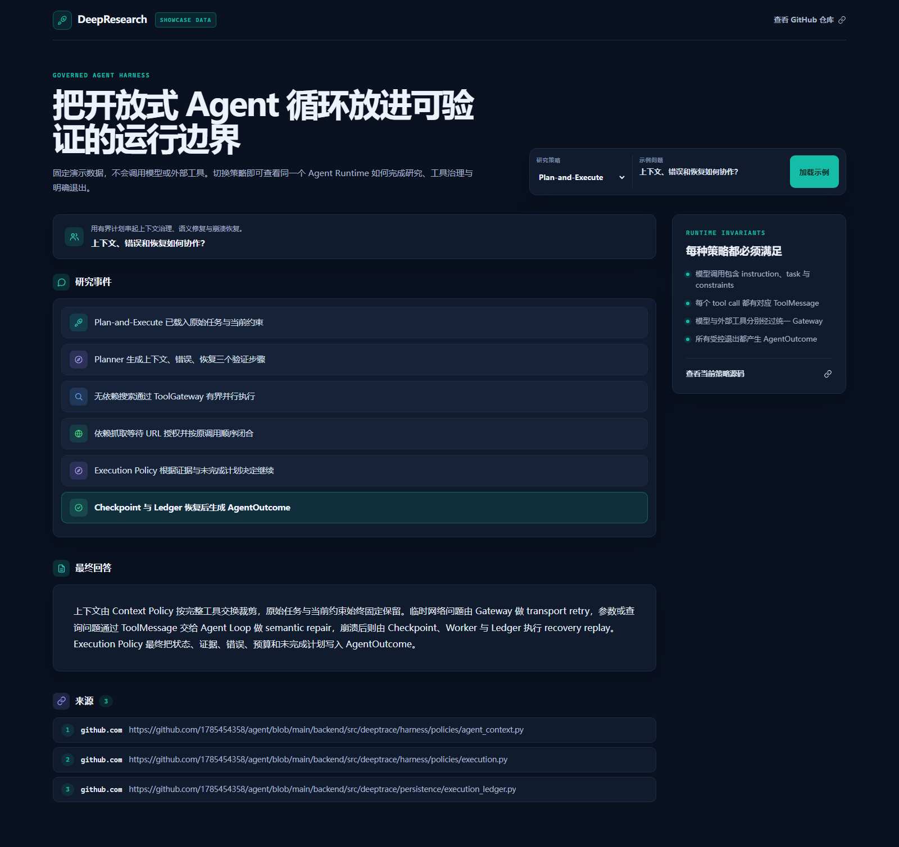
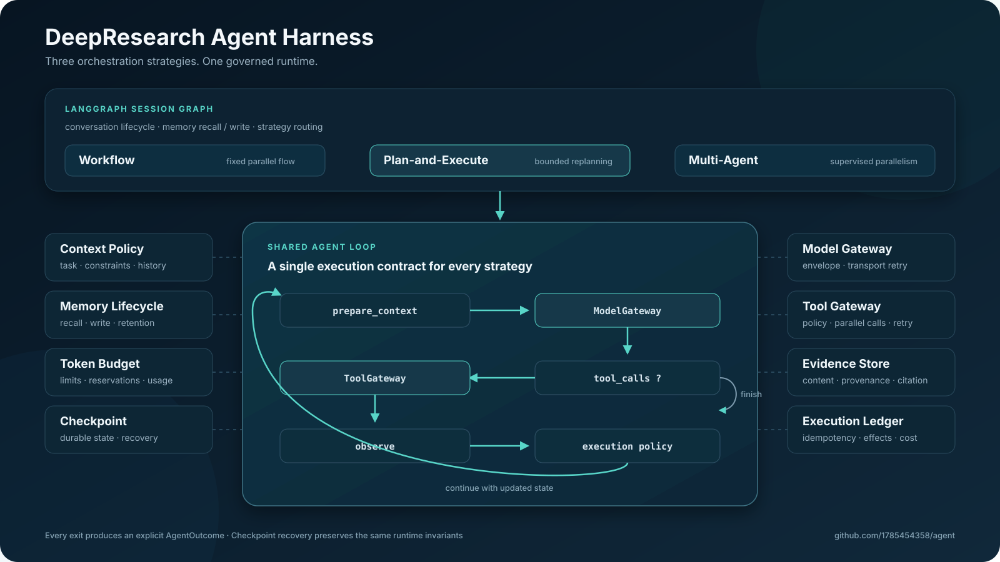

# DeepResearch

[](https://github.com/1785454358/agent/actions/workflows/ci.yml)
[](LICENSE)

**A governed research agent harness built on LangGraph.**

DeepResearch 用一个 Shared Agent Loop 承载模型驱动的研究循环，再由 Session Graph 负责会话生命周期、记忆和策略路由。Workflow、Plan-and-Execute、Multi-Agent 三种编排策略共享相同的模型、工具、上下文、预算、恢复和退出规则。



## 核心能力

- **统一 Agent Loop**：`prepare_context → model → tools / finish → observe → execution policy`，策略只决定如何编排。
- **明确 Gateway 边界**：所有模型调用经过 `ModelGateway`，所有外部工具经过 `ToolGateway`；无依赖工具调用可以有界并行。
- **三类 Retry 各有归属**：Gateway 处理 transport retry，Agent Loop 处理 semantic repair，Worker + Checkpoint + Ledger 处理 recovery replay。
- **显式 Outcome**：每个受控退出都生成 `AgentOutcome`，携带状态、答案、证据、错误、预算和未完成计划，而不只是一个 `stop_reason`。

## 无 Key 体验

Showcase Mode 使用固定夹具数据，不启动后端，也不会调用模型、搜索或抓取工具。

```powershell
git clone https://github.com/1785454358/agent.git
cd agent/frontend
npm ci
npm run showcase
```

打开 [http://127.0.0.1:5173](http://127.0.0.1:5173)，即可切换三种策略，查看执行轨迹、答案、来源和 Runtime invariants。页面始终显示 `SHOWCASE DATA`，避免把演示数据误认为实时研究结果。

## 三种编排策略

| 策略 | 执行方式 | 适合场景 |
| --- | --- | --- |
| Workflow | 固定阶段，无依赖分支并行执行 | 边界清楚、强调稳定吞吐 |
| Plan-and-Execute | 先规划，逐步执行并进行有界重规划 | 有依赖、需要补查的复杂问题 |
| Multi-Agent | Supervisor 拆解和评估，Researcher 并行研究 | 多个方向可以独立调查 |

三种策略都接收 `ResearchInput` 并返回 `ResearchOutcome`，不会各自复制一套 Harness。

## 架构



运行时保持以下不变量：

1. 每次模型调用都包含 system instruction、original task 和当前 constraints。
2. 每个 assistant tool call 最终都有对应的 `ToolMessage`。
3. 外部工具和模型调用分别经过 `ToolGateway` 与 `ModelGateway`。
4. 所有受控退出都产生明确的 `AgentOutcome`。
5. 从 Checkpoint 恢复后，上述不变量仍然成立。

## 运行真实研究

本地模式使用进程内执行器和 SQLite 持久化，适合开发与功能体验。

```powershell
cd backend
Copy-Item .env.example .env
# 填写 OpenAI-compatible 模型、Tavily 和本地 BGE-M3 路径
uv sync
uv run playwright install chromium
uv run python -m deeptrace.api

# 另开终端
cd frontend
npm ci
npm run dev
```

前端开发地址为 [http://127.0.0.1:5173](http://127.0.0.1:5173)，本地 API 使用 `8001` 端口。若只需要轻量关键词记忆召回，可在 `.env` 中设置 `DEEPTRACE_MEMORY_RETRIEVAL=lexical`。

分布式模式使用 MySQL 保存运行、事件、Checkpoint、Evidence、长期记忆、租约与 Ledger；Redis Streams 投递任务；Chroma 保存语义索引。

```powershell
Copy-Item .env.docker.example .env.docker
# 填写 Provider、Tavily 与 DEEPTRACE_EMBEDDING_MODEL_HOST_PATH
docker compose --env-file .env.docker up --build
```

## 验证

```powershell
# 后端确定性测试
cd backend
uv run pytest -m "not real"

# 前端
cd ../frontend
npm run lint
npm test
npm run build
npm run build:showcase
```

展示包当前验证基线（2026-09-18）：后端 `464 passed, 1 deselected`，前端 `25 passed`，Production 与 Showcase 两种构建均通过。

真实 Provider 与搜索服务测试需要有效凭据，因此与确定性测试分开执行。当前测试覆盖三种策略、Gateway 边界、上下文不变量、ToolMessage 配对、AgentOutcome、Checkpoint 恢复、记忆、预算、引用和分布式租约。

## 源码导览

| 关注点 | 入口 |
| --- | --- |
| Session Graph 与策略路由 | [`harness/graph.py`](backend/src/deeptrace/harness/graph.py) |
| Shared Agent Loop | [`harness/agent_executor.py`](backend/src/deeptrace/harness/agent_executor.py) |
| 模型调用边界 | [`harness/model_gateway.py`](backend/src/deeptrace/harness/model_gateway.py) |
| 工具并发与 ToolMessage 配对 | [`harness/agent_tools.py`](backend/src/deeptrace/harness/agent_tools.py) |
| 工具治理、预算与 Ledger | [`tools/gateway.py`](backend/src/deeptrace/tools/gateway.py) |
| 上下文与退出策略 | [`harness/policies/`](backend/src/deeptrace/harness/policies) |
| Checkpoint 恢复 | [`harness/checkpoint.py`](backend/src/deeptrace/harness/checkpoint.py) |
| Memory Lifecycle | [`harness/memory/lifecycle.py`](backend/src/deeptrace/harness/memory/lifecycle.py) |

深入设计见 [Agent Harness 架构文档](docs/architecture/agent-harness.md)，求职展示和讲解材料见 [docs/resume](docs/resume/README.md)。

Python 包名 `deeptrace`、`deeptrace` CLI 兼容入口和 `DEEPTRACE_*` 环境变量继续保留。
