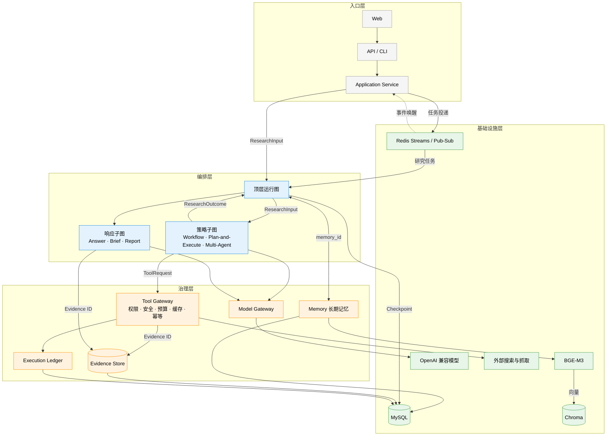

# ResearchPilot

ResearchPilot 是一个面向复杂开放问题的多模式深度研究 Agent。项目基于 LangGraph 实现统一 Agent Harness，让 Workflow、Plan-and-Execute 和 Multi-Agent 三种研究策略共用模型入口、工具治理、记忆、证据、预算、恢复与响应规则。

默认返回适合对话阅读的普通回答。用户明确要求报告时，系统才进入 Report 响应图。Python 包名 `deeptrace` 与 `DEEPTRACE_*` 环境变量保留兼容。

## 架构



图中展示分布式完整形态：MySQL 保存运行、事件、Checkpoint、Evidence、长期记忆、租约与工具账本，Redis Streams 投递任务，Pub/Sub 唤醒 SSE，Worker 消费任务并执行顶层运行图。本地模式中 Checkpoint 与 Evidence 落在 SQLite，任务在进程内执行，Chroma 使用本地持久目录。颜色只表达所有权：编排、公共治理与数据存储各用一种颜色。

Harness 是这些运行规则和模块边界的总和，不对应某个名为 HarnessGraph 的类。LangGraph 提供 State、节点、条件边、`Send` 并发、子图和 Checkpoint；项目在它之上规定三种策略怎样共享外部调用、状态所有权和恢复语义。

## 三种研究模式

| 模式 | 执行方式 | 适合场景 |
| --- | --- | --- |
| Workflow | 查询规划、并行 Topic 研究、证据评估 | 边界清楚、希望快速获得可靠答案 |
| Plan-and-Execute | 任务拆解、逐项执行、评估、有界重规划 | 有依赖关系且需要补查的复杂问题 |
| Multi-Agent | Supervisor 拆解和评估，多个 Researcher 并发研究 | 多个方向可以独立调查的问题 |

三种模式都以 `ResearchInput` 接收请求，以 `ResearchOutcome` 返回 Evidence、Finding、缺口和终止原因。策略子图只决定怎样研究，公共治理留在顶层运行图和 Tool Gateway。

## 记忆与可靠性

工作记忆保存计划、任务状态、Finding、Evidence ID 和未解决缺口，属于可恢复的 LangGraph State。短期会话记忆保留近期消息，旧消息经过有界结构化压缩进入 `ConversationSummary`。

长期记忆只接收用户明确要求保存的偏好，以及绑定 Evidence ID 的研究事实。分布式模式采用三段式召回。

1. MySQL 按 user/workspace 作用域、记忆类型、状态和有效期筛选候选记录。
2. 本地 BAAI/bge-m3 生成查询向量，Chroma 在候选 memory_id 内执行 TopK。
3. 命中的 memory_id 回查 MySQL，完整权威记录经过重要度、置信度和时效排序后进入上下文。

Chroma 只保存受限正文、embedding、memory_id 和检索元数据。MySQL 是长期记忆的权威数据源。索引失败不会阻断保存，后续召回会用内容哈希修复索引；Chroma 不可用时系统降级到确定性关键词排序。

网页正文属于 Evidence Store。Graph State 与长期记忆只携带 Evidence ID 或受限片段，避免 Checkpoint 和模型上下文随正文增长。

工具调用统一经过 Tool Gateway 的权限、安全、预算、缓存与幂等管道，每次外部调用写入 Execution Ledger。分布式任务采用 at-least-once 投递：run lease 与 thread lease 防止同一运行并发推进，Checkpoint 保存图位置，Ledger 保存调用身份与消耗，两者在恢复后共同抑制重复副作用。

## 本地运行

本地模式适合开发与功能体验。Checkpoint 和 Evidence 落在 SQLite，长期记忆结构化记录留在进程内，Chroma 使用本地持久目录。

```powershell
cd backend
Copy-Item .env.example .env
# 填写 OpenAI-compatible 模型、Tavily 和本地 BGE-M3 路径
uv sync
uv run playwright install chromium
uv run python -m deeptrace.api
```

浏览器打开 [http://127.0.0.1:8000](http://127.0.0.1:8000)。

若只想运行不带语义召回的轻量开发环境，可以在 `.env` 中设置下面一项。

```text
DEEPTRACE_MEMORY_RETRIEVAL=lexical
```

## 分布式运行

分布式模式用于展示完整可靠性设计。MySQL 保存运行、事件、Checkpoint、Evidence、长期记忆、租约和工具账本；Redis Streams 负责任务投递，Pub/Sub 唤醒 SSE；Chroma 保存长期记忆语义索引；Worker 独占加载 BGE-M3 并执行 LangGraph。

```powershell
Copy-Item .env.docker.example .env.docker
# 填写 Provider、Tavily 与 DEEPTRACE_EMBEDDING_MODEL_HOST_PATH
docker compose --env-file .env.docker up --build
```

API 健康检查可从下面的地址访问。

```text
http://127.0.0.1:8000/health
```

停止服务会保留 MySQL、Redis 和 Chroma 数据卷。

```powershell
docker compose --env-file .env.docker down
```

`down -v` 会删除本地数据卷，只应在确认需要清空演示数据时使用。

## API 示例

```powershell
$body = @{
  question = "比较 LangGraph Checkpoint 与工具执行账本各自解决的问题"
  mode = "plan_execute"
} | ConvertTo-Json

Invoke-RestMethod -Method Post `
  -Uri http://127.0.0.1:8000/researches `
  -ContentType application/json `
  -Body $body
```

后续请求携带第一次返回的 `thread_id` 即可延续同一会话。问题中明确写出“生成报告”会选择 Report 响应图，普通研究请求仍返回 Answer。

## 验证

```powershell
cd backend
uv run pytest -m "not real"
uv run pytest -m real tests/real/test_real_smoke.py
```

非真实测试覆盖三种策略、记忆、工具预算、引用、Checkpoint、崩溃恢复、分布式租约与迁移兼容。真实测试需要有效 Provider 和 Tavily 凭据。

## 文档

- [后端模块与配置](backend/README.md)
- [Harness 总体设计](docs/superpowers/specs/2026-09-10-langgraph-agent-harness-refactor-design.md)
- [文档索引](docs/README.md)
- [面试学习资料](docs/resume/多模式深度研究Agent面试与学习资料/00-阅读目录.md)
- [作品展示制作指南](docs/resume/作品展示制作指南.md)
