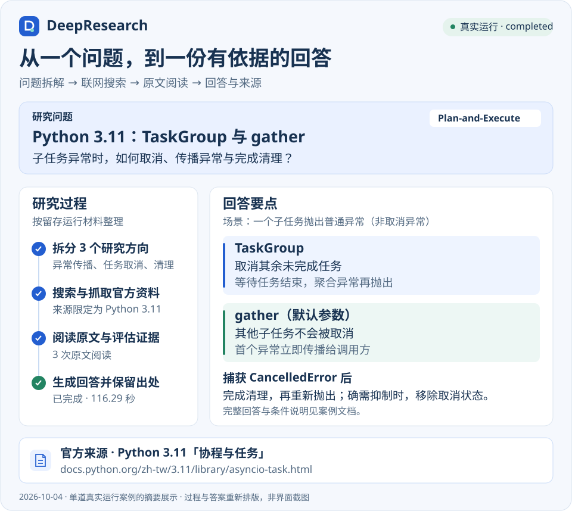
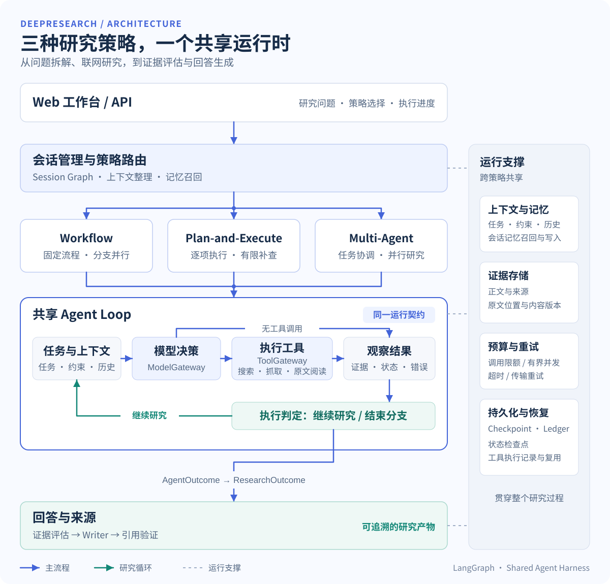

# DeepResearch

[](https://github.com/1785454358/agent/actions/workflows/ci.yml)
[](LICENSE)

**从一个研究问题，到一份有来源、可追溯的回答。**

DeepResearch 是基于 LangGraph 的多模式深度研究 Agent。它将问题拆解、联网搜索、网页阅读、证据评估与回答生成串成完整流程，并通过 Web 工作台展示研究进度、工具调用、最终回答和资料来源。

面向技术资料调研、方案对比与多方向研究，项目提供 Workflow、Plan-and-Execute、Multi-Agent 三种策略，共享同一套 Agent 运行时。

[快速体验](#快速体验) · [真实研究案例](docs/showcase/case-asyncio.md) · [架构设计](docs/architecture/agent-harness.md) · [设计参考](docs/showcase/mature-projects.md)



基于已留存真实运行重新排版的案例摘要，完整回答与原始记录见[案例文档](docs/showcase/case-asyncio.md)。

## 可以用它做什么

| 场景 | 输入示例 | 研究过程 |
| --- | --- | --- |
| 技术文档研究 | “对比 Python 3.11 的 TaskGroup 与 gather 的异常行为，并附官方出处” | 拆分问题、检索官方资料、阅读原文、组织带来源的回答 |
| 方案对比 | “从持久化、故障恢复和工具调用三个方面比较两种 Agent 方案” | 按维度建立研究任务，汇总支持各项结论的证据 |
| 多方向调查 | “分别调查某项技术的原理、应用和部署条件” | 并行研究不同方向，再统一评估与汇总 |

上表列出适用场景；已留存的真实联网运行见下方技术文档案例。

## 快速体验

无需 API Key，先体验工作台与三种策略的执行过程：

```bash
git clone https://github.com/1785454358/agent.git
cd agent/frontend
npm ci
npm run showcase
```

打开 [http://127.0.0.1:5173](http://127.0.0.1:5173)，选择研究策略并加载示例，即可查看执行轨迹、回答、来源和运行规则。

演示页面使用固定示例数据，标记为 `SHOWCASE DATA`。连接真实模型与搜索服务的运行步骤见[运行真实研究](#运行真实研究)。

## 真实研究案例

**任务：依据 Python 3.11 官方文档，比较 TaskGroup 与 gather 的异常传播、任务取消和取消后的清理行为。**

Agent 将问题拆为三个研究方向，经搜索、抓取和原文阅读后，生成中文回答并附官方文档出处。

| 项目 | Plan-and-Execute 主模式案例 |
| --- | --- |
| 运行结果 | completed |
| 研究耗时 | 116.29 秒 |
| Factual Correctness F1 | 1.00 |
| Faithfulness | 0.90 |
| 引用来源 | Python 3.11 官方文档 |

数据来自 2026-10-04 的一项已知诊断任务、一次真实联网运行；展示的是该案例结果。评测与研究调用分别计量。查看[原始回答、配置和指标记录](docs/showcase/case-asyncio.md)。

## 技术亮点

### 三种策略，共享一套运行时

| 策略 | 编排方式 | 适用任务 |
| --- | --- | --- |
| Workflow | 固定阶段推进，无依赖分支并行执行 | 研究边界清楚、流程稳定的任务 |
| Plan-and-Execute | 规划研究任务，逐项执行，根据证据缺口进行有限补查 | 存在依赖、需要逐步深入的问题 |
| Multi-Agent | Supervisor 协调任务，Researcher 并行研究 | 可以拆成多个独立方向的调查 |

三种策略统一接收 `ResearchInput`，输出 `ResearchOutcome`，复用模型调用、工具治理、上下文、预算与退出规则。

### 从搜索结果到可追溯证据

搜索发现来源，网页抓取保存正文，阅读工具按问题选取原文。研究结论保留证据标识、原文位置及内容版本，评估阶段检查需求覆盖与来源适用性，再向 Writer 交接材料。

这一链路将“找到网页”和“形成有依据的结论”连接起来，也为复查引用与分析回答质量提供数据。

### 为长任务建立运行边界

- **统一调用入口**：`ModelGateway` 管理模型调用，`ToolGateway` 管理工具权限、URL 校验、并发、预算与重试。
- **明确执行结果**：`AgentOutcome` 包含运行状态、答案、证据、预算、错误与未完成任务。
- **分层恢复机制**：Gateway 处理传输重试，Agent Loop 处理语义修复，Worker、Checkpoint 与 Ledger 支持任务恢复和执行记录复用。
- **会话与记忆**：Session Graph 管理策略路由和会话生命周期，支持关键词召回及本地语义记忆。
- **过程可观测**：FastAPI 与 SSE 将运行事件推送到前端，工作台展示进度、历史运行、回答与来源。

## 架构



主流程从上向下阅读：三种策略复用同一个研究循环，右侧的记忆、证据、预算与恢复机制贯穿运行过程。

本地模式采用进程内执行器与 SQLite 持久化。分布式模式采用 MySQL、Redis Streams、独立 Worker 与 Chroma，分别承载运行数据、任务投递、执行和语义索引。

技术栈：Python · LangGraph · FastAPI · SQLAlchemy · Redis · Chroma · React · TypeScript · Vite · Docker。

## 运行真实研究

准备 Python 3.11 或 3.12、uv、Node.js，以及支持 tool calling 的 OpenAI-compatible 模型与 Tavily 凭据。

```powershell
cd backend
Copy-Item .env.example .env
# 在 .env 中填写 OPENAI_API_KEY、OPENAI_BASE_URL、OPENAI_MODEL 和 TAVILY_API_KEY
# 关键词记忆模式设置 DEEPTRACE_MEMORY_RETRIEVAL=lexical
# 语义记忆模式需另配置本地 BGE-M3 模型路径
uv sync --locked
uv run playwright install chromium
uv run python -m deeptrace.api
```

另开终端启动前端：

```bash
cd frontend
npm ci
npm run dev
```

前端地址：[http://127.0.0.1:5173](http://127.0.0.1:5173)。API 地址：[http://127.0.0.1:8001](http://127.0.0.1:8001)。

## Docker 打包

镜像内包含前端工作台、后端和 Chromium，在仓库根目录执行：

```bash
docker build -f backend/Dockerfile -t deepresearch:0.2.0 .
```

配置 `backend/.env` 后，可直接启动单机模式：

```bash
docker run --rm -p 127.0.0.1:8000:8000 --env-file backend/.env -e DEEPTRACE_RUNTIME_MODE=local -e DEEPTRACE_MEMORY_RETRIEVAL=lexical --mount source=deepresearch-runs,target=/app/runs deepresearch:0.2.0
```

打开 [http://127.0.0.1:8000](http://127.0.0.1:8000)。Linux 镜像采用 CPU 版 Torch，Windows 本地开发保留 CUDA 版。分布式 Compose、镜像验收及导出步骤见 [Docker 部署指南](docs/deployment/docker.md)。

## 测试与工程验证

2026-10-04 本地工作树验证：后端确定性测试 **1213 passed，2 deselected**；前端 **26 passed**；Lint、Production 和 Showcase 构建通过。Linux 镜像内的离线测试、非 root Chromium、API 与前端资源启动检查通过，隔离评测镜像 **34 passed**。

```powershell
cd backend
uv run pytest -m "not real"

cd ../frontend
npm run lint
npm test
npm run build
npm run build:showcase
```

测试覆盖策略编排、工具与模型边界、消息配对、证据引用、预算、记忆、恢复及分布式租约。真实模型和外部服务测试单独运行。CI Badge 对应 GitHub 上已提交的版本。

## 源码入口

| 关注点 | 入口 |
| --- | --- |
| 会话管理与策略路由 | [harness/graph.py](backend/src/deeptrace/harness/graph.py) |
| 共享 Agent 执行循环 | [harness/agent_executor.py](backend/src/deeptrace/harness/agent_executor.py) |
| 模型调用边界 | [harness/model_gateway.py](backend/src/deeptrace/harness/model_gateway.py) |
| 工具治理与执行记录 | [tools/gateway.py](backend/src/deeptrace/tools/gateway.py) |
| 证据评估与覆盖检查 | [strategies/evidence_evaluation.py](backend/src/deeptrace/strategies/evidence_evaluation.py) |
| 回答的证据装配 | [responses/evidence.py](backend/src/deeptrace/responses/evidence.py) |
| 记忆生命周期 | [harness/memory/lifecycle.py](backend/src/deeptrace/harness/memory/lifecycle.py) |

更多设计说明见[架构文档](docs/architecture/agent-harness.md)。

## 开源参考

研究了 [Open Deep Research](https://github.com/langchain-ai/open_deep_research)、[GPT Researcher](https://github.com/assafelovic/gpt-researcher) 与 [DeerFlow](https://github.com/bytedance/deer-flow) 的研究编排和产品展示方式。DeepResearch 围绕共享运行时、证据交接与可验证的执行规则组织实现。详见[设计参考与演进方向](docs/showcase/mature-projects.md)。

项目采用 [MIT License](LICENSE)。
