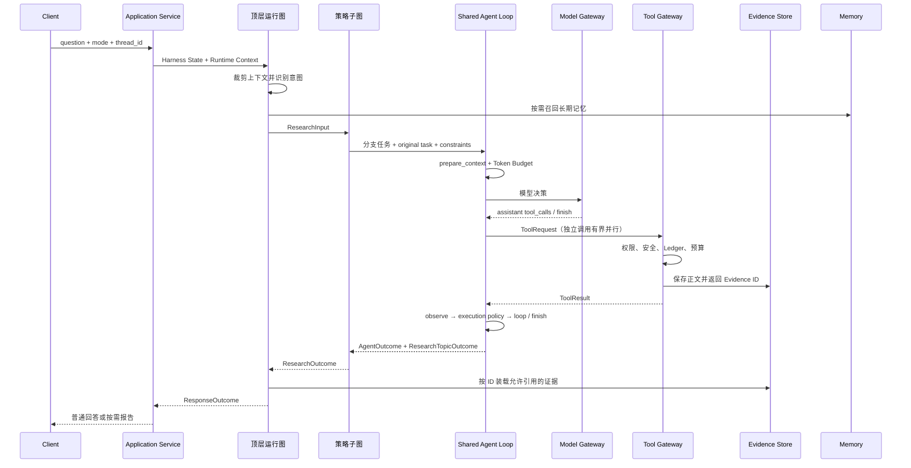

# DeepResearch 后端

后端已经统一到 LangGraph Agent Harness。旧 Basic、Deep 和手写 ReAct 目录不再参与执行。当前三个研究模式分别对应 Workflow、Plan-and-Execute 和 Multi-Agent 策略子图。

## 一次请求怎样执行



三个 orchestration strategy，共享同一个 Agent Harness Runtime。顶层 Session Graph 位于 `src/deeptrace/harness/graph.py`。`build_agent_runtime_graph()` 注册公共节点和路由，`_recall_memory()` 负责长期记忆召回，`_consolidate_memory()` 把带来源 Finding 沉淀为长期事实。

## 共享循环与治理边界

- `harness/agent_executor.py`：prepare_context → call_model → execute_tools → observe → execution policy；所有受控退出经过 finalize。
- `harness/prompts.py`：研究 system instruction 与统一 original task / constraints 消息前缀。
- `harness/policies/agent_context.py`：逐轮重建模型输入视图，保留当前任务/约束/计划，只按完整工具交互组裁剪历史；持久化轨迹保持完整。
- `harness/agent_tools.py`：工具协议、依赖分组、有界并行（默认 4），稳定归并；所有外部执行必经 ToolGateway。
- `harness/model_gateway.py`：所有角色的模型 I/O；调用前强制检查 system instruction、original task 和 current constraints，默认最多两次尝试、每次 60 秒，assembly 使用 planner_timeout_seconds 配置超时。
- `harness/policies/execution.py`：完成条件、轮数/错误上限、结构化退出。`domain/agent.py` 的 AgentOutcome 包含 status、stop_reason、summary、evidence_ids、errors、iterations、执行计数和计划进度。
- `harness/memory/lifecycle.py`：请求前召回、显式记忆写入、研究后归纳。可选召回不可用时记录降级，继续处理原始任务。

三类重试互不替代：

| 类型 | 归属 | 边界 |
| --- | --- | --- |
| Transport retry | ModelGateway / ToolGateway | 各自有限重试短暂 I/O 故障；模型 SDK retry 显式关闭，旧 topic 图不再叠加 RetryPolicy |
| Semantic repair | Shared Agent Loop / response policy | 模型读取错误后修正动作；循环受轮数、错误和提醒上限控制，响应纠偏受响应策略控制 |
| Recovery replay | Checkpoint + worker + ledger | 从已保存状态续跑；已提交工具结果通过稳定执行 ID 重放，不再次请求 provider |

每个 assistant tool_call 最终对应一个 ToolMessage，包括无效参数、拒绝、失败与取消；尚未派发的调用在终止时写入 skipped 结果。并行执行不会放宽 URL 授权：依赖搜索发现的抓取必须等待搜索完成。工具结果按原始调用顺序进入轨迹。

原始任务和当前约束保存在可恢复输入中，每轮生成固定消息前缀；恢复后继续适用。最后一轮模型产生的工具调用会在工具预算内闭合，随后停止。显式计划的未完成项阻止正常完成；未使用计划工具时保留“已有证据且模型结束”的兼容语义。

取消时共享循环形成 cancelled AgentOutcome，上层 strategy 传播取消并停止评估。进程被强制终止无法当场生成结果，需依赖 checkpoint 恢复；外部副作用发生但 ledger 尚未提交的窗口不承诺 exactly-once。

测试入口：`uv run pytest tests/harness/test_agent_invariants.py tests/harness/test_model_gateway.py -q`。

## 主要目录

```text
src/deeptrace/
├── application/        # 组合根、应用服务、Worker 适配
├── config/             # 环境变量读取与边界校验
├── domain/             # Research、Evidence、Memory、Tool 等领域契约
├── harness/            # 顶层运行图、State、Context、记忆与公共策略
│   └── memory/         # 写入、召回、遗忘、BGE 与语义检索协调
├── strategies/         # 三种研究策略子图；研究任务复用 Agent 执行器
├── tools/              # Tool Gateway、预算、缓存、安全与工具注册
├── responses/          # Answer、Brief、Report 子图和引用校验
├── persistence/        # SQL Checkpointer、MySQL Store、Chroma 适配器
├── queue/              # Redis Streams 与 Pub/Sub 适配
├── runtime/            # Local 与 Distributed 运行时
└── worker/             # 分布式任务消费、租约和恢复
```

阅读源码时可以沿着下面的顺序走。

1. `application/research.py` 中的 `ResearchApplicationService.invoke()` 校验 run/thread 身份并调用顶层图。
2. `harness/graph.py` 中的 `build_agent_runtime_graph()` 展示一次请求的公共生命周期。
3. `harness/registry.py` 展示策略与响应子图怎样通过统一契约注册。
4. `strategies/*/graph.py` 展示三种编排行为，`harness/agent_executor.py` 展示共用循环。
5. `tools/gateway.py` 中的 `AgentToolGateway.execute()` 展示外部调用治理管道。
6. `persistence/checkpoint.py` 与 `persistence/execution_ledger.py` 展示恢复和幂等的分工。
7. `harness/memory/retriever.py` 展示 MySQL、BGE-M3 与 Chroma 怎样协作。

## 长期记忆链路

`MemoryRecord` 带有 namespace、type、status、importance、confidence、版本、TTL 与 Evidence 引用。分布式环境中的 `SqlAlchemyMemoryStore.list_eligible()` 先在 MySQL 执行结构化过滤。

`SemanticMemoryRetriever` 随后检查候选记录的内容哈希。缺失或变化的记录由 `BgeM3EmbeddingGateway` 生成 1024 维归一化向量，再交给 `ChromaMemoryVectorIndex` upsert。查询时 Chroma 只能在 MySQL 给出的 candidate_ids 内返回 TopK，结果必须经 `get_many_by_ids()` 回查 MySQL。最终排序综合余弦距离、importance、confidence 与 recency。

这条链路保留两个降级点。MySQL 写入成功而 Chroma 写入失败时，记忆仍然存在；下一次召回会尝试修复。Chroma 查询失败时，召回退回 `select_memories()` 的确定性排序。

## 运行与存储

| 能力 | Local | Distributed |
| --- | --- | --- |
| API 执行 | 进程内异步任务 | API 入队，Worker 执行 |
| Checkpoint | SQLite | MySQL |
| Evidence | SQLite | MySQL |
| 长期记忆权威记录 | 进程内 Store | MySQL |
| 语义索引 | 本地 Chroma | Chroma 服务 |
| 任务队列 | 无 | Redis Streams |
| 恢复边界 | 单进程重启 | Worker 接管、租约、Ledger |

分布式任务使用 at-least-once 投递。run lease 防止同一 run 并发执行，thread lease 防止同一会话同时推进两个 Turn。Checkpoint 保存图位置，Tool Ledger 保存外部调用身份和消耗，两者一起降低恢复后的重复副作用。

## 配置

本地配置从 `.env.example` 开始。

```powershell
Copy-Item .env.example .env
uv sync
uv run playwright install chromium
uv run python -m deeptrace.api
```

长期记忆相关配置如下。

```text
DEEPTRACE_MEMORY_RETRIEVAL=semantic
DEEPTRACE_EMBEDDING_MODEL_PATH=path/to/bge-m3
DEEPTRACE_EMBEDDING_BATCH_SIZE=8
DEEPTRACE_CHROMA_URL=
DEEPTRACE_CHROMA_PERSIST_PATH=chroma
DEEPTRACE_CHROMA_COLLECTION=deeptrace-long-term-memory
DEEPTRACE_MEMORY_TOP_K=5
```

Local 留空 `DEEPTRACE_CHROMA_URL` 后使用 PersistentClient。Distributed 必须设置 Chroma URL，Compose 已配置为 `http://chroma:8000`。`lexical` 模式不会创建 Chroma 客户端，也不要求 BGE-M3 路径存在。

## 测试

```powershell
uv run pytest -m "not real"
```

真实 API 冒烟单独运行。

```powershell
uv run pytest -m real tests/real/test_real_smoke.py
```

Alembic 只通过新增迁移向前演进。不要修改已经发布的迁移文件。`20260914_01` 为长期记忆补充结构化召回列，并兼容升级前 JSON payload 中没有 importance 的记录。
