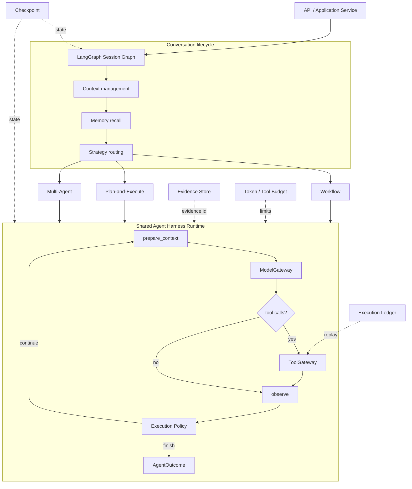

# Agent Harness 当前架构

本文描述当前代码中的运行边界和核心不变量。历史方案、阶段计划和已经被替换的 Topic 固定重试流程不再作为架构依据。

## 总体结构



架构分为两层：

- **Session Graph** 管理一轮对话的生命周期，包括上下文压缩、意图识别、长期记忆召回、策略路由、响应模式和记忆整理。
- **Shared Agent Harness Runtime** 管理一次研究分支的模型—工具循环。Workflow、Plan-and-Execute、Multi-Agent 负责不同的任务拆解与协调方式，但不各自实现工具循环。

主要入口：

- [顶层 Session Graph](../../backend/src/deeptrace/harness/graph.py)
- [Shared Agent Loop](../../backend/src/deeptrace/harness/agent_executor.py)
- [运行时依赖](../../backend/src/deeptrace/harness/context.py)
- [组装入口](../../backend/src/deeptrace/application/assembly.py)

## 三种编排策略

| 策略 | 负责任务 | 适用场景 | 当前边界 |
| --- | --- | --- | --- |
| Workflow | 生成查询并汇总研究结果 | 边界清晰、需要快速覆盖 | 固定路径，灵活性较低 |
| Plan-and-Execute | 规划、逐项执行、评估并有界重规划 | 多步骤问题和资料缺口补全 | 计划不是依赖 DAG |
| Multi-Agent | Supervisor 拆解，多 Researcher 并行，聚合后评估 | 可拆成多个相对独立方向的问题 | 协调成本和重复检索风险更高 |

三种策略都通过标准 `ResearchInput` 接收任务，通过 `ResearchOutcome` 返回结果。策略内部状态不会泄漏到顶层 Session State。对应实现位于：

- [Workflow](../../backend/src/deeptrace/strategies/workflow/)
- [Plan-and-Execute](../../backend/src/deeptrace/strategies/plan_execute/)
- [Multi-Agent](../../backend/src/deeptrace/strategies/multi_agent/)

## Shared Agent Loop

循环节点为：

```text
prepare_context
  → ModelGateway
  → execute_tools 或 observe
  → execution policy
  → 下一轮或 finalize
```

`prepare_context` 构造本轮模型视图。历史消息不会被原地截断；系统按完整的 assistant tool-call 批次及其 ToolMessage 结果成组裁剪，避免产生半个工具交换。

模型当前可见三个工具：

- `write_todos`：循环内计划状态工具，只修改可恢复 State，不经过外部 ToolGateway。
- `search_web`：外部搜索工具，必须经过 ToolGateway。
- `fetch_page`：外部抓取工具，必须经过 ToolGateway，并要求 URL 已由搜索结果或已抓取页面授权。

如果模型在计划未完成或没有足够证据时提前结束，Execution Policy 可以发送有界 completion nudge。达到迭代上限、连续错误上限、上下文上限、预算边界或取消条件时，循环进入 `finalize`。

## 上下文不变量

每次生产模型调用都必须包含：

1. 非空 system instruction；
2. original task；
3. current constraints。

[Context Policy](../../backend/src/deeptrace/harness/policies/agent_context.py) 在预算内固定保留这些内容，[ModelGateway](../../backend/src/deeptrace/harness/model_gateway.py) 在调用 Provider 前再次校验信封。较早的完整工具交换和可选背景可以被裁剪，任务与约束不能被裁剪。

Session Graph 的长期上下文采用滑动窗口和结构化摘要。摘要失败时仍执行确定性窗口裁剪，避免上下文无限增长。

## 模型与工具边界

所有生产模型调用必须经过 `ModelGateway`。它统一：

- 角色级模型参数覆盖；
- 工具 Schema 绑定；
- 上下文信封校验；
- 超时和 transport retry；
- 异常到稳定错误类别的映射。

所有外部工具调用必须经过 [ToolGateway](../../backend/src/deeptrace/tools/gateway.py)。它统一：

- 调用者和工具白名单；
- 参数、URL 和公网地址校验；
- Run / Mode / Agent 预算预留；
- 缓存与 Singleflight；
- 执行账本与幂等重放；
- 超时、transport retry 和结构化失败；
- Evidence 持久化。

同一批调用中，无依赖调用通过信号量有界并行。`fetch_page` 如果依赖同批 `search_web` 产生的 URL 授权，会等待相关搜索结果。执行完成后，ToolMessage 按模型原始调用顺序写回，保证轨迹稳定。

每个 assistant tool call 最终都必须对应一个 ToolMessage。参数非法、未知工具、取消和终止性错误也会生成配对的失败消息，不能留下未闭合调用。

## 三种 retry 的归属

| 类型 | 所有者 | 处理内容 | 不负责什么 |
| --- | --- | --- | --- |
| Transport retry | ModelGateway / ToolGateway | 超时、连接错误、限流、可识别的临时服务错误 | 不修正查询语义和工具参数 |
| Semantic repair | Shared Agent Loop | 将结构化失败作为 ToolMessage 回灌，让模型换参数、换查询或换来源 | 不重复已经提交的外部副作用 |
| Recovery replay | Checkpoint / Worker / Ledger | 进程崩溃、节点重放和 at-least-once 投递后的恢复 | 不把业务失败伪装成成功 |

每类重试只有一个主要所有者。网关退避次数有限；Agent 受迭代与错误熔断限制；恢复时优先读取 Ledger 已提交结果。

## AgentOutcome 与退出治理

[AgentOutcome](../../backend/src/deeptrace/domain/agent.py) 不只是 `stop_reason`，还包含：

- `status`：`completed`、`partial`、`failed` 或 `cancelled`；
- `summary` 和 `evidence_ids`；
- 结构化 `errors`；
- `iterations` 与 `executed_steps`；
- `budget` 快照；
- `plan_total`、`plan_completed` 和 `unfinished_todos`。

[Execution Policy](../../backend/src/deeptrace/harness/policies/execution.py) 负责继续、提示和停止决策，并在所有受控退出路径构造明确 Outcome。上层策略据此合并部分成功、未完成计划和取消状态。

## 记忆、证据和可恢复状态

三类数据的所有权不同：

- **State / Checkpoint**：保存可序列化、可恢复的控制状态、消息、计划、Evidence ID 和 Outcome。
- **Runtime Context**：注入模型、工具、时钟、Store 等进程资源，不写入 Checkpoint。
- **Evidence Store**：保存网页正文、来源和内容哈希；State 只保存 Evidence ID。

[Memory Lifecycle](../../backend/src/deeptrace/harness/memory/lifecycle.py) 负责按意图召回、处理用户显式记忆请求，并在研究完成后整理带证据的事实。权威记录保存在结构化 Store；Chroma 只承担候选内语义检索，命中后回查权威记录。

[Checkpoint serializer](../../backend/src/deeptrace/harness/checkpoint.py) 显式注册 Agent State、Todo 和 Outcome 类型。工具节点完成后有独立 Checkpoint 边界；恢复后仍要求模型上下文完整、工具调用配对、Gateway 边界和最终 Outcome 不变量成立。

## Token 与调用预算

当前预算分为两类：

- 模型上下文采用保守 Token 估算，固定保留指令、原始任务、当前约束和输出空间，再按完整交换裁剪历史。
- 外部工具在执行前按 Run / Mode / Agent 预留调用次数和网络额度，并在成功、失败或取消后提交或释放。

`AgentOutcome.budget` 当前主要记录模型调用与工具步骤统计，不应表述为 Provider 返回的精确 Token 账单。全链路真实 Token 成本计量仍是演进方向。

## 当前验证边界

离线测试基线：`464 passed, 1 deselected`。相关不变量集中在：

- [Agent loop tests](../../backend/tests/harness/test_agent_executor.py)
- [Cross-cutting invariant tests](../../backend/tests/harness/test_agent_invariants.py)
- [ModelGateway tests](../../backend/tests/harness/test_model_gateway.py)
- [Memory lifecycle tests](../../backend/tests/harness/memory/test_lifecycle.py)

离线测试覆盖模型上下文信封、tool-call / ToolMessage 配对、Gateway 边界、AgentOutcome、并行工具顺序和 Checkpoint 恢复。真实 Provider、Tavily、MySQL、Redis 和 Chroma 需要凭据或外部服务，不写成已完成的本次验收。

当前演进方向包括认证后的租户隔离、通用 Human-in-the-loop 审批、内容级 Prompt Injection 检测、真实 Token 成本计量和系统化在线 Agent Eval。
