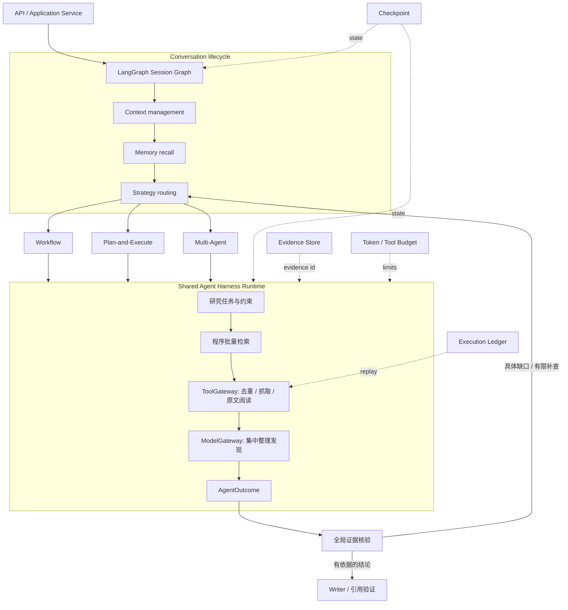

# Agent Harness 当前架构

本文描述当前代码中的运行边界和核心不变量。历史方案、阶段计划和已经被替换的 Topic 固定重试流程不再作为架构依据。

## 总体结构


```mermaid
flowchart TB
    API[API / Application Service] --> SG[LangGraph Session Graph]

    subgraph Session[Conversation lifecycle]
        SG --> CC[Context management]
        CC --> MR[Memory recall]
        MR --> SR[Strategy routing]
    end

    SR --> WF[Workflow]
    SR --> PE[Plan-and-Execute]
    SR --> MA[Multi-Agent]

    WF --> LOOP
    PE --> LOOP
    MA --> LOOP

    subgraph LOOP[Shared Agent Harness Runtime]
        PC[研究任务与约束] --> SEARCH[程序批量检索]
        SEARCH --> TG[ToolGateway: 去重 / 抓取 / 原文阅读]
        TG --> MG[ModelGateway: 集中整理发现]
        MG --> OUT[AgentOutcome]
    end
    OUT --> REVIEW[全局证据核验]
    REVIEW -->|具体缺口 / 有限补查| SR
    REVIEW -->|有依据的结论| WRITE[Writer / 引用验证]

    CP[Checkpoint] -. state .-> SG
    CP -. state .-> LOOP
    ES[Evidence Store] -. evidence id .-> LOOP
    LD[Execution Ledger] -. replay .-> TG
    TB[Token / Tool Budget] -. limits .-> LOOP
```

架构分为两层：

- **Session Graph** 管理一轮对话的生命周期，包括上下文压缩、意图识别、长期记忆召回、策略路由、响应模式和记忆整理。
- **Shared Agent Harness Runtime** 管理研究分支的批量取材和集中整理。三种策略共享同一条取材与引用管道，负责各自的任务调度。

主要入口：

- [顶层 Session Graph](../../backend/src/deeptrace/harness/graph.py)
- [默认批量研究子图](../../backend/src/deeptrace/harness/batch_research.py)
- [按计划取材](../../backend/src/deeptrace/harness/batch_collection.py)
- [集中整理与一次格式修复](../../backend/src/deeptrace/harness/batch_synthesis.py)
- [运行时依赖](../../backend/src/deeptrace/harness/context.py)
- [组装入口](../../backend/src/deeptrace/application/assembly.py)

## 三种编排策略

| 策略 | 负责任务 | 适用场景 | 当前边界 |
| --- | --- | --- | --- |
| Workflow | 生成查询并汇总研究结果 | 边界清晰、需要快速覆盖 | 固定路径，灵活性较低 |
| Plan-and-Execute | 规划、逐项执行、评估并有界重规划 | 多步骤问题和资料缺口补全 | 计划不是依赖 DAG |
| Multi-Agent | Supervisor 拆解，多 Researcher 并行，聚合后评估 | 可拆成多个相对独立方向的问题 | 协调成本和重复检索风险更高 |

三种策略都通过标准 `ResearchInput` 接收任务，通过 `ResearchOutcome` 返回结果。策略内部状态不会泄漏到顶层 Session State。对应实现位于：

- [Workflow](../../backend/src/deeptrace/strategies/workflow/)
- [Plan-and-Execute](../../backend/src/deeptrace/strategies/plan_execute/)
- [Multi-Agent](../../backend/src/deeptrace/strategies/multi_agent/)

[strategies/common.py](../../backend/src/deeptrace/strategies/common.py) 统一输入归一化、研究分支调用、Outcome 校验、取消传播和部分完成的判定。策略节点只处理自己的计划、调度与状态更新，不再跨策略导入 Workflow 的公共函数。

## 研究到回答的共享证据交接

三种调度模式复用同一条证据管道，不各自复制评估和引用逻辑：

```text
成功 read_evidence → 元数据锚点 → 当前原文取材 → 当次可见短编号
                                                ↓
模型选择编号/判断语义 → 宿主构造原文支持 → 覆盖门禁 → Answer / Report
```

职责对应到独立模块：

| 职责 | 模块 | 边界 |
| --- | --- | --- |
| 读取交接 | domain/evidence_anchor.py、harness/read_anchors.py | 仅保存实际成功预览的来源版本/哈希/坐标；每分支64个唯一锚点，可checkpoint恢复，不直接证明事实 |
| 原文取材 | tools/evidence_units.py | 验收支持优先，其次读锚点，最后旧选择器；片段不跨缺口拼接，不改写正文 |
| 有界可见视图 | strategies/evaluation_materials.py | 最多8来源、每来源3000字符、128单位、每单位500字符；整体JSON再次验算token，仅当次可见单位有编号 |
| 引用解析 | strategies/evidence_references.py | 模型只返回如p1的短编号，宿主生成完整EvidenceSupport；未知编号与重复finding ID拒绝 |
| 语义与完成门禁 | strategies/evidence_evaluation.py | 保留固定requirements、covered/missing/conflicting检查及既有策略动作，不把编号合法当成语义证明 |

新研究契约为v3；旧完成v2可读取，旧中途状态不能以新契约继续派发。短编号仅属于一次模型调用，不能作为持久证据；持久支持仍使用evidence_id/version/content_hash/原文坐标和quote。Writer将材料省略、验证失败等诊断与事实缺口分开，不将其解释为完整文档缺少相关说明。事实记忆仍需原有来源与原文支持准入。

这条管道将研究者实际读取的原文交给评估器，并由宿主解析模型选择的引用编号。检索相关性、语义判断和最终回答质量通过独立评测核对；公开运行的原始回答、配置和指标见[真实研究案例](../showcase/case-asyncio.md)。

## 默认批量研究路径

生产装配默认运行 `search → fetch → read → synthesize → finalize`。程序执行检索、URL 去重、并行抓取和带锚点的原文选段；模型接收一批原文，提交有引用的研究发现。每个分支通常一次整理调用，参数或引用不合法时最多一次修复。

首批默认选择最多三个不同来源，失败页面由剩余候选替换。已授权来源可以直接读取，避免重复抓取。原文、内容版本和引用锚点继续由既有 EvidenceStore 与 ToolGateway 保存和校验；模型只能引用本次输入可见的原文编号。分支取材完成与事实需求覆盖分开判定。

Plan-and-Execute 和 Multi-Agent 依据全局证据缺口安排最多两轮补查；补查没有新增证据时停止。Workflow 保持固定阶段的并行取材路径。

整个问题默认共享 20 次模型调用和 100,000 输入 token 的准入预算。并行分支在同一 run 的网关中原子预留额度；研究阶段保留最后两次调用给评估与回答。调用前按上下文估算准入，服务商返回 usage 后结算，缺少 usage 时保留估算值。研究阶段时间窗口默认 600 秒，收尾另留 120 秒。配置见环境模板。

## SDK 自由 Agent 循环

`build_research_agent_graph()` 保留供直接 SDK 调用与历史轨迹验证使用。下面描述该可选执行器；默认应用装配使用上面的批量子图。

循环节点为：

```text
prepare_context
  → call_model（即时构造模型视图 → ModelGateway）
  → execute_tools 或 observe
  → execution policy
  → 下一轮或 finalize
```

`prepare_context` 只检查继续执行的条件。`call_model` 在调用 Provider 前从原始 State 构造本轮模型视图，视图是局部变量，不保存为重复的 `model_messages` Checkpoint 字段。旧快照即便带有此字段，恢复也以原始任务、约束和消息重新生成视图。

历史消息不会被原地截断；系统按完整的 assistant tool-call 批次及其 ToolMessage 结果成组裁剪，避免产生半个工具交换。节点名与工具执行后的恢复边界保持兼容。这与 [LangGraph 的原始状态和提示视图区分](https://docs.langchain.com/oss/python/langgraph/thinking-in-langgraph) 一致。

模型当前可见四个工具：

- `write_todos`：循环内计划状态工具，只修改可恢复 State，不经过外部 ToolGateway。
- `search_web`：外部搜索工具，必须经过 ToolGateway。
- `fetch_page`：外部抓取工具，必须经过 ToolGateway，并要求 URL 已由搜索结果或已抓取页面授权。
- `read_evidence`：只读已授权保存证据，返回带版本/哈希/坐标的有界完整JSON；实际成功读取锚点由宿主捕获。

共享循环采用证据优先路径：定位来源 → 抓取 → 读取完整相关原文 → `finish_research`。宿主收尾要求实际已读锚点当前仍已授权、ACTIVE且版本/哈希/坐标有效，已有todo必须完成；只抓取未阅读不能收尾。`record_findings`仍兼容旧轨迹，但不再是必经步骤。分支完成不代表全局充分：统一评估直接从原文抽取结论并核对固定需求，缺口仍走定向补查，Writer使用已接受findings。

原文阅读组与最多500字符的短引用分开；工具编号与评估预算按完整阅读组保留/省略，不将某条短引用本身视为完整语义证明。候选claim/confidence留档，但不再输入全局评估视图。

如果模型在计划未完成或没有足够证据时提前结束，Execution Policy 可以发送有界 completion nudge。达到迭代上限、连续错误上限、上下文上限、预算边界或取消条件时，循环进入 `finalize`。

## 上下文不变量

每次生产模型调用都必须包含：

1. 非空 system instruction；
2. original task；
3. current constraints。

[Context Policy](../../backend/src/deeptrace/harness/policies/agent_context.py) 在预算内固定保留这些内容，[ModelGateway](../../backend/src/deeptrace/harness/model_gateway.py) 在调用 Provider 前再次校验信封。较早的完整工具交换和可选背景可以被裁剪，任务与约束不能被裁剪。

批量整理默认以 6k 输入为目标，按完整来源片段组选择材料；没有被交给模型的原文编号不能用于提交发现。SDK 自由循环保留最近三组完整工具交换，并在剩余预算内保留较早阅读预览；其 6k 目标为软限制，硬窗口仍不可越过。持久轨迹和原文库完整保留。

Session Graph 的长期上下文采用滑动窗口和结构化摘要。摘要失败时仍执行确定性窗口裁剪，避免上下文无限增长。

## 模型与工具边界

所有生产模型调用必须经过 `ModelGateway`。它统一：

- 角色级模型参数覆盖；
- 工具 Schema 绑定；
- 上下文信封校验；
- 超时和 transport retry；
- 异常到稳定错误类别的映射。

消息内容解码与 JSON 对象提取统一在 [harness/model_io.py](../../backend/src/deeptrace/harness/model_io.py)。`strategies/model_io.py` 保留策略提示组装及有既有消费者的解析导入入口，不再承担上层 Harness 反向依赖的底层解析职责。

所有外部工具调用必须经过 [ToolGateway](../../backend/src/deeptrace/tools/gateway.py)。它统一：

- 调用者和工具白名单；
- 参数、URL 和公网地址校验；
- Run / Mode / Agent 预算预留；
- 缓存与 Singleflight；
- 执行账本与幂等重放；
- 超时、transport retry 和结构化失败；
- Evidence 持久化。

抓取来源键使用已通过安全边界的final URL（缺失则requested URL）。现有`canonical_url`字段承载实际来源键，发布者HTML canonical仅保存在metadata；不同版本/语言页面不再互相作废，同一实际URL正文更新仍supersede，不复活历史失效证据。

同一批调用中，无依赖调用通过信号量有界并行。`fetch_page` 如果依赖同批 `search_web` 产生的 URL 授权，会等待相关搜索结果。执行完成后，ToolMessage 按模型原始调用顺序写回，保证轨迹稳定。

每个 assistant tool call 最终都必须对应一个 ToolMessage。参数非法、未知工具、取消和终止性错误也会生成配对的失败消息，不能留下未闭合调用。

## 三种 retry 的归属

| 类型 | 所有者 | 处理内容 | 不负责什么 |
| --- | --- | --- | --- |
| Transport retry | ModelGateway / ToolGateway | 超时、连接错误、限流、可识别的临时服务错误 | 不修正查询语义和工具参数 |
| Semantic repair | 批量整理 / 策略补查 | 格式或引用错误最多修复一次；根据全局缺口安排新查询 | 不重复已经提交的外部副作用 |
| Recovery replay | Checkpoint / Worker / Ledger | 进程崩溃、节点重放和 at-least-once 投递后的恢复 | 不把业务失败伪装成成功 |

每类重试只有一个主要所有者。生产模型网关采用单次传输尝试，由共享运行预算限制实际请求数量；工具网关保留有限传输重试，恢复时优先读取 Ledger 已提交结果。

## 响应生成：一条有界纠错路径

ANSWER / BRIEF / REPORT 共用 ResponsePolicy 与 `load_evidence → generate → validate`。每次 generate 先生成候选，一次检查解析、引用标记、篇幅和悬空结尾；存在问题时合并为一次纠错请求。不再将解析、引用、篇幅修复串联为多次模型请求。

一次 generate 执行最多两次业务层 ModelGateway 调用。Gateway 的 transport retry 和 Checkpoint 重放不在该局部次数保证内。纠错解析失败保留可解析的首稿；最终正文仍超长时按既有句子边界确定性截断，再由引用校验节点形成 ResponseOutcome 或来源清单降级。Provider 错误和取消不伪装成格式问题。

消息解码复用 `harness/model_io.py`，支持 AIMessage 的字符串与文本块；响应模块仅保留 content JSON 契约及散文包裹 JSON 的兼容解析。证据正文只读取一次并局部复用，预算、节点名和恢复边界不变。此次没有改变 Provider 协议或接入新的结构化输出 SDK。

实现与回归见 [响应图](../../backend/src/deeptrace/responses/graph.py) 和 [响应测试](../../backend/tests/responses/test_graph.py)。

## 研究执行入口与迁移

生产装配的三个研究策略统一使用 `deeptrace.harness.batch_research.build_batch_research_graph`。策略安排研究任务和缺口补查，批量执行器完成取材与集中整理。`deeptrace.harness.agent_executor.build_research_agent_graph` 保留为可选 SDK 入口，其自由工具循环与现有测试继续有效。

旧 Python 入口 `deeptrace.strategies.build_research_topic_graph` 及 `deeptrace.strategies.topic` 的节点、状态导出已移除。调用者需直接导入新入口，注入支持 `researcher` 角色及 `tools` 参数的 ModelGateway；不能将此次替换理解为仅改函数名的行为兼容。

`ResearchTopicInput`、`ResearchTopicOutcome` 和 `TopicStepError` 领域契约仍保留。新批量子图具有独立的 search / fetch / read / synthesize 检查点。旧自由循环的未完成快照应由原版本完成，或创建新任务；已完成的研究记录仍可读取。持久化检查点、执行账本与证据存储继续复用。

测试只脚本化外部模型和搜索 / 抓取服务。ToolGateway、证据存储、Executor 与 Checkpoint 仍执行真实逻辑；并发研究分支根据自己的消息历史取得响应，不共享模型响应游标。脚本成本基线包含 researcher 调用，不代表真实 Provider 的质量、Token 成本或端到端延迟。

## AgentOutcome 与退出治理

[AgentOutcome](../../backend/src/deeptrace/domain/agent.py) 不只是 `stop_reason`，还包含：

- `status`：`completed`、`partial`、`failed` 或 `cancelled`；
- `summary` 和 `evidence_ids`；
- 结构化 `errors`；
- `iterations` 与 `executed_steps`；
- `budget` 快照；
- `plan_total`、`plan_completed` 和 `unfinished_todos`。

[Execution Policy](../../backend/src/deeptrace/harness/policies/execution.py) 负责继续、提示和停止决策，输出通用 `AgentOutcome`。Executor 包装为研究分支的 `ResearchTopicOutcome`，策略再汇总为 `ResearchOutcome`；停止策略不负责研究查询、URL 等业务包装。State、Policy 与 Outcome 共用 `AgentStatus` / `AgentStopReason` 类型定义。

## 记忆、证据和可恢复状态

三类数据的所有权不同：

- **State / Checkpoint**：保存可序列化、可恢复的控制状态、消息、计划、Evidence ID 和 Outcome。
- **Runtime Context**：注入模型、工具、时钟、Store 等进程资源，不写入 Checkpoint。
- **Evidence Store**：保存网页正文、来源和内容哈希；State 只保存 Evidence ID。

[Memory Lifecycle](../../backend/src/deeptrace/harness/memory/lifecycle.py) 负责按意图召回、处理用户显式记忆请求，并在研究完成后整理带证据的事实。权威记录保存在结构化 Store；Chroma 只承担候选内语义检索，命中后回查权威记录。

长期记忆只在主链路自动使用用户偏好和工作区研究事实。写入执行准入策略和原子版本更新；召回先取每个身份的最新版本，再检查状态、有效期与相关性。注入有条数 / token 双重预算与来源标识，当前用户要求优先。显式保存失败会说明未保存，自动整理失败不使研究失败。完整设计见 [记忆模块](memory.md)。

[Checkpoint serializer](../../backend/src/deeptrace/harness/checkpoint.py) 显式注册 Agent State、Todo 和 Outcome 类型。工具节点完成后有独立 Checkpoint 边界；恢复后仍要求模型上下文完整、工具调用配对、Gateway 边界和最终 Outcome 不变量成立。

## Token 与调用预算

当前预算覆盖三个层次：

- 模型上下文采用保守 Token 估算，固定保留指令、原始任务、当前约束和输出空间，再按完整交换裁剪历史。
- 外部工具在执行前按 Run / Mode / Agent 预留调用次数和网络额度，并在成功、失败或取消后提交或释放。
- 默认批量运行共享模型请求、输入准入与时间预算，并为核验和回答保留额度。计数器覆盖同一进程内同一 run 的并发分支；跨进程恢复仍使用工具持久化账本，模型准入计数不作为持久化账单。

`AgentOutcome.budget` 当前主要记录模型调用与工具步骤统计，不应表述为 Provider 返回的精确 Token 账单。全链路真实 Token 成本计量仍是演进方向。

## 当前验证边界

2026-10-01 的离线验收覆盖以下关键不变量，具体命令与最终结果见 [记忆模块验收记录](memory.md#验证)：

- [Agent loop tests](../../backend/tests/harness/test_agent_executor.py)
- [Cross-cutting invariant tests](../../backend/tests/harness/test_agent_invariants.py)
- [ModelGateway tests](../../backend/tests/harness/test_model_gateway.py)
- [Memory lifecycle tests](../../backend/tests/harness/memory/test_lifecycle.py)
- [Memory transactions tests](../../backend/tests/harness/memory/test_memory_transactions.py)

离线测试覆盖模型上下文信封、tool-call / ToolMessage 配对、Gateway 边界、AgentOutcome、并行工具顺序、旧 Checkpoint 恢复，以及内存 / SQLite 的记忆并发版本、事务回滚、遗忘和召回过滤。真实 Provider、Tavily、MySQL、Redis 和 Chroma 需要凭据或外部服务，不写成已完成的本次验收。

当前演进方向包括认证后的租户隔离、通用 Human-in-the-loop 审批、内容级 Prompt Injection 检测、真实 Token 成本计量和系统化在线 Agent Eval。
