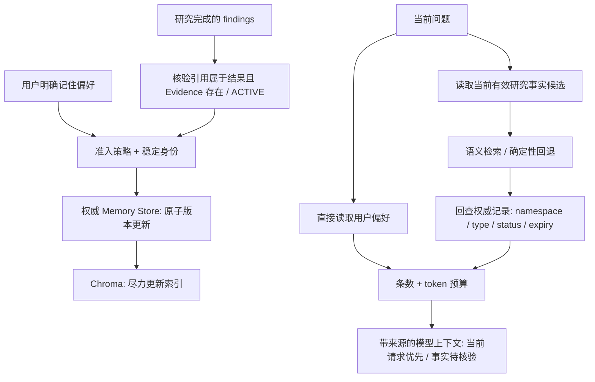

# 记忆模块：可追溯的长期记忆，而不是第二份聊天记录

本模块保留现有 LangGraph、SQL 和 Chroma，采用短期 / 长期分层、稳定身份、版本生命周期和按需召回。没有引入独立 Memory Agent、任务队列或另一套运行时。

## 数据与职责

| 数据 | 所有者 | 保存内容 | 使用方式 |
| --- | --- | --- | --- |
| 工作记忆 | Session / Agent State + Checkpoint | 消息、结构化摘要、计划、证据 ID、Outcome | 当前线程执行与崩溃恢复 |
| 用户偏好 | Memory Store，`("user", user_id, "preferences")` | 用户明确要求记住的信息 | 直接读取，作为可被当前请求覆盖的偏好 |
| 研究事实 | Memory Store，`("workspace", workspace_id, "facts")` | 小粒度结论、证据引用、时间、版本 | 按问题检索，作为待核验背景 |
| 网页证据 | Evidence Store | 来源、网页正文、内容哈希 | 支撑本轮研究与引用 |
| 语义索引 | Chroma | 记忆向量及检索元数据 | 生成候选，不决定记忆是否有效 |

短期记忆不需要重新向量化；网页正文不全部复制进 Memory；长期记忆也不能替代 Evidence。这一组织方式参考 [LangGraph 的短期 / 长期记忆与 namespace](https://docs.langchain.com/oss/python/concepts/memory)。当前生产主链路只自动使用 PREFERENCE / FACT；其他已有类型保持兼容，没有另行扩展自动写入行为。

## 核心链路



记忆提取、保存和使用各有明确职责。这借鉴了 [LangMem 的记忆处理方式](https://langchain-ai.github.io/langmem/concepts/conceptual_guide/)，但当前只整理已生成的 findings，不额外调用一个模型做开放式记忆提取。

## 写入：入口强制治理

生产写入通过 `remember(store, record, policy, source=...)`，由 [write.py](../../backend/src/deeptrace/harness/memory/write.py) 执行一次准入、保留周期和 Store.upsert。生命周期节点不重复预检；`MemoryWriteRejected(ValueError)` 表达规则拒绝，与存储故障分开处理。

- 用户偏好只接受明确的 `user_request` 或既有策略允许的 `repeated_preference` 来源；当前主链路没有自动推断重复偏好的流程。
- 事实必须带证据引用。自动整理还会检查引用属于当前 ResearchOutcome，并在同一 workspace 的 Evidence Store 中存在且为 ACTIVE。
- 没有引用、引用伪造、记录不是 ACTIVE 或来源不受支持的内容不进入自动记忆链路。
- 一轮最多处理 20 条 finding。偏好默认不设过期时间；新写入的 FACT 默认有效 30 天，可在记录中显式指定到期时间。

30 天是应用的再核验周期，不是对世界事实有效期的判断。历史没有 expires_at 的记录保留原兼容行为。证据检查验证的是来源可追溯性，不是已经证明结论必然被原文蕴含。

`put` 是存储适配器的低层写入接口，供种子、兼容数据及测试使用，不等同于生产准入入口。不要从业务节点绕过 `remember`。

### 自动整理：合法候选 → 去重核验 → 保存 → 索引

先检查前 20 条 finding 的引用属于本轮结果，再由 MemoryRecord 校验内容长度和来源上限。不合法的单条候选不阻止其他候选。每条最多 20 个来源，因此一次整理最多核验 400 个唯一 Evidence ID；没有合法候选时不读取证据。

正常批次通过当前 workspace 的 `get_many` 一次读取去重来源，仅保存全部来源存在且 ACTIVE 的事实。严格批量读取遇到 KeyError 时，记录一次降级，再对每个唯一 ID 调用单 ID 的 `get_many`，跳过缺失项；不要求适配器提供 Harness 接口以外的 `get` 方法。这样一条缺失不会连带丢弃其他有效事实。其他存储异常直接降级，不逐事实重试；最坏缺失回退为一次失败批次加最多 400 次读取，不能把它说成恒定一次查询。

[SQL Evidence Store](../../backend/src/deeptrace/persistence/evidence_store.py) 在同一会话中按最多 400 个唯一 ID 执行 tenant-scoped IN 查询，不加载 body 列。返回顺序和重复项与输入一致，各位置是独立副本；空列表无查询，缺失或跨租户 ID 仍抛 KeyError。网页正文继续通过 read_body / read_chunks 读取，不复制进 MemoryRecord 或图状态。

核验后逐条通过 remember 保存，单个 upsert 失败不阻止其他候选；最终仅尽力索引已保存的 ACTIVE 记录。来源核验与记忆保存没有跨 Store 事务快照，核验不代表已经证明结论被原文蕴含。

## 身份与版本：明确 ADD / UPDATE / NOOP

`MemoryRecord` 的身份是 `(type, namespace, subject)`；每个版本有独立 id / store_key，以及 `version` 和 `supersedes`。

subject 由确定性规则生成：

- 常见偏好使用稳定槽位：`response.language`、`response.detail`、`response.format`。例如“用中文回答”改为“用英文回答”更新同一偏好。
- 其他明确记忆和研究事实使用规范化内容的摘要键，避免随机 finding ID 覆盖无关事实。
- 已存在的自定义 subject 不强制迁移。规则未命中的偏好按独立内容保存，不声称可以解决任意自然语言冲突。

版本决策集中在 [domain/memory.py](../../backend/src/deeptrace/domain/memory.py)：

| 情况 | 结果 |
| --- | --- |
| 身份不存在 | 保存首条记录 |
| 最新版本 ACTIVE、未过期，内容和来源引用均相同 | NOOP，返回原记录 |
| 同身份内容或来源变更，或最新版本已失效 | 创建下一版本，记录 supersedes |
| 最新版本 DELETED，自动整理再次产生同一内容 | 保留 tombstone，不自动复活 |
| 最新版本 DELETED，用户明确要求重新保存 | 创建新 ACTIVE 版本 |

创建新版本时将旧 ACTIVE 版本标记为 SUPERSEDED；旧版本保留用于审计。同内容 NOOP 不刷新更新时间和 TTL，避免不断重放让事实永久不过期。默认不做语义近似合并：改写措辞的事实可能形成独立条目，这比错误合并互相矛盾的事实更可控。

ADD / UPDATE / NOOP 和更新历史的思路参考 [Mem0 Add Memory](https://docs.mem0.ai/core-concepts/memory-operations/add) 与 [Update Memory](https://docs.mem0.ai/core-concepts/memory-operations/update)，实现仍是本项目的确定性策略与 SQL 事务，不依赖 Mem0 服务。

## 原子性与遗忘

[内存 Store](../../backend/src/deeptrace/harness/memory/store.py) 在同一锁内完成版本判定、旧版失效与新版保存；[SQL Store](../../backend/src/deeptrace/persistence/memory_store.py) 在一个事务内完成这些操作，对已有身份加行锁，插入竞争触发 IntegrityError 时最多尝试三个事务。

SQL 新版插入失败会回滚旧版状态，不能留下“旧版已失效，但新版没写入”的中间结果。事务提交后才更新向量索引；SQL 与 Chroma 没有假装提供跨系统事务。

`get` 返回最新版本，即使它已删除或过期，也不能退回旧 ACTIVE 版本。召回先在 namespace / type 范围内选每个身份的最新版本，再做有效性过滤；兼容旧数据中遗留的多个 ACTIVE 版本。版本身份按完整键匹配，不因 subject 前缀相似误更新其他记忆。

[forget.py](../../backend/src/deeptrace/harness/memory/forget.py) 提供两种已有接口：

- 逻辑遗忘：同身份所有版本变为 DELETED，保留 tombstone，防止旧版本被召回或自动整理复活。
- 物理删除：移除同身份所有版本。它不保留 tombstone，后续新研究仍可能重新学到相同事实；不适合作为“永久禁止再记住”的承诺。

物理删除没有新增对话意图、API 或 Chroma 清理服务。残留向量因不在权威候选集合内而不可召回，但底层向量的物理清理不在本次实现范围内。

## 召回：先权限范围与有效性，再相关性

在研究、增量研究及报告意图下按需召回；普通追问继续依赖线程工作记忆。

1. 偏好从用户 namespace 直接读取，不要求与当前问题有词汇重叠。
2. 研究事实从工作区 namespace 读取最新、ACTIVE、未到期记录，作为检索候选。
3. 启用 semantic 时，候选按需索引，通过 Chroma 检索；距离超过 0.8 的命中不使用。
4. 向量命中后通过记忆 ID 回查权威 Store，再检查候选 ID、namespace、type、ACTIVE 与有效期，防止检索期间已被遗忘或替代的记录进入上下文。
5. 向量 / embedding 不可用时重新读取有效记录，以词汇重叠、更新时间和置信度做确定性排序。中文支持连续双字片段匹配；无相关性的事实不为了填满 top-k 强行入选。

semantic 排序权重为相似度 0.70、重要性 0.15、置信度 0.10、新鲜度 0.05。0.8 是当前余弦距离的工程默认值，不是跨 embedding 模型验证过的最佳参数。

偏好先占用召回名额，事实使用剩余额度；默认总上限 5 条，由既有 `settings.memory_top_k` 配置。当前不会对大量偏好做复杂的分类配额或推理。

SQL 为了正确处理旧版本，在指定 namespace / type 范围内读取版本后归并最新记录；当前没有额外版本索引或大规模召回性能承诺。

## 注入：有限、可追溯、低于当前请求

[lifecycle.py](../../backend/src/deeptrace/harness/memory/lifecycle.py) 生成独立的 recalled view，不改写权威记录。每条内容最多 500 字符，保留 id、version、来源 Evidence ID、confidence、updated_at、expires_at。

整个 recalled view 的序列化大小受 `HarnessContext.memory_context_tokens` 限制，默认 768 个估算 token。预算包含元数据；超额条目不注入。模型总上下文仍由原有 Context Policy / ModelGateway 管理，这不是 Provider 的精确计费 token。

研究提示将偏好并入当前约束副本、事实作为带来源的背景；响应提示同样保留记忆来源。系统指令明确：当前用户要求优先于历史偏好，历史事实是待核验背景，不能直接替代本轮证据与引用。

记忆 ID 不变成引用 ID，也不自动把旧 Evidence ID 添入当前研究结果。

## 失败处理

- 没有 Memory Store：研究仍继续，明确保存请求回答“未能保存”。
- 显式保存不满足准入规则：返回 `memory_rejected`，不写 Store；存储抛出的普通 ValueError 即使消息相同，也不冒充规则拒绝。
- 显式记住请求的 Store 写入失败：返回失败说明，不回复“已记住”。
- 自动整理失败：记录日志与 `memory.degraded` 事件，保留研究结果。
- recall 失败：保留已经获得的有效部分，或以空记忆继续任务。
- Chroma 索引失败：权威写入仍成功；下次 semantic 召回尝试补索引，必要时走确定性回退。
- 取消不被普通异常兜底吞掉，继续遵守 Harness 的取消语义。

这里只做可选模块降级，不新增后台重试队列。索引重建以有效记录为准，不承担永久删除审计等合规功能。

## 代码导航

- [MemoryRecord 与版本决策](../../backend/src/deeptrace/domain/memory.py)
- [Memory Store / Retriever 协议及配置](../../backend/src/deeptrace/harness/context.py)
- [Session 生命周期](../../backend/src/deeptrace/harness/memory/lifecycle.py)
- [写入策略](../../backend/src/deeptrace/harness/memory/write.py)
- [召回与上下文标识](../../backend/src/deeptrace/harness/memory/recall.py)
- [语义检索器](../../backend/src/deeptrace/harness/memory/retriever.py)
- [内存存储](../../backend/src/deeptrace/harness/memory/store.py) / [SQL 存储](../../backend/src/deeptrace/persistence/memory_store.py)
- [遗忘](../../backend/src/deeptrace/harness/memory/forget.py)

## 验证

2026-10-01 使用本地虚拟环境，从 backend 目录执行：

```powershell
.\.venv\Scripts\python.exe -m pytest -m "not real" -q --tb=short
```

本轮入口与证据读取收敛后的结果：`547 passed, 2 deselected`（43.36 秒）；记忆、SQL / 内存证据、Workflow 响应与恢复专项 `98 passed`（24.35 秒）。本次改动的源文件通过 Ruff 全规则检查，测试通过 I / F 检查，全部修改 Python 文件通过格式检查，`git diff --check` 无空白错误。

真实 SQLite 查询探针确认：含重复项的两个唯一 ID 从 3 次查询减少到 1 次；401 个唯一 ID 从 401 次减少到 2 次，每批最多 400 个 ID，查询不加载 body。20 条 finding 共享来源时从 20 次重复核验减少到一次，真实 Memory Store 仍保存 20 条事实。缺失回退、同 ID 跨租户隔离、独立副本、单条候选 / 写入失败、重放 TTL、tombstone、取消及无 context / 无 Store 边界均有回归。

新增回归覆盖：写入准入、稳定偏好更新、并发单 ACTIVE / 版本链、SQL 回滚、全版本遗忘、自动整理不复活 tombstone、旧版不越过最新失效记录、完整身份匹配、检索后状态回查、中文回退、证据引用检查、token 预算与来源保留、可选模块失败，以及旧 Checkpoint 模型视图兼容。

真实 MySQL 多进程锁竞争、Chroma 服务、Embedding / LLM Provider 未在此次离线验收运行。namespace 沿用当前 user_id / workspace_id，不等于已经实现认证后的多租户安全隔离；自动事实整理也没有新增敏感信息识别或内容级 Prompt Injection 检测。

相关回归入口见 [记忆生命周期测试](../../backend/tests/harness/memory/test_lifecycle.py) 和 [记忆事务测试](../../backend/tests/harness/memory/test_memory_transactions.py)。
