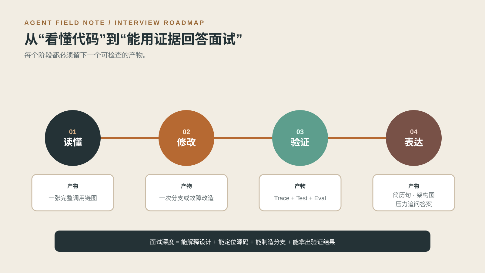

# Agent Harness 学习与面试路线

这份路线不要求先背完所有概念。目标是把当前 DeepResearch 项目当作实验场，沿着 **读懂 → 修改 → 验证 → 表达** 四步，把 Harness 学到能够定位源码、制造分支、解释取舍并接受面试追问的程度。



建议先通读[项目深度拆解](Agent%20Harness项目深度拆解.md)，再按本文完成实验。需要下钻时查阅[源码学习指南](Agent%20Harness源码学习指南.md)，需要准备回答时使用[面试手册](Agent%20Harness面试手册.md)，开发优先级以[实现差距与完善清单](Agent%20Harness实现差距与完善清单.md)为准。

## 阶段一：Agent Loop

### 学习目标

能够从一次 API 请求画出 Session Graph、策略子图、Shared Agent Loop 和 Response Graph 的完整调用链；解释模型何时调用工具、何时被提醒继续、何时生成 `AgentOutcome`。

### 推荐源码顺序

1. [`domain/agent.py`](../../backend/src/deeptrace/domain/agent.py)：先看最终退出契约。
2. [`harness/agent_state.py`](../../backend/src/deeptrace/harness/agent_state.py)：理解循环保存哪些状态。
3. [`harness/agent_executor.py`](../../backend/src/deeptrace/harness/agent_executor.py)：按节点和路由读主循环。
4. [`harness/policies/execution.py`](../../backend/src/deeptrace/harness/policies/execution.py)：理解继续、nudge 和停止。
5. [`harness/graph.py`](../../backend/src/deeptrace/harness/graph.py)：最后回到顶层会话生命周期。

### 必做实验

- 使用脚本化模型跑一条完整请求，记录每个节点的输入输出。
- 让模型在计划未完成时提前输出答案，观察 completion nudge。
- 分别触发迭代上限、连续错误、预算耗尽和取消，比较 Outcome。

运行：

```powershell
cd backend
uv run pytest tests/harness/test_agent_executor.py tests/harness/test_agent_invariants.py -q
```

### 完成标准

- 不看源码也能画出 `prepare_context → call_model → execute_tools / observe → policy`。
- 能解释“模型没有工具调用”为什么不必然等于完成。
- 能从 Outcome 判断已完成工作、证据、错误、预算和未完成计划。

### 面试追问

- 为什么 Agent Loop 不直接写进三个策略？
- completion nudge 如何避免无限循环？
- `partial` 与 `failed` 的产品语义有什么区别？

### 应准备的证据

一张完整调用链图、一条成功 Trace、一条提前结束后被 nudge 的 Trace，以及四种非正常退出的 Outcome 对照。

## 阶段二：Context

### 学习目标

理解模型每一轮实际看到什么；能区分稳定指令、任务约束、工作状态、证据和长期记忆；能解释为什么裁剪必须保持完整工具交换。

### 推荐源码顺序

1. [`harness/policies/agent_context.py`](../../backend/src/deeptrace/harness/policies/agent_context.py)：消息分组、裁剪与固定信息。
2. [`harness/token_budget.py`](../../backend/src/deeptrace/harness/token_budget.py)：保守 Token 预算。
3. [`harness/model_gateway.py`](../../backend/src/deeptrace/harness/model_gateway.py)：Provider 调用前的上下文信封校验。
4. [`harness/context.py`](../../backend/src/deeptrace/harness/context.py)：运行时依赖与可恢复 State 的边界。

### 必做实验

- 构造包含多个 tool-call 批次的超长历史，逐步收紧上下文预算。
- 验证 system instruction、original task、current constraints 始终存在。
- 验证 assistant tool calls 与对应 ToolMessage 一起保留或一起裁剪。
- 制造固定信息本身超过预算的情况，确认系统明确返回 `context_limit`。

运行：

```powershell
cd backend
uv run pytest tests/harness/test_token_budget.py tests/harness/test_model_gateway.py tests/harness/test_agent_invariants.py -q
```

### 完成标准

- 能画出稳定层、任务层、工作层、证据层如何形成 Model View。
- 能说明长期记忆召回和短期 Context 裁剪不是同一个问题。
- 能指出当前 Token 是保守估算，不能声称等于 Provider 账单。

### 面试追问

- 为什么不能简单保留最近 N 条消息？
- 摘要失败时系统如何保证上下文不会无限增长？
- 为什么 ToolMessage 配对属于上下文不变量？

### 应准备的证据

一份裁剪前后消息对照、一个触发 `context_limit` 的测试、一次“全量历史 vs 按需装配”的完成率与约束保留对照。

## 阶段三：Tool

### 学习目标

理解“可调用函数”与“受治理工具”的区别；能够追踪一次工具调用从模型输出到参数校验、权限、预算、执行、Evidence 落库和 ToolMessage 回写。

### 推荐源码顺序

1. [`domain/tools.py`](../../backend/src/deeptrace/domain/tools.py)：工具请求、结果、错误和能力契约。
2. [`tools/registry.py`](../../backend/src/deeptrace/tools/registry.py)：能力注册。
3. [`tools/policy.py`](../../backend/src/deeptrace/tools/policy.py)：调用者白名单。
4. [`tools/gateway.py`](../../backend/src/deeptrace/tools/gateway.py)：统一执行边界。
5. [`harness/agent_tools.py`](../../backend/src/deeptrace/harness/agent_tools.py)：批执行、依赖等待和 ToolMessage 配对。

### 必做实验

- 调用未知工具和非法参数，确认都返回配对失败 ToolMessage。
- 尝试抓取未由搜索结果授权的 URL，并覆盖私网、非法协议与重定向。
- 同时发起多个独立搜索，观察有界并行和稳定回写顺序。
- 在同一批次发送搜索和依赖其 URL 的抓取，验证抓取等待搜索授权。
- 并发发起相同工具请求，观察缓存、Singleflight 和预算预留。

运行：

```powershell
cd backend
uv run pytest tests/tools tests/harness/test_agent_invariants.py -q
```

### 完成标准

- 能解释 `write_todos` 为什么不经过 ToolGateway。
- 能区分调用权限、URL 授权、参数合法和执行成功四件事。
- 能证明每个 assistant tool call 最终都有对应 ToolMessage。

### 面试追问

- ToolGateway 与 ModelGateway 为什么分开？
- 并行调用如何避免打乱 ToolMessage 顺序？
- 新增一个物流、数据库或代码执行工具，需要补哪些契约和测试？

### 应准备的证据

一条完整工具调用 Trace、一组 URL 安全测试、一组并发与依赖调用对照，以及新增工具的最小注册示例。

## 阶段四：Runtime

### 学习目标

理解 transport retry、semantic repair、recovery replay 的所有权；掌握 Checkpoint、Ledger、预算、租约和 at-least-once 投递之间的关系。

### 推荐源码顺序

1. [`harness/checkpoint.py`](../../backend/src/deeptrace/harness/checkpoint.py)：可恢复类型序列化。
2. [`tools/execution_store.py`](../../backend/src/deeptrace/tools/execution_store.py)：执行账本接口。
3. [`persistence/execution_ledger.py`](../../backend/src/deeptrace/persistence/execution_ledger.py)：持久化 Ledger。
4. [`runtime/distributed.py`](../../backend/src/deeptrace/runtime/distributed.py) 与 [`worker/service.py`](../../backend/src/deeptrace/worker/service.py)：分布式执行、租约和恢复。
5. [`application/assembly.py`](../../backend/src/deeptrace/application/assembly.py)：本地与分布式依赖组装。

### 必做实验

- 分别注入模型超时、工具临时错误和非法工具参数，确认由不同层处理。
- 在工具节点完成后的 Checkpoint 边界中断执行，再恢复同一线程。
- 模拟工具已经提交但响应丢失，验证恢复优先读取 Ledger 或核对远端状态。
- 并发预留预算，验证不会各自读取同一旧余额后全部通过。
- 重复投递同一个 run，观察租约与执行记录如何限制重复工作。

运行：

```powershell
cd backend
uv run pytest tests/integration/test_recovery.py tests/integration/test_distributed_runtime.py tests/tools/test_execution_store.py tests/tools/test_budget.py -q
```

### 完成标准

- 任意给出一个失败，都能先判断它属于哪类 retry。
- 能说明 Checkpoint 为什么不能单独保证外部副作用不重复。
- 能准确表述系统是 at-least-once 恢复，而不是轻率承诺 exactly-once。

### 面试追问

- Worker 在写操作完成后崩溃，恢复时怎么办？
- 本地模式与分布式模式的 Ledger 有什么差别？
- 多 Agent 共享预算时如何避免超卖？

### 应准备的证据

一次中断恢复录像或 Trace、一份三类故障矩阵、一次重复投递测试，以及一段说明 exactly-once 边界的回答。

## 阶段五：Eval

### 学习目标

能够在固定任务、模型和预算下比较三种策略；同时评估最终答案、证据质量、调用成本、终止原因和错误副作用。

### 推荐源码顺序

1. [`eval/dataset.py`](../../backend/src/deeptrace/eval/dataset.py)：问题与 gold source。
2. [`eval/env.py`](../../backend/src/deeptrace/eval/env.py)：有状态本地语料与故障注入。
3. [`eval/runner.py`](../../backend/src/deeptrace/eval/runner.py)：运行记录。
4. [`eval/scoring.py`](../../backend/src/deeptrace/eval/scoring.py)：确定性指标。
5. [`eval/judge.py`](../../backend/src/deeptrace/eval/judge.py)：需要模型的质量指标。

### 必做实验

- 对同一数据集分别运行 Workflow、Plan-and-Execute、Multi-Agent。
- 固定预算，比较完成数、gold coverage、citation validity、步骤和调用数。
- 注入搜索失败、抓取失败和证据缺失，观察终止原因与部分结果。
- 将调参使用的任务与留出任务分开，避免“测试集就是开发集”。
- 有凭据时单独运行真实 Provider 评测，并与脚本化结果分表报告。

运行离线测试：

```powershell
cd backend
uv run pytest tests/eval tests/integration/test_mode_evaluation.py -q
```

运行评测 CLI：

```powershell
cd backend
uv run python -m deeptrace.eval --mode all --provider scripted --repeats 1
```

### 完成标准

- 能解释为什么“答案看起来不错”不足以证明 Agent 设计有效。
- 能区分历史回放、脚本化有状态环境和真实 Provider 实验。
- 能用同一组指标解释三种策略的质量—成本取舍。

### 面试追问

- 为什么不只用 LLM-as-a-Judge？
- citation validity 与 faithfulness 有什么不同？
- 如何证明优化没有增加错误副作用？

### 应准备的证据

一份可重复运行的三策略报告、一份故障注入报告、一组留出任务，以及对指标口径和局限性的说明。

## 面试前证据清单

- [ ] 一张从 API 到 Outcome 的完整调用链图。
- [ ] 同一问题的两条不同策略 Trace。
- [ ] 一次 Context 裁剪前后对照。
- [ ] 一次未知工具或非法参数的闭合失败轨迹。
- [ ] 一次工具失败后的 semantic repair。
- [ ] 一次 Checkpoint + Ledger 恢复演示。
- [ ] 一份三策略离线评测报告。
- [ ] 一段 30 秒项目介绍和一段 3 分钟架构介绍。
- [ ] 对当前限制的诚实回答：租户隔离、通用审批、内容级 Prompt Injection、精确 Token 成本和真实 Provider 基线。

## 推荐表达顺序

30 秒版本只回答三件事：项目解决什么问题、为什么需要统一 Harness、最强的一条工程证据是什么。

3 分钟版本按“任务 → 架构 → 一个关键故障 → 验证结果”展开。深挖时再进入 Context、ToolMessage、Checkpoint、Ledger、Memory 或 Eval。不要一开场罗列技术栈；技术名词只有放进问题、取舍和证据里才有价值。

当前工作树的确定性测试基线为 `482 passed, 2 deselected`。它适合作为工程回归证据，不应被表述为真实模型质量或线上收益。
