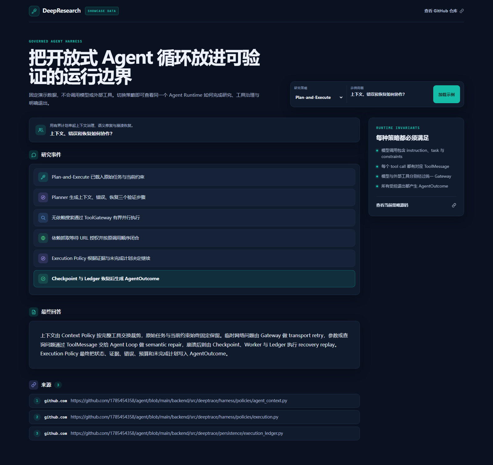
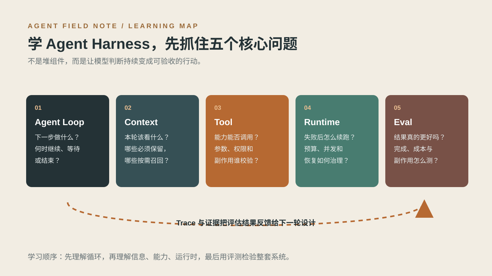
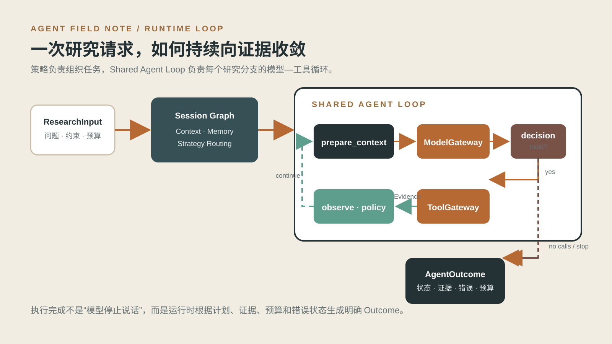
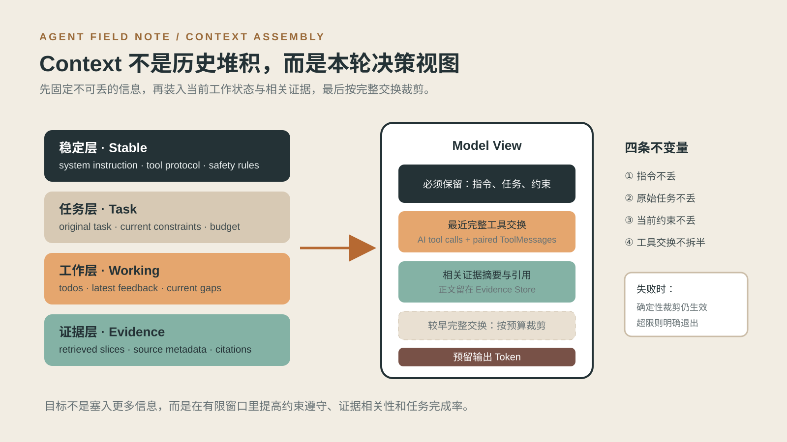
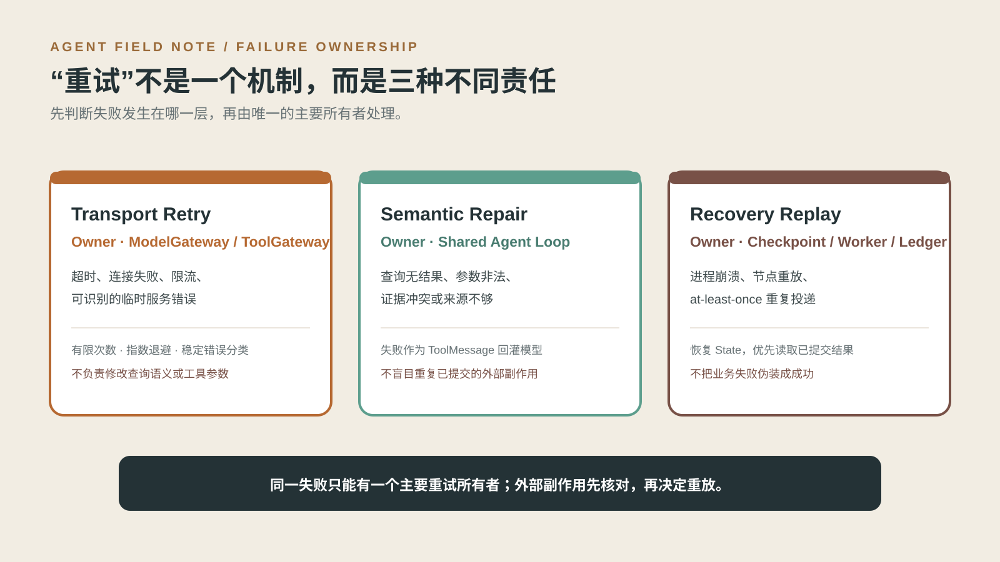
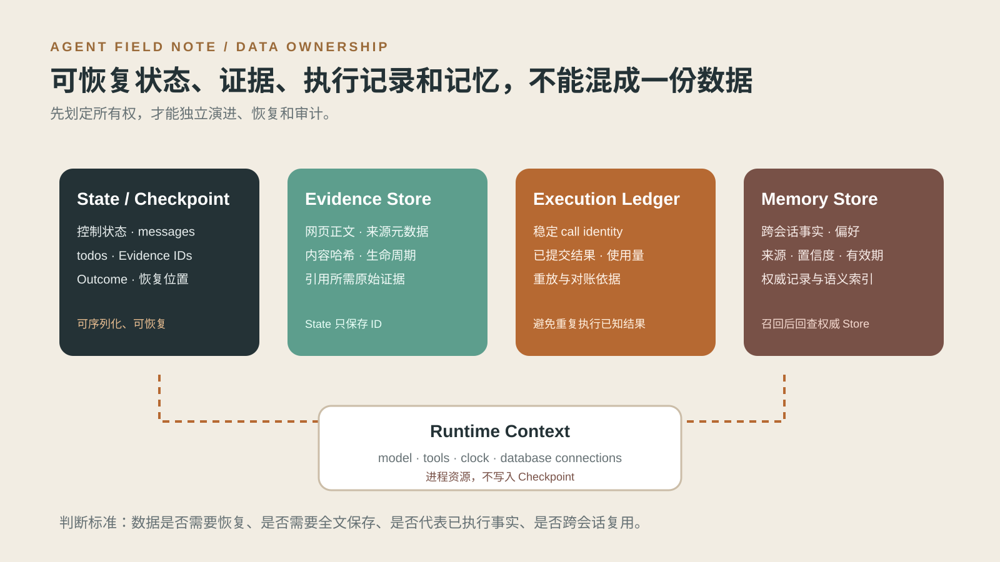

# DeepResearch Agent Harness，简历怎么写出工程深度？

大家好，这篇直接拆一个 DeepResearch 项目。

很多 Agent Demo 都能搜索、调用工具、生成长答案。真正到了简历和面试，问题会变成：**模型为什么做这一步？失败后能不能继续？结论能不能回查？换一种编排方式，底层治理是否还成立？**

这个项目的目标，不是再包装一条“搜索 → 总结”流水线，而是构建一套可治理的 Agent Harness：让 Workflow、Plan-and-Execute、Multi-Agent 三种策略共享模型、工具、上下文、预算、恢复与退出规则，在有限资源下完成有证据的复杂研究。

▲ 工作台同时展示执行轨迹、最终回答、来源和运行时状态。Showcase 使用固定数据，避免把演示结果误认为实时研究。

**真正的 Agent Harness，不是让模型多调用几次工具，而是把模型的判断变成可恢复、可审计、可验收的研究过程。**

文章主线：**复杂任务 → 决策循环 → 上下文与工具 → 稳定运行 → 系统评估 → 简历表达**

AGENT FIELD NOTE 01 / 11

## 复杂研究任务：为什么“搜索 + 总结”还不够

一个开放问题通常没有现成答案。例如：“对比三种 Agent 编排方式在多跳研究中的质量、成本与失败恢复能力，并给出适用边界。”

它至少包含五类工作：理解问题与约束、规划调查方向、搜索候选来源、抓取原文并处理冲突、形成带引用的结论。搜索没有结果时要换查询；网页无法抓取时要换来源；证据不足时不能假装完成；预算耗尽时要交付部分结果和未完成项。

● **任务不是一次模型调用**：模型必须根据最新观测决定下一步，直到满足退出条件。

● **答案不是唯一交付**：系统还要交付证据、错误、预算快照、执行步数和未完成计划。

● **“停止”也需要理由**：完成、部分成功、失败、取消、上下文超限和预算耗尽，后续处理完全不同。

项目因此把一次研究的出口定义为结构化 [`AgentOutcome`](../../backend/src/deeptrace/domain/agent.py)，而不是只返回一段文本或一个 `stop_reason`。

**简历怎么写**

面向复杂开放问题构建 DeepResearch Agent Harness，在有限预算下完成策略路由、网页检索、原文查证与引用回答，并以结构化 Outcome 交付状态、证据、错误和未完成计划。

▲ 一个完整 Harness 同时回答 Loop、Context、Tool、Runtime 和 Eval 五类问题。

AGENT FIELD NOTE 02 / 11

## 场景变了，执行路径也应该变

同样是“研究一个技术方案”，任务结构不同，合适的编排方式也不同。

● **问题边界清楚、方向可以并列**：Workflow 先生成查询，再并行覆盖多个主题，最后统一评估与汇总。

● **步骤存在先后依赖、研究中会暴露新缺口**：Plan-and-Execute 先规划，逐项执行，根据评估结果进行有界重规划。

● **多个方向可以独立调查、需要 Supervisor 协调**：Multi-Agent 将方向分发给多个 Researcher，再聚合和补查。

三种策略都接收同一种 `ResearchInput`、返回同一种 `ResearchOutcome`，并调用同一个 Shared Agent Loop。策略负责“怎样拆任务”，Harness 负责“每个研究分支怎样安全、稳定地使用模型与工具”。对应实现位于 [`strategies/`](../../backend/src/deeptrace/strategies)。

这里有一个容易说错的边界：当前 Plan-and-Execute 是带评估和重规划的顺序计划，不是通用依赖 DAG。面试时把它夸大成任意任务图，反而容易被源码追问击穿。

**面试追问：**为什么不只保留 Multi-Agent？

因为并行不是免费收益。简单任务使用多 Agent 会增加协调、重复检索和模型调用；固定流程则更适合稳定吞吐。策略选择本身就是质量、延迟和成本之间的工程取舍。

AGENT FIELD NOTE 03 / 11

## Shared Agent Loop：让研究持续向证据收敛

一次研究分支的核心循环是：

`prepare_context → ModelGateway → tools / finish → observe → Execution Policy`

[`agent_executor.py`](../../backend/src/deeptrace/harness/agent_executor.py) 先装配本轮模型视图，再调用模型。模型可以更新计划、搜索、抓取，或者尝试结束。工具结果写回后，Execution Policy 根据迭代、错误、预算和计划状态决定继续、提醒还是退出。

● **先找当前缺口**：模型看到原始任务、当前约束、待办和最新证据，而不是重新从头理解整个会话。

● **工具调用身份稳定**：缺失、过长或重复的 call ID 会被归一化，恢复重放时仍能识别同一次意图。

● **提前结束会被有界纠正**：计划未完成或证据不足时，系统可以发出 completion nudge；达到上限后不再无限劝模型继续。

● **所有受控退出都产生 Outcome**：即使失败，也要说明已经完成什么、为什么停止、还有什么未完成。

▲ 策略决定任务组织，Shared Agent Loop 统一处理每个研究分支的模型—工具循环。

**简历怎么写**

设计共享 Agent Loop，以当前任务缺口和最新工具反馈驱动模型决策；通过有界 completion nudge、迭代上限、错误熔断和结构化 Outcome 控制开放式循环。

**面试追问：**模型没有调用工具就输出答案，系统为什么不直接结束？

因为“模型停止调用工具”只是一个观测，不等于任务已经完成。Execution Policy 还要检查计划、证据和终止条件。

AGENT FIELD NOTE 04 / 11

## Context：每一轮到底应该给模型什么

把全部聊天、网页正文和工具记录塞进 Prompt，看似信息充分，实际上会让关键约束被淹没，还可能截断一半工具交换。

项目通过 [`agent_context.py`](../../backend/src/deeptrace/harness/policies/agent_context.py) 构造本轮消息，并由 [`ModelGateway`](../../backend/src/deeptrace/harness/model_gateway.py) 在调用 Provider 前再次校验：每次生产模型调用必须包含非空 system instruction、original task 和 current constraints。

● **稳定层**：角色指令、工具协议和安全规则。

● **任务层**：原始问题、当前约束和预算。

● **工作层**：待办、最新反馈和当前证据缺口。

● **证据层**：与本轮决策相关的摘要、来源和引用；网页全文保存在 Evidence Store。

裁剪以完整的 assistant tool-call 批次及其 ToolMessage 为单位，不能留下有调用无结果的“半个交换”。系统还必须预留输出空间；如果连固定信息都放不下，就明确以 `context_limit` 退出。

▲ Context 优化的目标不是塞入更多信息，而是在有限窗口里提高约束遵守、证据相关性和完成率。

**怎么验证：**构造超长历史，对比全量拼接与按完整交换裁剪，检查四件事：固定信息是否保留、ToolMessage 是否闭合、旧证据是否误用、任务是否完成。

AGENT FIELD NOTE 05 / 11

## Tool：可插拔要落到契约、权限和执行边界

工具可插拔，不是把 Python 函数塞进列表。完整路径包括能力注册、调用者白名单、参数校验、URL 授权、预算预留、缓存与 Singleflight、执行账本、Evidence 落库和结构化错误。

模型当前主要看到 `write_todos`、`search_web` 和 `fetch_page`：

● `write_todos` 只修改可恢复 State，不产生外部副作用，因此留在 Agent Loop 内。

● `search_web` 与 `fetch_page` 经过 [`ToolGateway`](../../backend/src/deeptrace/tools/gateway.py)，统一执行治理。

● `fetch_page` 只能访问搜索结果或已抓取页面发现并授权的 URL，不能让模型随意探测任意地址。

● 同批无依赖工具有界并行；依赖搜索授权的抓取会等待前置结果。结果最终按模型原始调用顺序写回，保持轨迹稳定。

未知工具、非法参数、取消和失败也必须生成配对的 ToolMessage。对模型来说，错误是下一轮决策的真实观测；对运行时来说，工具交换必须闭合。

**简历怎么写**

建设工具注册表、白名单与 ToolGateway，统一参数和 URL/SSRF 校验、三级预算、缓存、Singleflight、超时、执行账本及 Evidence 落库；支持无依赖调用有界并行和依赖调用等待。

**面试追问：**为什么 `write_todos` 不经过 ToolGateway？

因为它是循环内部的计划状态操作，不访问外部系统。边界应按副作用、权限与成本划分，而不是为了“统一”让所有函数都走同一条链路。

AGENT FIELD NOTE 06 / 11

## Evidence 与 Citation：让结论能够回查

研究 Agent 最危险的情况，不是少搜一页，而是给出看似完整、实际无法追溯的结论。

项目将网页正文、来源元数据和内容哈希写入 Evidence Store，Graph State 只携带 Evidence ID。响应阶段只能使用当前已加载证据，引用检查位于 [`responses/citations.py`](../../backend/src/deeptrace/responses/citations.py)。

这种分离有三个价值：

● Checkpoint 不需要反复复制大段网页正文；

● 引用可以回查原始证据，而不是依赖模型生成的来源描述；

● Evidence 生命周期、去重和版本管理可以独立演进。

引用 ID 合法，不代表结论一定被来源支持。离线系统可以确定性检查 ID、URL、覆盖率和引用集合；“这条证据是否真正蕴含结论”仍需更强的数据集或 Judge，并与真实 Provider 结果分开报告。

**简历怎么写**

设计 Evidence Store 与引用约束，正文和来源独立持久化，运行状态仅传递 Evidence ID；响应阶段限制引用集合并检查引用有效性，支持结论回查与离线评测。

AGENT FIELD NOTE 07 / 11

## 稳定工程：三种 Retry 不能混在一起

模型调用超时、工具参数错误、Worker 重启都可能被叫作“重试”，但它们不是同一类问题。

▲ 每类失败只有一个主要处理者，避免网关、Agent 和 Worker 同时重试造成放大。

● **Transport retry**：由 ModelGateway 或 ToolGateway 处理超时、连接错误、限流和可识别的临时服务错误；次数有限并带退避。

● **Semantic repair**：由 Agent Loop 处理查询无结果、参数非法、证据冲突等问题；失败作为 ToolMessage 回灌，让模型换参数、查询或来源。

● **Recovery replay**：由 Checkpoint、Worker 和 Ledger 处理崩溃、节点重放及 at-least-once 投递；恢复时优先读取已提交结果。

Checkpoint 保存“系统进行到哪里”，Ledger 保存“这次工具意图是否已经产生结果”。只有 Checkpoint，没有 Ledger，节点重放仍可能重复外部动作。即使有 Ledger，也不能对任意第三方副作用承诺 exactly-once；写操作响应丢失时，正确动作通常是先查询远端真实状态。

**面试追问：**为什么不在每一层都加 retry，提高成功率？

因为多层重试会相乘，放大调用、成本和副作用。先确定所有权，再定义上限和退出语义，系统才可推理。

AGENT FIELD NOTE 08 / 11

## State、Evidence、Ledger 与 Memory：数据应该放在哪里

Agent 系统常见的问题，是把消息、网页正文、工具执行结果和长期记忆都塞进一个 State。短期能跑，恢复和扩展时就会失控。

▲ 是否需要恢复、全文保存、代表已执行事实或跨会话复用，决定了数据的归属。

● **State / Checkpoint**：保存可序列化控制状态、消息、计划、Evidence ID 和 Outcome。

● **Evidence Store**：保存网页正文、来源元数据、内容哈希和生命周期。

● **Execution Ledger**：保存稳定调用身份、已提交结果和恢复重放依据。

● **Memory Store**：保存有来源、置信度和有效期的跨会话事实与偏好；Chroma 只负责候选内语义检索，命中后回查权威 Store。

模型、工具、时钟和数据库连接属于 Runtime Context，是进程资源，不应序列化进 Checkpoint。对应实现可从 [`harness/context.py`](../../backend/src/deeptrace/harness/context.py)、[`harness/memory/`](../../backend/src/deeptrace/harness/memory) 和 [`persistence/`](../../backend/src/deeptrace/persistence) 继续下钻。

**简历怎么写**

拆分可恢复 State、Evidence、Execution Ledger 与长期 Memory 的数据所有权，以 Checkpoint 保存控制过程，以权威 Store 保存证据和记忆，支持恢复、审计及跨会话召回。

AGENT FIELD NOTE 09 / 11

## 多策略共享 Harness，而不是复制三套运行时

Workflow、Plan-and-Execute 和 Multi-Agent 的差异主要在任务拆解与协调，不应该各自复制模型调用、工具治理、Context 裁剪和退出逻辑。

顶层 [`Session Graph`](../../backend/src/deeptrace/harness/graph.py) 管理会话生命周期、记忆召回、策略路由和响应模式；策略子图使用强类型输入输出隔离私有状态；每个研究分支最终进入同一个 Shared Agent Loop。

这带来两个直接收益：

● 修复一次 ToolMessage 配对、上下文不变量或预算漏洞，三种策略同时受益；

● 策略评测更公平，因为底层模型、工具、预算和错误语义保持一致。

代价是接口必须足够稳定。策略不能依赖执行器内部状态，执行器也不能知道自己属于哪种编排。边界不清时，“复用”很容易变成一个巨大的 Graph。

**面试追问：**为什么不用一个 Graph 包含所有分支？

因为会话生命周期、策略编排和单分支执行的变化原因不同。分层后，每一层可以独立测试、替换和理解。

AGENT FIELD NOTE 10 / 11

## 系统评估：不能只看最终答案像不像

Agent 的质量同时包含结果和过程。只让另一个模型给答案打分，看不到无效调用、错误副作用、预算透支和恢复失败。

当前 [`deeptrace.eval`](../../backend/src/deeptrace/eval) 提供本地语料、脚本化搜索与抓取、故障注入、运行记录和确定性评分，并在固定问题上比较三种策略。指标包括：完成数、回答数、gold source coverage、Evidence 数、citation validity、执行步骤、工具调用、模型调用、耗时、工具重试和终止原因；接入 Judge 后再报告 faithfulness、answer correctness、source coverage、citation accuracy 与 coherence。

评测要坚持三条规则：

● 固定问题、初始状态、模型设置和预算，再比较策略或优化；

● 历史回放适合检查决策，动作后的状态变化需要有状态环境；

● 离线脚本化成绩、真实 Provider 质量和真实业务收益分别统计。

当前工作树的确定性验证结果为：`482 passed, 2 deselected`。它证明核心契约和离线路径通过测试，不等于真实模型质量或线上性能结论。

**简历怎么写**

构建离线 Agent Eval 环境与故障注入集，在固定输入和预算下比较三种策略，统一记录证据覆盖、引用有效性、调用成本、终止原因与错误路径；当前确定性测试 `482 passed, 2 deselected`。

AGENT FIELD NOTE 11 / 11

## 最终简历：把系统设计压成可追问的项目经历

**多模式深度研究 Agent｜独立开发｜2026.04–2026.09**

**技术栈：** Python、LangGraph、LangChain、FastAPI、Pydantic、SQLAlchemy、MySQL、Redis Streams、Chroma、BGE-M3、Tavily、Docker、Pytest

面向复杂开放问题构建可治理的 DeepResearch Agent Harness，支持 Workflow、Plan-and-Execute、Multi-Agent 三种研究策略，在有限预算下完成网页检索、原文查证、引用回答与结构化结果交付。

● **Shared Agent Loop**：设计 `prepare_context → model → tools / finish → observe → policy` 循环，三种策略共享模型—工具执行器；通过有界补查、错误熔断和 AgentOutcome 管理完成、部分成功、失败与取消。

● **Context 工程**：固定保留 system instruction、original task 与 current constraints，按完整工具交换裁剪历史并预留输出空间，避免上下文压缩破坏调用协议。

● **Tool 治理**：通过 ToolGateway 统一白名单、参数和 URL/SSRF 校验、预算、缓存、Singleflight、并发、重试、Ledger 与 Evidence 落库，保证每个 tool call 都有配对结果。

● **稳定性与恢复**：划分 transport retry、semantic repair、recovery replay 三类所有权，以 Checkpoint 恢复控制状态，以 Ledger 复用已提交结果，不对任意外部副作用承诺 exactly-once。

● **Evidence 与 Eval**：拆分 State、Evidence、Memory 与执行记录，构建脚本化语料、故障注入和三策略对照评测；确定性测试 `482 passed, 2 deselected`，真实 Provider 质量单独验证。

**项目材料：**代码与 Showcase｜[架构文档](../architecture/agent-harness.md)｜[学习与面试路线](Agent%20Harness学习与面试路线.md)｜[实现差距清单](Agent%20Harness实现差距与完善清单.md)｜[面试手册](Agent%20Harness面试手册.md)

值得约面试的 Agent 项目，不只要“能跑”。它还要讲清：**任务为什么需要 Agent，模型怎样根据观测继续行动，运行时如何限制风险，失败以后如何恢复，最后用什么证据证明设计有效。**
