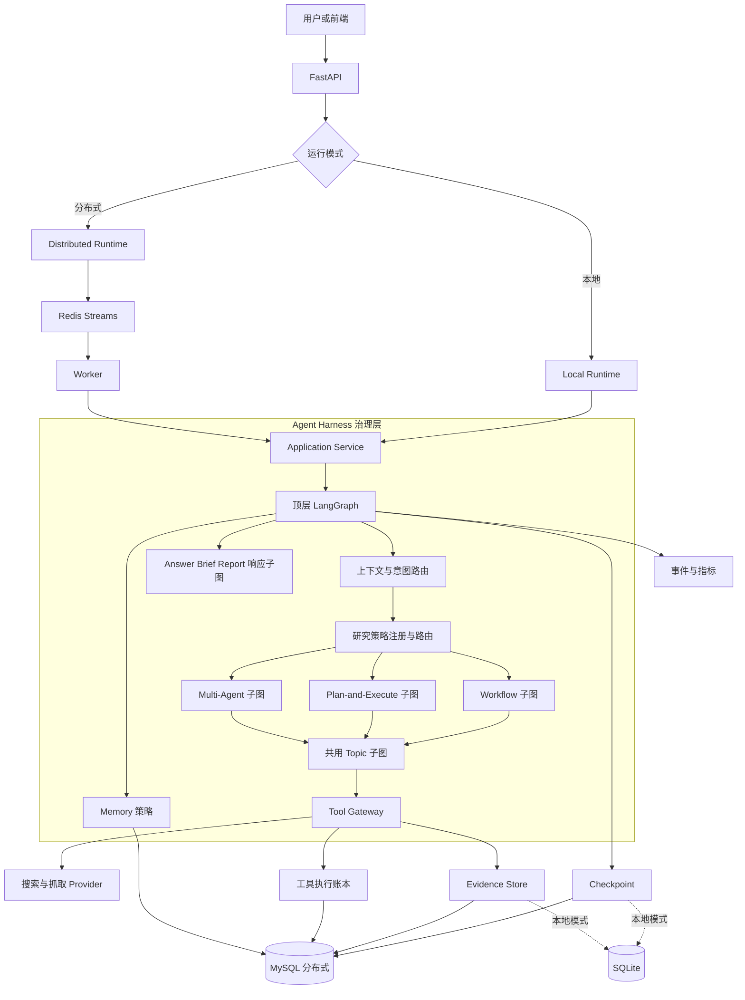
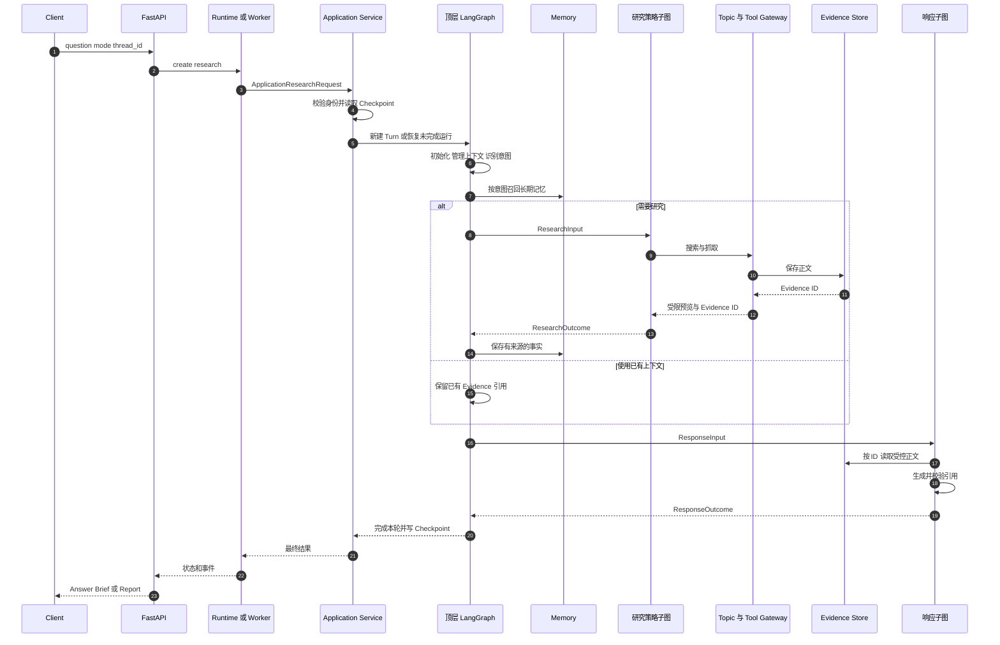
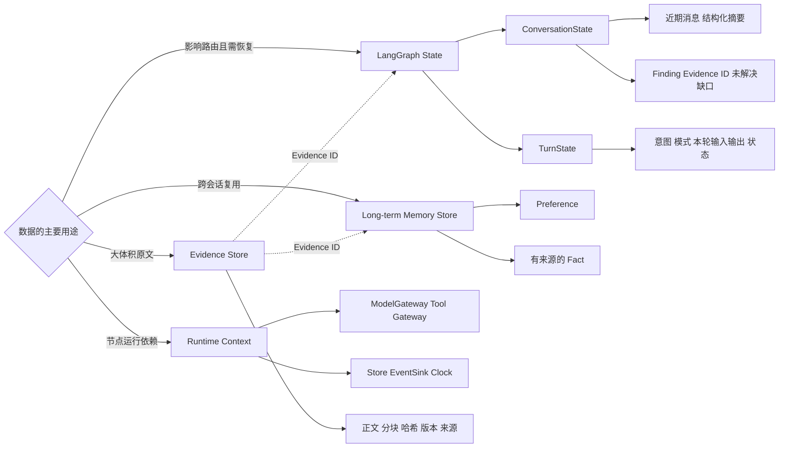
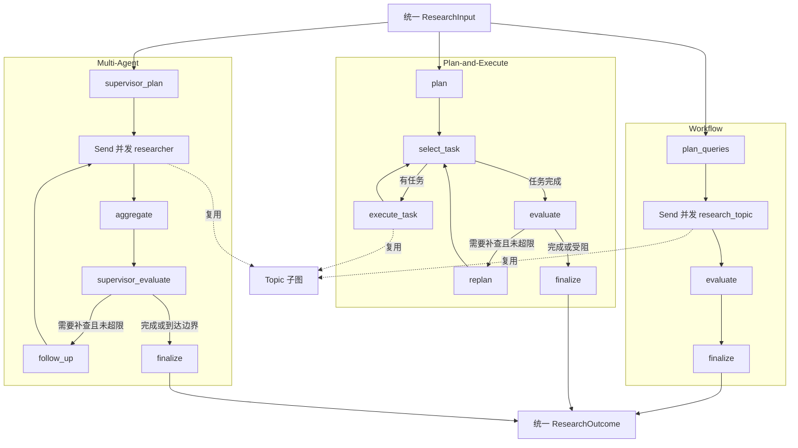
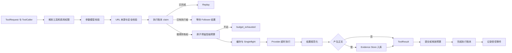
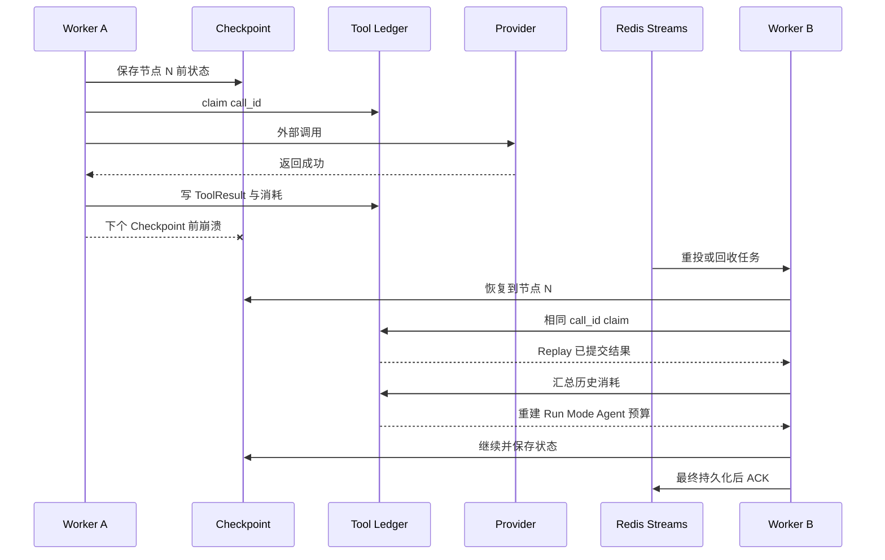

# 多模式深度研究 Agent 面试与学习指南

这份材料按当前代码编写，用于理解架构、准备项目介绍和应对面试追问。项目中的 Agent Harness 是一套运行治理机制，由顶层 LangGraph、统一状态契约、运行时依赖、策略注册、模型与工具网关、证据与记忆存储、Checkpoint、预算、执行账本和事件系统共同组成。它由多个模块共同实现，文档中也不会使用 HarnessGraph 或 Profile 这类自造概念。

## 怎样学习

建议分四遍阅读。

1. 先看核心模型、90 秒介绍和总体架构图。
2. 顺着请求时序图和代码调用链读源码。
3. 深入 State、Memory、Evidence、Tool Gateway 和恢复机制。
4. 遮住答案做最后的自测题。

真正理解的标准是给出一个请求后，能够指出它经过哪些模块、改变哪些状态、调用哪些函数、数据保存在哪里，崩溃后怎样继续。

## 一句话讲清项目

这是一个以 Agent Harness 统一运行治理的多模式深度研究 Agent。三种 LangGraph 研究策略共享模型、工具、证据、记忆、预算和恢复机制，在不同研究路径下都返回可验证的统一结果。

## 核心模型

| 层次 | 核心问题 | 项目中的实现 |
| --- | --- | --- |
| 接入层 | 请求怎样进入 | FastAPI、Local Runtime、Distributed Runtime、Worker |
| Harness 治理层 | 所有策略遵守什么规则 | 顶层运行图、State、Runtime Context、Registry、Gateway、Checkpoint、Memory |
| 研究策略层 | 证据怎样获得 | Workflow、Plan-and-Execute、Multi-Agent、共用 Topic 子图 |
| 响应层 | 证据怎样表达 | Answer、Brief、Report 响应子图与引用校验 |

Harness 可以概括成五个统一。

- 统一入口和身份，使用 `run_id`、`thread_id` 和强类型请求契约。
- 统一状态和依赖，业务进度进入 State，客户端与服务进入 Runtime Context。
- 统一策略接口，三种研究子图都接收 `ResearchInput`，返回 `ResearchOutcome`。
- 统一外部调用，模型经过 ModelGateway，工具经过 Tool Gateway。
- 统一可靠性，Checkpoint、执行账本、预算恢复、租约和事件记录共同工作。

## 90 秒项目介绍

我独立开发了一个多模式深度研究 Agent，用来处理需要网页检索、原文阅读、信息查证和引用回答的开放问题。

项目核心是我基于 LangGraph 设计的一套 Agent Harness。LangGraph 负责状态图、条件路由、并行派发、子图和 Checkpoint。Harness 规定整次运行怎样管理状态、依赖、模型、工具、证据、记忆、预算和故障恢复。

研究层有 Workflow、Plan-and-Execute 和 Multi-Agent 三种策略。它们通过统一的 `ResearchInput` 和 `ResearchOutcome` 接入顶层图，并共用一个 Topic 研究子图。Workflow 适合固定流程和快速研究，Plan-and-Execute 支持任务拆解与有界重规划，Multi-Agent 由 Supervisor 拆分方向，再并行调度多个 Researcher。

所有网络调用都进入 Tool Gateway，先完成权限、参数和 URL 安全校验，再处理幂等账本、预算预留、缓存、超时和证据入库。网页正文只进入 Evidence Store，图状态保存 Evidence ID，避免 Checkpoint 膨胀。

会话状态使用滑动窗口和结构化摘要压缩，长期记忆只保存明确偏好和有证据支持的事实。分布式模式下 MySQL 保存权威状态、Checkpoint、证据和执行账本，Redis Streams 负责任务投递与实时通知。任务中断后，Checkpoint 恢复执行位置，工具账本复用已经完成的调用并重建预算。

## 3 分钟项目介绍

我做的是一个多模式深度研究 Agent，目标是让复杂问题既能使用不同研究策略，也遵守统一的工程治理。系统可以搜索网页、读取原文、提取有来源支持的 Finding，最后生成带引用的普通回答、摘要或正式报告。默认返回自然、简洁的 Answer，只有用户明确要求报告时才进入 Report 响应图。

项目以 Agent Harness 为主线。这里的 Harness 是我在项目中定义的一组运行协议和模块边界。LangGraph 提供 `StateGraph`、条件边、`Send` 并发、子图、Reducer 和 Checkpoint。Harness 再规定这些能力怎样被使用，包括 State 与 Runtime Context 的边界、研究策略契约、模型和工具调用规则、证据和记忆的所有权、预算、错误处理、恢复和观测。

一次请求进入后，Application Service 校验 `thread_id`，创建本轮 `TurnState`，并通过 Checkpoint 判断这是新会话、同一会话的新一轮，还是中断任务恢复。顶层运行图随后初始化本轮、裁剪和压缩上下文、识别意图、按需召回长期记忆，再把研究请求路由到对应策略子图。

Workflow 先生成有限查询，再用 `Send` 并发执行 Topic 子图，最后评估证据。Plan-and-Execute 先拆解任务，按任务逐项执行，评估后可以在上限内重规划。Multi-Agent 中 Supervisor 只负责拆分、评估和补充研究方向，Researcher 才能进入 Topic 子图调用网络工具。这个权限边界让预算归属、失败隔离和全局决策更清楚。

三个策略共用 Topic 子图。Topic 子图负责搜索、筛选安全 URL、并行抓取和返回 Evidence ID。工具调用全部经过 Tool Gateway。它先解析工具和调用者权限，再校验参数与 URL，之后查询执行账本。新调用会原子预留 Run、Mode、Agent 层级预算，再经过缓存和 Singleflight 执行 Provider。正文由 Evidence Store 规范化、分块和版本化，ToolResult 只返回受限预览与 Evidence ID。

当前计划、任务进度、Finding、Evidence ID 和未解决缺口属于可恢复的工作记忆，放在 LangGraph State。模型客户端、数据库连接、Gateway 和时钟属于 Runtime Context。网页正文体积大且有独立生命周期，只保存在 Evidence Store。

会话上下文保留近期原始消息，超过阈值后把较早消息压缩成结构化 `ConversationSummary`。长期记忆有独立写入门槛。用户明确要求记住时可以保存偏好，研究后的事实只有绑定 Evidence ID 才能写入。召回根据意图触发，并按关键词相关性、时效和置信度排序。

分布式模式使用 MySQL 保存运行记录、事件、Checkpoint、Evidence、长期记忆、线程租约和工具执行账本，Redis Streams 负责 at-least-once 任务投递，Pub/Sub 只负责唤醒 SSE 读取。Worker 通过运行租约和线程租约避免并发写同一任务或会话。崩溃恢复时，Checkpoint 决定从哪个图节点继续，执行账本避免重复使用已完成的工具结果，并重建已消耗预算。

## Harness 总体架构图

这张图回答三种策略不同，为什么仍然属于一个系统。



讲图时从中间开始。顶层图管理公共生命周期，策略子图决定怎样研究，Gateway 管理外部调用，存储层管理可恢复事实。本地模式的 Checkpoint 和 Evidence 使用 SQLite，工具账本与长期记忆只在进程内保存。分布式模式才把四类数据统一持久化到 MySQL。

## 单次请求时序图



## State、Memory 与 Evidence 所有权图



- 继续执行必须知道的业务事实进入 State。
- 客户端、连接、Gateway 和时钟进入 Runtime Context。
- 体积大、生命周期独立的内容进入专用 Store，State 只留引用。

## 三种研究策略子图



| 策略 | 决策方式 | 并发方式 | 适用问题 | 主要成本 |
| --- | --- | --- | --- | --- |
| Workflow | 一次生成查询，固定向前执行 | 查询和页面抓取并行 | 边界清晰、快速覆盖 | 灵活性较低 |
| Plan-and-Execute | 执行后评估并有界重规划 | 当前按任务顺序，任务内抓取并行 | 多步骤、资料缺口补全 | 调用次数与时延更高 |
| Multi-Agent | Supervisor 拆分和评估 | 多个 Researcher 并行 | 多方向独立覆盖 | 协调和重复研究成本更高 |

当前 Plan-and-Execute 使用查询列表逐项执行，并未实现依赖 DAG。Multi-Agent 的 Researcher 复用受控 Topic 子图，自主范围受到图和工具权限约束。这些边界在面试中要说准确。

## Tool Gateway 执行管道



| 机制 | 解决的问题 |
| --- | --- |
| Cache | 相同输入的数据能否复用 |
| Singleflight | 同一时刻的相同请求能否只访问一次 Provider |
| Execution Ledger | 同一个逻辑 `call_id` 是否已经完成，恢复后能否 Replay |

Gateway 先校验再占预算，因为无权限、参数错误或 URL 不安全的请求不应消耗额度。校验通过后必须先预留预算，再执行并发调用，否则多个 Researcher 可能一起穿透上限。

## 崩溃恢复时间线



Checkpoint 保存图状态和下一执行位置。执行账本保存工具调用的逻辑身份、所有权、结果和预算消耗。两者共同使用才能支持外部调用节点的可靠重放。

Provider 已成功但 Worker 在账本提交前崩溃时，恢复后仍可能再次调用。搜索和抓取属于读操作，重复一般可接受。支付、发信等写操作还需要 Provider 幂等键、事务发件箱或补偿机制。

## 项目目录地图

| 路径 | 主要职责 | 关键入口 |
| --- | --- | --- |
| `backend/src/deeptrace/api.py` | HTTP、SSE、选择本地或分布式 Runtime | `create_app`、`_build_runtime` |
| `application/` | 组装 Harness，建立唯一应用入口 | `build_harness_runtime`、`ResearchApplicationService.invoke` |
| `domain/` | 强类型领域契约 | `ResearchInput`、`ResearchOutcome`、`ToolRequest` |
| `harness/` | 顶层图、State、Context、注册与公共策略 | `build_agent_runtime_graph`、`HarnessState`、`HarnessContext` |
| `strategies/` | 三种策略和共用 Topic 子图 | 四个 `build_*_graph` 函数 |
| `responses/` | Answer、Brief、Report 与引用校验 | `build_response_graph`、`validate_citations` |
| `tools/` | Gateway、权限、安全、预算、缓存 | `AgentToolGateway.execute` |
| `persistence/` | MySQL 或 SQLite 持久化 | Checkpointer、Repository、Ledger、Evidence、Memory Store |
| `runtime/` | 本地执行与分布式 API 侧运行 | `LocalResearchRuntime`、`DistributedResearchRuntime` |
| `queue/` | Redis Streams、取消与事件唤醒 | `RedisResearchBroker` |
| `worker/` | 消费、租约续期、执行和最终提交 | `ResearchWorker.process`、`_monitor` |
| `observability/` | 受控事件与聚合指标 | `HarnessEventRecorder.emit` |
| `backend/alembic/` | MySQL Schema 迁移 | `alembic upgrade head` |
| `backend/tests/` | 契约、图、Gateway、恢复与分布式测试 | 当前收集到 374 个非真实调用测试 |

## 主要模块和函数

### 运行组装

`application/assembly.py` 是组合根，也是最适合先读的文件。

- `build_harness_runtime` 创建模型、研究子图、响应子图、顶层图和 Context 工厂。
- `_build_durable_stores` 选择 MySQL 或本地 SQLite。
- `_budgets_for_run` 建立 Run、Mode、Agent 三层额度。
- `_SeededBudgets._ensure` 从持久化工具账本重建恢复后的已消耗额度。
- `HarnessRuntimeBundle.aclose` 关闭数据库连接池、HTTP 客户端和浏览器资源。

组合根集中创建基础设施依赖，图节点只通过接口使用它们，因此测试可以替换 Gateway 和 Store。

### 应用入口

`application/research.py` 把 HTTP 或 Worker 请求转换成图调用。

- `ApplicationResearchRequest` 约束运行身份、问题和模式。
- `ResearchApplicationService.invoke` 校验 `thread_id`，读取 Checkpoint，区分新会话、新一轮和中断恢复。
- `_extract_outcome` 保证图必须产生合法 `ResponseOutcome`。

`run_id` 表示一次具体运行，`thread_id` 表示一条会话。多个 run 可以属于同一个 thread。恢复同一个未完成 run 时，应用层向图传入 `None`，沿 Checkpoint 继续。新一轮只传新的 `turn`，已持久化的 `conversation` 会被保留。

### 顶层运行图

`harness/graph.py` 管理公共生命周期。

- `build_agent_runtime_graph` 定义节点和条件路由。
- `_initialize_turn` 写用户消息并切换运行状态。
- `_manage_context` 执行滑动窗口与结构化摘要压缩。
- `_classify_intent` 判断研究、补查、普通回答、模式切换和记忆更新。
- `_recall_memory` 按意图召回长期记忆。
- `_mode_node` 解析策略、构造 `ResearchInput` 并校验 `ResearchOutcome`。
- `_consolidate_memory` 把有 Evidence 支持的 Finding 筛选为长期 Fact。
- `_select_response_mode` 与 `_response_node` 执行响应子图。
- `_finalize_turn` 写助手消息并确定 completed 或 partial。

### State 与 Runtime Context

`harness/state.py` 定义两块状态。

- `ConversationState` 跨同一 thread 的多次运行存在，保存消息、摘要、当前模式、Evidence ID、Finding 和未解决缺口。
- `TurnState` 只描述当前 run，保存输入、意图、策略、研究结果、响应结果和状态。
- `merge_conversation` 是 Reducer，合并消息和受控字段，并拒绝未知字段。
- `new_conversation` 与 `new_turn` 创建初始状态。

`harness/context.py` 定义节点依赖协议。`HarnessContext` 包含身份、ModelGateway、Tool Gateway、Evidence Store、EventSink、Clock 和 Memory Store。Context 不进入 Checkpoint，节点换到新 Worker 后由组合根重新创建。

### 四个研究子图

`strategies/workflow/` 中的主要函数如下。

- `build_workflow_research_graph` 编译固定流程。
- `build_plan_queries_node` 生成有限查询。
- `route_topics` 使用 `Send` 并发派发。
- `evaluate_node` 只接受引用真实 Evidence ID 的 Finding。
- `finalize_node` 生成统一 `ResearchOutcome`。

`strategies/plan_execute/` 中的主要函数如下。

- `build_plan_execute_research_graph` 编译计划执行流程。
- `build_plan_node` 生成最多六个研究任务。
- `select_task_node` 逐项选择任务。
- `build_execute_task_node` 调用 Topic 子图。
- `evaluate_node` 决定 complete、replan 或 block。
- `build_replan_node` 在最多两次的边界内补充任务。

`strategies/multi_agent/` 中的主要函数如下。

- `build_multi_agent_research_graph` 编译 Supervisor 与 Researcher 协作。
- `build_supervisor_plan_node` 拆分研究方向。
- `route_researchers` 用 `Send` 并行派发 Researcher。
- `build_researcher_node` 为 Researcher 构造独立 caller_id 并调用 Topic 子图。
- `supervisor_evaluate_node` 判断证据是否充分。
- `build_follow_up_node` 生成不重复的新方向。
- `build_finalize_node` 收敛为 `ResearchOutcome`。

`strategies/topic/` 是共同复用的原子研究流程。

- `search_node` 构造稳定 `call_id` 并调用 `search_web`。
- `select_urls_node` 从受限预览中解析并校验 URL。
- `route_fetches` 并行派发页面抓取。
- `fetch_page_node` 只访问搜索结果授权的 URL，并调用 `fetch_page`。
- `TransientToolError` 把瞬时错误交给节点级 `RetryPolicy`，最多尝试三次。

### 响应子图

`responses/graph.py` 用同一条 `load_evidence → generate → validate` 拓扑构建三种响应。

- `build_answer_graph` 面向简洁回答，上限 2000 字符。
- `build_brief_graph` 面向结构化摘要，上限 8000 字符。
- `build_report_graph` 面向正式报告，上限 50000 字符。
- `load_evidence_node` 按 ID 加载 Evidence。
- `build_generate_node` 读取受控正文片段并调用 responder。
- `build_validate_node` 校验引用，无可信引用时返回 partial 降级结果。

`responses/citations.py` 中的 `select_response_mode` 只在用户明确要求报告、摘要或简报时改变输出形式。`validate_citations` 保证引用标记只能映射到实际加载的 Evidence。

### 工具、证据与记忆

`tools/gateway.py` 中的 `AgentToolGateway.execute` 是所有工具调用的统一边界。`tools/policy.py` 管理调用者权限和 URL 安全。`tools/budget.py` 中的 `reserve`、`commit`、`release` 管理层级额度。`tools/execution_store.py` 定义幂等协议，分布式实现位于 `persistence/execution_ledger.py`。

`persistence/evidence_store.py` 保存正文、规范 URL、内容哈希、分块和版本。正文变化时创建新版本，旧版本变为 superseded。

`harness/memory/write.py` 中的 `MemoryWritePolicy.can_store` 决定能否写入，`remember` 负责幂等和版本更新。`recall.py` 中的 `should_recall` 决定触发时机，`select_memories` 按关键词、时效和置信度排序。`forget.py` 定义过期、陈旧和删除状态。

当前遗忘策略和测试已经存在，但自动定时清扫尚未接入 Worker 调度。面试时应说“遗忘生命周期已经建模，自动清扫属于待接入项”。

### Checkpoint、MySQL、Redis 与 Worker

`persistence/checkpoint.py` 中的 `SqlAlchemyCheckpointSaver` 实现 LangGraph `BaseCheckpointSaver` 接口，生产使用 MySQL，本地和测试可使用 SQLite。它是项目基于 SQLAlchemy 编写的 Checkpointer，不能描述为安装一个官方 MySQL 依赖后直接完成。

`DistributedResearchRuntime.create` 先申请 thread lease，再保存运行并投递 Redis Stream。`RedisResearchBroker` 提供消费组、任务回收、ACK、取消键和 Pub/Sub 通知。

`ResearchWorker.process` 先申请 run lease，再检查重试与取消，随后运行 Harness 并持久化事件。`_monitor` 周期续期 run lease 和 thread lease。最终结果写入 MySQL 后才 ACK 消息。

MySQL 是权威事实来源，Redis 用于传递和唤醒。SSE 收到通知后仍从 MySQL 读取带事件 ID 的记录，因此 Pub/Sub 丢失一次通知不会改变最终事实。

## 从请求到回答的代码调用链

```text
POST /researches
  → api.create_research
  → DistributedResearchRuntime.create
  → acquire_thread_lease → repository.create → broker.enqueue

ResearchWorker.process
  → repository.claim
  → HarnessResearchRunner.__call__
  → ResearchApplicationService.invoke
  → 顶层 LangGraph
  → initialize_turn → manage_context → classify_intent → recall_memory
  → StrategyRegistry.resolve
  → 某个研究策略子图
  → Topic 子图
  → AgentToolGateway.execute
  → Evidence Store 与 Tool Ledger
  → ResearchOutcome
  → ResponseGraphRegistry.resolve
  → load_evidence → generate → validate
  → ResponseOutcome → finalize_turn
  → repository.complete → broker.ack
```

本地模式由 `LocalResearchRuntime._execute_through_harness` 直接进入 `ResearchApplicationService.invoke`，没有 Redis 和独立 Worker。顶层 Harness、策略、Tool Gateway、Evidence 和响应流程仍然共用。

## 记忆设计完整回答

### 工作记忆

工作记忆是任务的可恢复执行事实，包括计划、已完成任务、查询结果、Finding、Evidence ID、未解决缺口和结束原因。它影响后续路由，因此进入策略 State 或顶层 State。

### 短期会话记忆

近期原始消息和结构化 `ConversationSummary` 保存在 `ConversationState`。当前按消息条数控制窗口，软上限 24，硬上限 60。超出窗口的旧消息由 summarizer 压缩为主题、用户约束、已确认事实、实体、未解决问题和历史结论。摘要字段还有数量上限，防止多轮压缩后无限增长。

当前触发条件按消息数量实现，还没有按真实 Token 精确计算。Token 感知压缩属于下一步优化。

### 长期记忆

长期记忆跨 thread 或 session 复用。当前主要落地两类内容。

- Preference 保存用户明确要求记住的稳定偏好。
- Fact 保存研究整理出的可信事实，写入时必须绑定 Evidence ID。

系统不会把所有聊天直接存入长期记忆。聊天包含临时要求、错误信息、过时结论和敏感内容，全量保存会提高召回噪声、成本与隐私风险。

### 六个生命周期问题

| 问题 | 当前实现 |
| --- | --- |
| 何时存 | 用户明确要求记住，或研究结束后整理有来源的 Finding |
| 存什么 | 稳定偏好、有 Evidence 支持的事实，不存完整聊天、正文和隐藏推理 |
| 如何组织 | `("user", user_id, "preferences")` 与 `("workspace", workspace_id, "facts")` |
| 何时召回 | Research、Incremental Research、Report Request 等需要历史信息的意图 |
| 如何更新 | 相同内容幂等复用，变化内容生成新版本并 supersedes 旧版本 |
| 如何遗忘 | expires、stale、逻辑删除和物理删除，自动清扫尚待接入 |

当前 API 组合根注入固定的 `local-user` 与 `local-workspace`，所以部署仍是单租户。数据结构预留了 namespace，真正的多租户隔离需要先接入认证身份。

## 高频面试问题与答案

### 1. Harness 和 LangGraph 分别负责什么

LangGraph 提供 State、Node、Edge、条件路由、Reducer、`Send` 并发、子图、RetryPolicy 和 Checkpoint。Harness 定义项目怎样使用这些能力，规定状态边界、依赖注入、策略契约、外部调用入口、预算与权限、Evidence 与 Memory 所有权、恢复规则和观测字段。

### 2. Harness 是一个类或第三方框架吗

它是项目定义的一组运行规则及实现边界。顶层图、State、Context、注册表、Gateway、Store、Checkpoint 和事件系统合在一起构成 Harness，并不对应某一个类或外部框架。

### 3. 为什么三种模式都做成策略子图

三种策略都有各自的状态、路由和终止条件。子图提供一致的调用、恢复、观测和测试方式。顶层只依赖 `ResearchInput → ResearchOutcome`，内部计划和 Agent 状态不会泄漏。

### 4. 为什么还要 Topic 子图

三种策略最终都要搜索、筛选 URL、抓取页面和收敛错误。Topic 子图复用这段原子流程，并确保所有网络调用都经过同一个 Tool Gateway。策略只决定研究哪些方向和是否补查。

### 5. 工作记忆为什么属于 State

计划剩余任务决定下一节点，未解决缺口决定是否重规划，Evidence ID 决定响应读取哪些正文。这些事实可序列化且恢复后仍需要，所以属于 State。

### 6. Runtime Context 为什么不进入 Checkpoint

连接、客户端、锁、Gateway 和时钟是进程资源，不代表业务进度，也无法稳定序列化。换 Worker 后由组合根重新创建即可。

### 7. Evidence 正文为什么不能放进 State

正文很大。进入 State 会让每个 Checkpoint 重复写入，增加数据库体积与恢复时间，也容易挤占模型上下文。Evidence Store 管理正文生命周期，State 只保存 ID。

### 8. Finding 和 Evidence 有什么区别

Evidence 是来源记录和正文。Finding 是模型依据 Evidence 提炼出的主张，并绑定 Evidence ID。前者回答资料从哪里来，后者回答资料支持什么结论。

### 9. Tool Gateway 为什么先校验再预留预算

无权限、参数错误和不安全 URL 不应消耗额度。校验通过后原子预留，可以避免并发 Researcher 同时看见余额充足并一起超限。

### 10. Ledger 为什么在预算预留之前

同一 `call_id` 已完成时可以直接 Replay，无需再次访问 Provider 或扣费。Follower 只等待 owner 的结果。只有新的 owner 才需要预留预算。

### 11. Cache、Singleflight 和 Ledger 有什么区别

Cache 复用相同数据输入，Singleflight 合并同一时刻的相同请求，Ledger 记录同一逻辑调用并支持崩溃恢复。它们的 key、生命周期和目标不同。

### 12. 为什么重试由 LangGraph 节点负责

项目让一类错误只有一个重试所有者。Gateway 把异常转换成稳定错误码，Topic 节点把瞬时错误提升为 `TransientToolError`，节点级 RetryPolicy 再重放，避免 SDK、Gateway、节点三层重试相乘。

### 13. Checkpoint 为什么不能单独解决重复调用

节点完成外部调用后、写下一个 Checkpoint 前可能崩溃，恢复会再次进入节点。执行账本用稳定 `call_id` 记录已提交结果，节点重放时才能直接复用。

### 14. 系统能保证 exactly-once 吗

不能绝对保证。内部使用 at-least-once 投递，加租约、条件更新和工具账本控制重复。Provider 成功而账本未提交的窗口仍存在。读操作可容忍，写操作需要 Provider 幂等键或补偿。

### 15. 恢复后预算怎样重建

工具账本记录 mode、caller_id 和实际消耗。新 Worker 第一次预留前，`_SeededBudgets` 调用 `tool_usage_for_run`，把历史消耗展开成 Agent、Mode 和 Run 三层计数，再播种到新的内存 BudgetManager。

### 16. 预算为什么仍使用内存管理器

一个活跃 run 由租约保证只有一个有效 Worker，进程内锁可以高效处理并发 Researcher。崩溃后的持久事实由 SQL Ledger 恢复，实现运行态计数和持久化事实分离。

### 17. MySQL 和 Redis 怎样分工

MySQL 保存运行、事件、Checkpoint、Evidence、Memory、租约和工具账本。Redis Streams 投递任务，取消键传播信号，Pub/Sub 唤醒 SSE。最终事实都从 MySQL 读取。

### 18. 为什么采用 at-least-once

Worker 在最终结果写入 MySQL 后才 ACK。提前崩溃时消息可被其他消费者回收。重复投递由 run lease、条件更新和执行账本处理，这比提前 ACK 更不容易丢任务。

### 19. run lease 和 thread lease 有什么区别

run lease 防止两个 Worker 同时执行一个 run。thread lease 防止同一会话同时启动两个 run，避免两个 Turn 并发修改 ConversationState。Worker 心跳同时续期两种租约。

### 20. Multi-Agent 为什么不允许 Supervisor 直接联网

Supervisor 负责拆分、覆盖评估和补查决策，Researcher 负责外部研究。分开后最小权限、预算归属、失败隔离和上下文边界更清楚。权限由 Tool Gateway 统一执行。

### 21. Researcher 怎样隔离状态

每个 Researcher 由 `Send` 获得独立 `ResearcherBranchState` 和 caller_id，结果通过 Reducer 合并为 Evidence、outcome 和 gap。它们共享受控 Gateway 与 Store，不共享随意可写的消息列表。

### 22. Multi-Agent 一定优于 Plan-and-Execute 吗

多个方向相互独立时，并发 Researcher 能提高覆盖和速度。任务有强前后依赖时，Plan-and-Execute 更适合。简单问题使用 Multi-Agent 会增加模型调用、重复检索和协调成本。

### 23. 长期记忆为什么不能保存所有聊天

长期记忆面向稳定复用，聊天里还有临时要求、错误信息和过时内容。全量保存会带来召回噪声、隐私风险和错误累积。偏好要求用户明确，事实要求 Evidence 支持。

### 24. 长期记忆是工具调用吗

当前没有开放成 Agent 可以任意决定的 Tool Call。召回、写入和整理是顶层 Harness 的确定性节点与策略，触发时机、权限和数据类型更可控。研究工具中的 `search_memory` 面向资料检索，也不等于随意写用户记忆。

### 25. 短期记忆和工作记忆有什么区别

短期会话记忆关注用户说过什么，主要是近期消息和摘要。工作记忆关注任务做到哪里，主要是计划、步骤、Finding、Evidence ID 和缺口。两者都可以在 State 中，但用途与生命周期不同。

### 26. 动态压缩怎样防止摘要增长

系统只压缩滑出窗口的旧消息，并把新摘要与旧摘要做有界合并。约束、事实、实体、问题和结论都有条目上限。模型失败时仍执行确定性裁剪。

### 27. 为什么默认普通回答，报告显式触发

研究深度和表达篇幅是两个正交维度。深度研究不代表用户每次都想读长报告。默认 Answer 降低阅读负担和生成成本。明确要求后再进入 Report，并使用更大的正文片段和输出上限。

### 28. 引用可信怎样保证

响应子图只加载允许的 Evidence ID，并把加载顺序映射为引用编号。生成后 `validate_citations` 删除无法映射的标记。完全没有可信引用时返回 partial 降级结果。

### 29. 为什么研究策略和响应模式分开

研究策略决定怎样取得证据，响应模式决定怎样表达证据。Multi-Agent 可以输出 Answer，Workflow 也可以生成 Report。拆开后可以独立控制研究成本和输出形式。

### 30. 为什么 request 和 config 都要校验 thread_id

Checkpointer 根据 config 的 thread_id 定位状态，业务请求也携带 thread_id。两者不一致可能把一个 Turn 写入另一个会话。应用入口在副作用发生前阻止身份错配。

### 31. 强类型 ResearchInput 和 ResearchOutcome 有什么价值

它们隔离顶层图和策略实现，提供类型、长度和唯一性约束。新增策略只要遵守契约就能接入，顶层无需理解它的私有 State。

### 32. 为什么 ModelGateway 比 Tool Gateway 简单

当前 ModelGateway 主要统一模型实例和角色参数覆盖。工具涉及权限、URL 安全、预算、幂等、缓存、正文和并发，治理更复杂。结构化模型输出目前主要由节点中的 Pydantic 解析与回退完成，未来可继续收敛到 ModelGateway。

### 33. 怎样处理部分成功

策略保留已经取得的 Evidence 和 Finding，把错误转为 unresolved gap 或 termination reason。响应仍可基于有效证据生成。顶层根据研究与响应完整度标记 completed 或 partial。

### 34. 当前架构最大的不足是什么

长期记忆自动清扫尚未调度，短期窗口按消息数而非精确 Token，ModelGateway 的结构化输出与模型预算治理还较轻，API 仍是固定身份的单租户。部分旧配置还保留 embedding 路径校验，但当前长期记忆召回没有启用向量重排。

### 35. 下一步优先做什么

先接入认证身份和真实 namespace 隔离，再使用模型 Token 计数驱动上下文压缩，并把遗忘生命周期接入周期任务。随后统一结构化模型调用、Token 预算和评测指标。策略接口稳定后再加入 Auto 路由。

## 压力追问

### 这是否只是把代码包了一层

如果只有一个 Facade，价值确实有限。本项目约束的是跨策略一致的运行语义。任何网络工具都经过权限、安全、预算和账本，任何正文都进入 Evidence Store，任何策略都返回同一 Outcome，任何恢复都同时考虑 Checkpoint 和外部调用账本。这些边界都有对应测试。

### 为什么不用一个大图

一个大图会把 Workflow 查询队列、Plan-and-Execute 计划和 Multi-Agent Researcher 状态混在同一 State。子图封装私有状态与终止条件，顶层只保留公共生命周期，也能独立测试每种策略。

### 为什么不用一个开放 Agent 决定所有步骤

完全开放的控制流会让预算、权限、恢复和终止更难预测。项目把生命周期和安全规则固定在图中，把查询规划、证据评估和写作交给模型，保留推理能力的同时控制副作用。

### Checkpoint 是否等于业务数据库

不等于。Checkpoint 保存图状态和 pending writes。运行状态、SSE 事件、租约、Evidence、Memory 和 Tool Ledger 都有独立业务表，通过 `run_id` 和 `thread_id` 关联。

### MySQL 是否来自 LangGraph 官方现成适配器

当前项目的 `SqlAlchemyCheckpointSaver` 实现 `BaseCheckpointSaver` 接口，并支持 MySQL 与 SQLite。不要声称只安装一个官方 MySQL 包就完成了接入。

## 面试回答方法

遇到架构问题时按四步组织。

1. 先说问题。例如多个策略各自调用工具会造成重试、预算和证据规则不一致。
2. 再说设计。例如建立 Tool Gateway，让所有 Topic 节点只依赖统一接口。
3. 说明原因。例如校验后原子预留预算可以控制并发穿透。
4. 主动给边界。例如 Provider 成功但账本未提交时仍可能重复，需要外部幂等能力。

这种回答比只念模块名更可信，也更容易接住下一层追问。

## 源码学习路线

第一轮看主干。

1. `application/assembly.py`
2. `application/research.py`
3. `harness/graph.py`
4. `harness/state.py`
5. `harness/context.py`

第二轮看四个研究子图。

1. `strategies/workflow/`
2. `strategies/plan_execute/`
3. `strategies/multi_agent/`
4. `strategies/topic/`

第三轮看治理边界。

1. `tools/gateway.py`
2. `tools/policy.py`
3. `tools/budget.py`
4. `tools/execution_store.py`
5. `persistence/evidence_store.py`
6. `responses/graph.py` 与 `citations.py`

第四轮看分布式恢复。

1. `runtime/distributed.py`
2. `queue/redis_streams.py`
3. `worker/service.py`
4. `persistence/repository.py`
5. `persistence/checkpoint.py`
6. `persistence/execution_ledger.py`

每一轮都用一个真实请求复述调用链。最后假设 Worker 在 Provider 调用前、账本提交后、最终 ACK 前三个位置崩溃，分别说明系统行为。

## 不看答案的自测题

- Harness 和 LangGraph 分别负责什么。
- 为什么三种研究策略都需要子图。
- 为什么还要复用 Topic 子图。
- 工作记忆为什么属于 State。
- Evidence 正文为什么不能进入 State。
- Runtime Context 为什么不参与 Checkpoint。
- Tool Gateway 为什么先校验再预留预算。
- Cache、Singleflight 和执行账本分别解决什么。
- Checkpoint 为什么不能单独解决重复调用。
- 恢复后的预算怎样重建。
- 长期记忆为什么不能保存全部聊天。
- 长期记忆何时写入、召回、更新和遗忘。
- Multi-Agent 为什么不允许 Supervisor 直接联网。
- run lease 和 thread lease 有什么区别。
- 为什么默认普通回答，报告需要单独触发。
- 当前实现有哪些边界，下一步怎样改。

如果某题只能说出一句定义，就回到源码找出至少一个类、一个函数和一条失败路径。能讲清失败路径，才算真正理解。

## 表述边界

- 使用“基于 LangGraph 实现统一 Agent Harness”，不要使用 HarnessGraph。
- 使用“研究策略子图”或“研究模式”，不要使用 Profile。
- 可以说支持同一 thread 的上下文延续，无需把连续追问作为独立卖点。
- 可以说 MySQL 支持分布式持久化，当前 Checkpointer 是项目自己的 SQLAlchemy 实现。
- 可以说长期记忆生命周期已建模，不能说自动清扫已经上线。
- 可以说命名空间预留隔离能力，当前部署仍是固定身份的单租户。
- 可以说降低和控制重复执行，不能承诺任意外部副作用 exactly-once。
- 当前收集到 374 个非真实调用测试，真实 API 冒烟覆盖了预算重建路径。测试数量变化后应重新确认。
