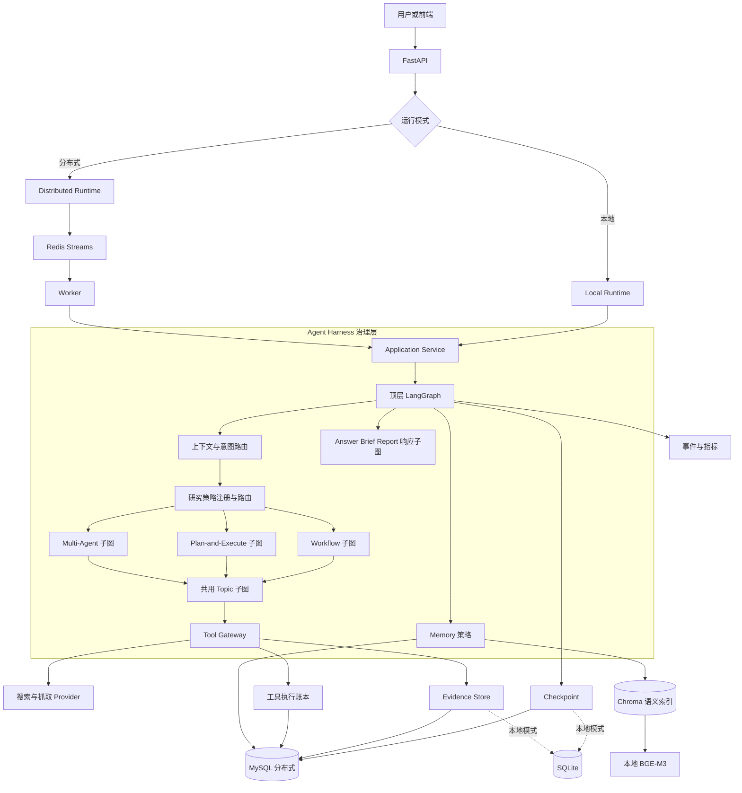
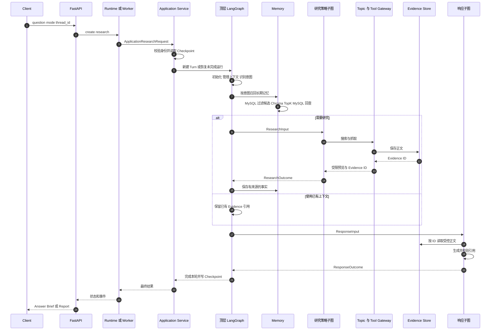
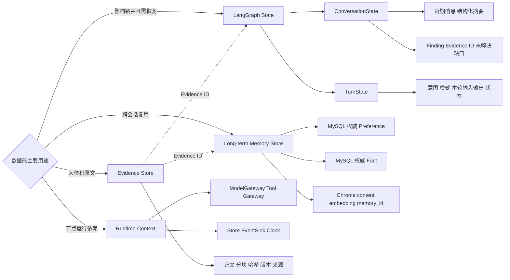
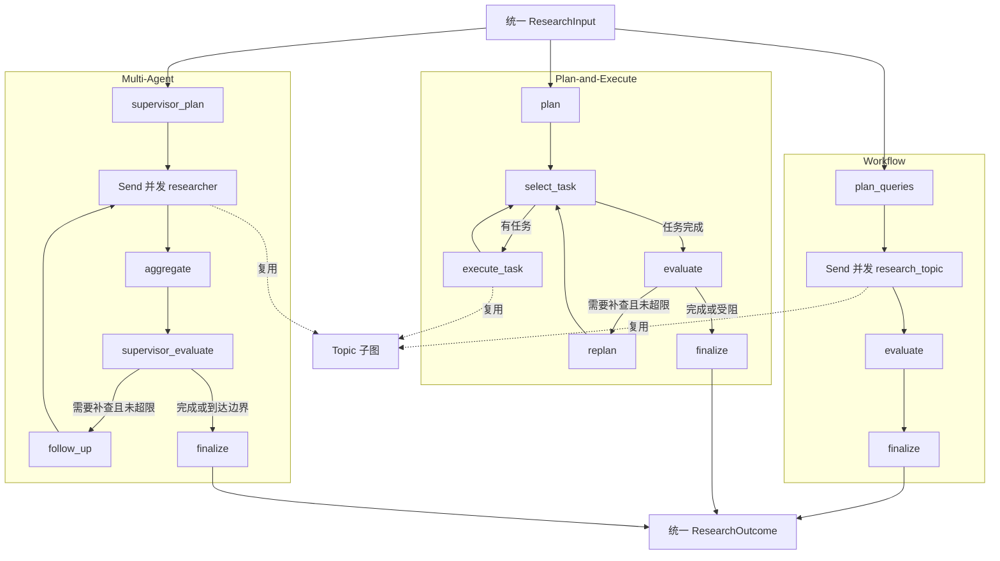
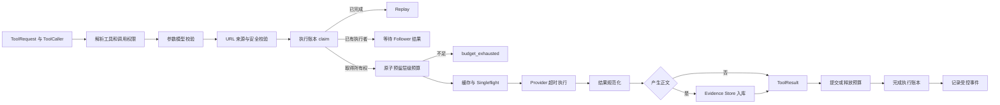
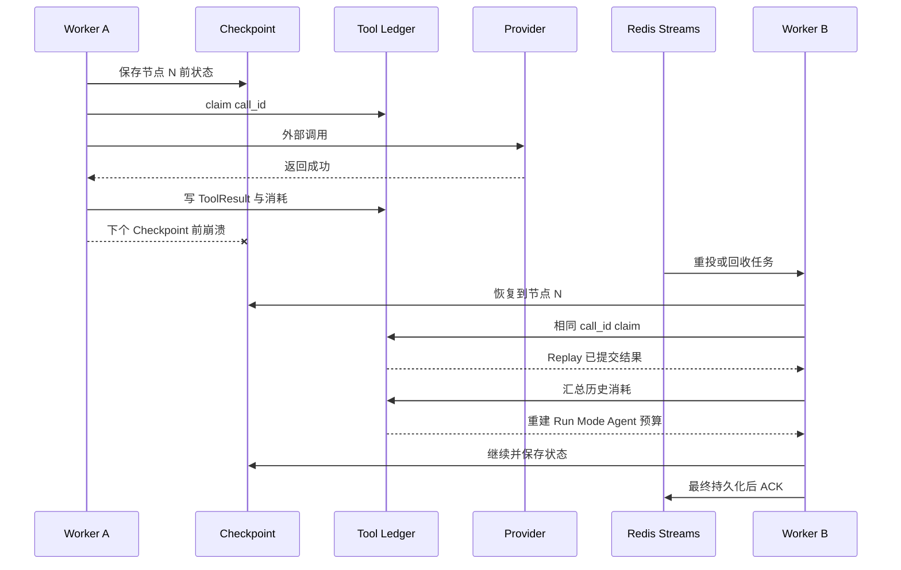

# Harness 总体架构

这一篇用六张图串起公共运行协议、请求流程、数据所有权、三种策略、工具调用和故障恢复。

## Harness 总体架构图

这张图回答三种策略不同，为什么仍然属于一个系统。

讲图时从中间开始。顶层图管理公共生命周期，策略子图决定怎样研究，Gateway 管理外部调用，存储层管理可恢复事实。本地模式的 Checkpoint 和 Evidence 使用 SQLite，工具账本与长期记忆只在进程内保存，Chroma 可以使用本地持久目录。分布式模式把权威记录放入 MySQL，Chroma 只保存由 BGE-M3 生成的长期记忆语义索引。

## 单次请求时序图

## State、Memory 与 Evidence 所有权图

- 继续执行必须知道的业务事实进入 State。
- 客户端、连接、Gateway 和时钟进入 Runtime Context。
- 体积大、生命周期独立的内容进入专用 Store，State 只留引用。

## 三种研究策略子图

| 策略 | 决策方式 | 并发方式 | 适用问题 | 主要成本 |
| --- | --- | --- | --- | --- |
| Workflow | 一次生成查询，固定向前执行 | 查询和页面抓取并行 | 边界清晰、快速覆盖 | 灵活性较低 |
| Plan-and-Execute | 执行后评估并有界重规划 | 当前按任务顺序，任务内抓取并行 | 多步骤、资料缺口补全 | 调用次数与时延更高 |
| Multi-Agent | Supervisor 拆分和评估 | 多个 Researcher 并行 | 多方向独立覆盖 | 协调和重复研究成本更高 |

当前 Plan-and-Execute 使用查询列表逐项执行，并未实现依赖 DAG。Multi-Agent 的 Researcher 复用受控 Topic 子图，自主范围受到图和工具权限约束。这些边界在面试中要说准确。

## Tool Gateway 执行管道

| 机制 | 解决的问题 |
| --- | --- |
| Cache | 相同输入的数据能否复用 |
| Singleflight | 同一时刻的相同请求能否只访问一次 Provider |
| Execution Ledger | 同一个逻辑 `call_id` 是否已经完成，恢复后能否 Replay |

Gateway 先校验再占预算，因为无权限、参数错误或 URL 不安全的请求不应消耗额度。校验通过后必须先预留预算，再执行并发调用，否则多个 Researcher 可能一起穿透上限。

## 崩溃恢复时间线

Checkpoint 保存图状态和下一执行位置。执行账本保存工具调用的逻辑身份、所有权、结果和预算消耗。两者共同使用才能支持外部调用节点的可靠重放。

Provider 已成功但 Worker 在账本提交前崩溃时，恢复后仍可能再次调用。搜索和抓取属于读操作，重复一般可接受。支付、发信等写操作还需要 Provider 幂等键、事务发件箱或补偿机制。

[返回阅读目录](00-阅读目录.md)
