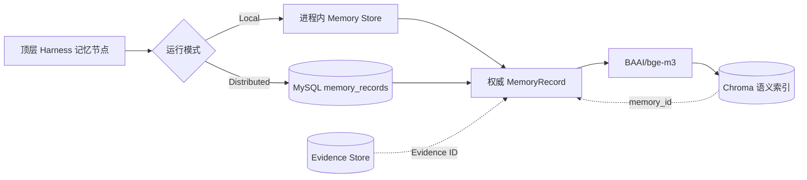
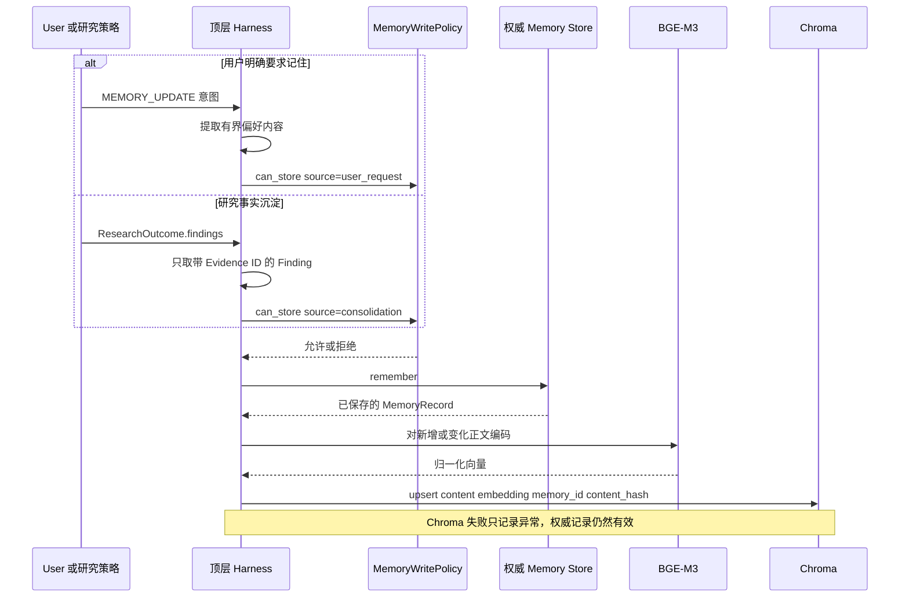
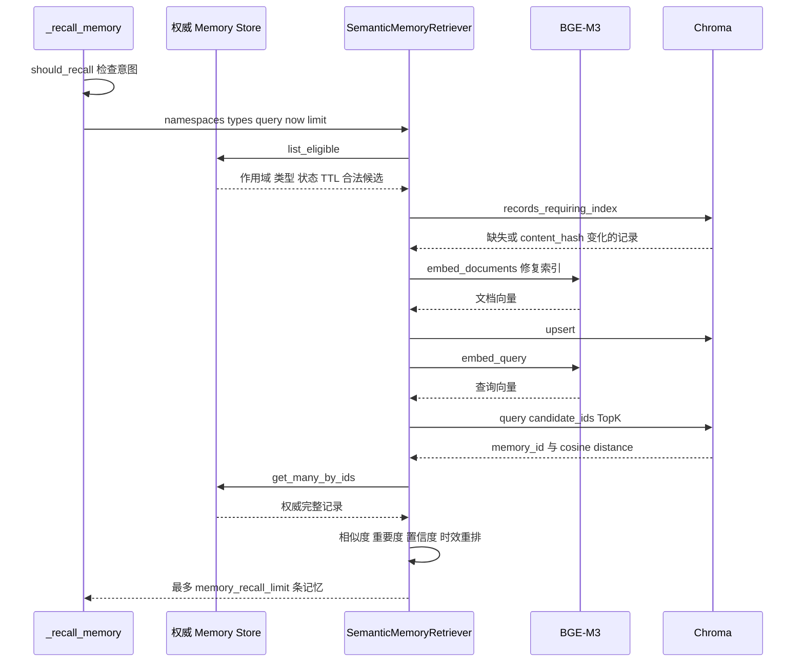

# 长期记忆源码与面试专题

这篇材料单独讲长期记忆。读完以后，应当能沿着一次真实请求说清何时存、存什么、如何组织、何时召回、如何更新、如何遗忘，也能说明 MySQL、BGE-M3 和 Chroma 各自拥有哪部分数据。

## 先建立一条主线

长期记忆由顶层 Harness 控制。研究策略不能随意写用户记忆，也不能直接查询 Chroma。顶层图根据意图决定是否召回，根据数据来源决定是否写入，Store 和向量索引分别承担权威保存与语义检索。

完整形态运行在 Distributed 模式。MySQL 保存权威记录，本地 BGE-M3 负责向量编码，Chroma 保存可重建的语义索引。Local 模式保留同一套接口和召回算法，权威记录暂存在 API 进程内，不能跨进程重启。

## 数据归谁所有

MySQL 中的 `MemoryRecord` 包含 namespace、type、subject、content、status、importance、confidence、版本、时间、TTL 和 Evidence 引用。结构化列用于候选过滤，JSON payload 保留完整领域对象。

Chroma 保存 memory_id、受限 content、embedding、content_hash 和少量检索元数据。它不决定一条记忆是否仍然有效，也不负责版本和权限。Chroma 中出现一条记录，不代表 Harness 有权召回它。

Evidence 正文继续由 Evidence Store 管理。长期记忆中的 Fact 只保存结论和 Evidence ID，不复制大段网页正文。

## 两条写入路径

### 用户偏好

`_classify_intent()` 识别用户明确的记忆更新请求，随后 `_memory_update_node()` 提取最多 2000 字符的内容，构造 user/preferences 命名空间下的 Preference。`MemoryWritePolicy.can_store()` 只接受 `user_request` 或 `repeated_preference` 来源的 Preference。

当前节点把整段偏好内容同时用作 subject 和 content。用户换一种说法时，subject 也可能变化，系统会把它当作另一条逻辑记忆。实体归一化和偏好冲突合并还没有实现。

### 研究事实

研究策略返回 `ResearchOutcome` 后，`_consolidate_memory()` 最多检查前 20 条 Finding。Fact 使用 workspace/facts 命名空间，content 保存 claim，source_evidence_ids 保存 Finding 引用的证据。没有 Evidence ID 的事实过不了写入策略。

Fact 的 subject 当前取 Finding ID。只有后续记录继续使用同一个 Finding ID，才会进入同一逻辑身份的版本链。系统还没有用实体、谓词或规范化主题识别语义冲突。

### 写入顺序

`remember()` 先写权威 Store，`_index_memory_best_effort()` 随后更新 Chroma。这个顺序保证索引故障不会让权威记录丢失。权威 Store 写入失败时，本轮节点失败，系统不会只在 Chroma 留下一条被当作成功的记忆。

## 召回路径

### 何时触发

`should_recall()` 当前会为 Research、Incremental Research 和 Report Request 返回真。普通上下文回答、模式切换和记忆写入不触发长期召回。顶层节点只查询 user/preferences 与 workspace/facts 两个命名空间。

### 结构化候选过滤

Distributed 模式调用 `SqlAlchemyMemoryStore.list_eligible()`，在 MySQL 中同时过滤 namespace、memory_type、status 和 expires_at。Local 模式调用 `InMemoryMemoryStore.list_eligible()` 完成同样的逻辑过滤。

候选只包括 ACTIVE 和 STALE，CANDIDATE、SUPERSEDED、EXPIRED 与 DELETED 不进入语义查询。TTL 已过期的记录也会被排除。MySQL 先给出 candidate_ids，Chroma 无法返回范围之外的记忆。

### 索引修复

`records_requiring_index()` 比较 Chroma metadata 中的 content_hash。候选在 Chroma 中缺失，或者同一 memory_id 的正文哈希发生变化时，Retriever 会重新生成向量并 upsert。这个修复发生在召回路径，不需要先完成一次全库重建。

### TopK 与最终重排

BGE-M3 使用本地 SentenceTransformer，生成 1024 维归一化向量。编码通过 `asyncio.to_thread()` 离开事件循环，并由异步锁限制同一模型实例上的并发 encode。

Chroma 使用 cosine 空间，只在 candidate_ids 中返回候选。Retriever 会多取最多 `limit * 3` 条命中，再按下面的权重排序。

| 因素 | 权重 |
| --- | --- |
| 向量相似度 | 70% |
| importance | 15% |
| confidence | 10% |
| recency | 5% |

重排完成后只返回 `memory_recall_limit` 条，默认值为 5。进入模型上下文的内容还会截断 subject 和 content，避免单条记忆无限扩大提示词。

## 故障时会发生什么

| 场景 | 当前行为 | 面试时应怎样描述 |
| --- | --- | --- |
| 权威 Store 写入失败 | 写入节点失败，不继续把 Chroma 当成成功结果 | 权威保存优先，索引不能替代数据库事务 |
| 权威 Store 成功，Chroma 写入失败 | 记录异常，记忆仍然有效 | 下一次召回根据 content_hash 尝试补索引 |
| Chroma 查询失败 | Retriever 捕获异常并调用 `select_memories()` | 系统降级为 ACTIVE 记忆上的确定性关键词、置信度和时效排序 |
| Chroma 留有已删除或过期 ID | 该 ID 不在权威 Store 给出的 candidate_ids 内 | 残留索引暂时占空间，但不能绕过生命周期过滤 |
| BGE-M3 路径缺失 | semantic 运行时组装失败 | 显式暴露配置错误；设置 lexical 后不创建 BGE 和 Chroma 客户端 |
| Local API 重启 | 进程内权威记忆丢失，本地 Chroma 可能留下孤立向量 | Local 只用于开发，跨重启长期记忆要使用 Distributed 或补持久化 Store |
| 语义相近但 subject 不同 | 形成两条逻辑记忆 | 当前没有实体归一化与冲突合并，不能宣称自动更新同主题事实 |
| 自动遗忘清扫尚未调度 | `apply_lifecycle()` 和 `forget()` 已存在，但 Worker 没有周期任务 | 生命周期策略已建模，自动执行仍是待接入项 |

## 更新与遗忘的真实边界

`MemoryRecord.identity()` 由 namespace、type 和 subject 组成。`remember()` 先按这个身份查找旧记录。相同身份和相同 content 直接返回旧记录，相同身份但 content 变化时创建更高 version，新记录的 supersedes 指向旧 memory_id，旧版本转为 SUPERSEDED。

这套版本机制已经可以保存历史，但它依赖稳定 subject。当前写入节点还没有把“我喜欢蓝色”和“我现在喜欢红色”归一到同一个 preference key，也没有判断两条研究事实是否描述同一实体属性。面试时应把版本链与语义冲突合并分开说明。

遗忘部分已经定义 TTL、STALE、EXPIRED、DELETED、逻辑删除和物理删除。`apply_lifecycle()` 能计算状态迁移，`forget()` 能执行删除。当前 Worker 没有定时扫描任务，因此这些策略不会自动周期运行。

## Local 与 Distributed

| 项目 | Local | Distributed |
| --- | --- | --- |
| 权威 Memory Store | 进程内实现 | MySQL |
| Chroma | 本地 PersistentClient | 独立 Chroma 服务 |
| BGE-M3 加载位置 | API 执行进程 | Worker，API 不挂载模型 |
| 跨 API 重启 | 不保证 | MySQL 与 Chroma 数据卷保留 |
| 适用场景 | 开发和快速验证 | 完整作品演示与可靠性讲解 |

Distributed 的 API 只创建任务并写队列，不组装执行所需的 BGE-M3。Worker 消费任务时调用 `_build_memory_retriever()`，连接 Chroma HttpClient 并懒加载本地模型。这样 API 不需要挂载大型模型目录。

## 源码阅读顺序

按下面的顺序阅读，每次都带着一条具体偏好或 Fact 跟踪参数。

1. `domain/memory.py` 查看 `MemoryRecord`、identity 和版本字段。
2. `harness/memory/write.py` 查看 `MemoryWritePolicy.can_store()` 与 `remember()`。
3. `harness/graph.py` 查看 `_memory_update_node()`、`_consolidate_memory()`、`_recall_memory()` 和 `_index_memory_best_effort()`。
4. `harness/memory/retriever.py` 查看候选同步、查询、回查和重排。
5. `harness/memory/embedding.py` 查看模型懒加载、线程执行与锁。
6. `persistence/chroma_memory.py` 查看 content_hash、candidate_ids 和 cosine distance。
7. `persistence/memory_store.py` 查看 MySQL 过滤与按 ID 回查。
8. `application/assembly.py` 查看 `_build_memory_retriever()` 怎样选择 PersistentClient 或 HttpClient。
9. `harness/memory/forget.py` 查看状态迁移与删除能力。

## 面试回答模板

面试官问长期记忆怎样设计时，可以沿着下面这段逻辑回答，再根据追问展开源码。

> 我把长期记忆拆成权威记录和语义索引。Distributed 模式由 MySQL 保存作用域、类型、状态、版本、置信度和 Evidence 引用，Chroma 只保存 BGE-M3 生成的向量和 memory_id。召回时先用 MySQL 限定合法候选，再让 Chroma 在 candidate_ids 内做 TopK，命中 ID 必须回查 MySQL。MySQL 写入成功但索引失败时保留权威记录，后续召回通过内容哈希补索引；Chroma 查询失败时降级到确定性排序。更新依赖 namespace、type、subject 三元身份，自动冲突合并和周期遗忘仍是当前边界。

## 脱稿自测

- 为什么 MySQL 过滤必须先于 Chroma TopK。
- Chroma 已经保存 content，为什么命中后还要回查 MySQL。
- MySQL 写入成功而 Chroma 失败，会不会丢记忆。
- Chroma 中残留的过期 ID 为什么不能被召回。
- BGE-M3 为什么在 Distributed API 中不加载。
- Local Chroma 已经持久化，为什么 API 重启后仍不能恢复长期记忆。
- `remember()` 在什么条件下创建新版本。
- 为什么语义相似不能直接等同于同一条逻辑记忆。
- 关键词降级与正常语义召回有哪些行为差异。
- 自动遗忘已经有哪些代码，还缺哪个运行环节。

回答时至少说出一个类、一个函数和一条失败路径。能够从用户输入一路讲到 Store、Chroma 和模型上下文，才算真正掌握这部分设计。

[返回阅读目录](00-阅读目录.md)
