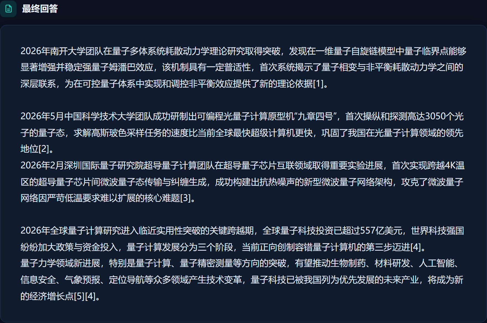
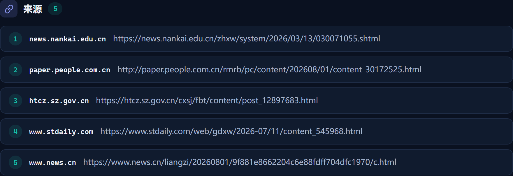

# 真实研究案例：批量取材与集中整理

2026-10-04，使用真实模型、搜索服务和网页抓取执行「2026年量子力学领域进展」。策略为 Plan-and-Execute，运行状态为 completed，回答附 5 个来源。

[下载项目作品 PDF](DeepResearch_项目作品介绍.pdf) · [查看原始统计与回答](data/batch-research-20261004.json) · [查看批量执行器源码](../../backend/src/deeptrace/harness/batch_research.py)

## 运行结果

| 指标 | 本次结果 |
| --- | --- |
| 模型 | doubao-seed-2.0-lite，temperature=0 |
| 实际模型请求 | 7 次：规划 1、集中整理 3、核验 1、回答 2 |
| 模型输入 / 输出 | 51,980 / 11,581 token |
| 总 token | 63,561，来自服务商返回的 usage |
| 研究耗时 | 222.144 秒，不含运行时初始化 |
| 工具调用 | 搜索 3、抓页 8、阅读证据 9，共 20 次 |
| 回答与引用 | completed，5 个来源 |
| 本次补查轮数 | 0，首轮固定需求已覆盖 |

这是单题单次运行。回答生成的两次请求包含一次 JSON 格式修复；所有模型角色均计入用量。固定检索、去重、抓页与读取由程序执行，不需要逐工具调用模型决策。

## 实际研究操作

1. 将问题拆为三个研究方向，保留原始问题、时间范围与执行约束。
2. 程序按计划检索并选择来源，去重后批量抓取，复用已授权原文。
3. 读取证据片段，保留内容版本、哈希和正文坐标。
4. 每个分支集中整理一次，由全局核验检查固定需求与原文支持。
5. 生成中文回答，校验引用并交付来源；存在缺口时按缺口有限补查。

以下截图为实际保存记录在当前工作台中的回看，保留原始回答、调用计数及来源，不是 Showcase 夹具数据。

## 回答与来源

以下为本次 Agent 实际输出的工作台截图。完整文字与编号来源保存在案例数据中。

## 工程实现与验证

三种研究策略共用批量执行器与工具网关。引用由实际可见的原文编号解析，宿主核对证据权限、版本、哈希与字符坐标。模型请求使用共享次数、输入准入和时间预算，并为核验与回答预留额度。

2026-10-04 本地验收：后端离线 1263 passed / 2 deselected，前端 50 passed，Lint 与生产构建通过。测试覆盖 URL 去重、失败来源替换、存量来源复用、可见引用校验、并发预算准入、缺口补查及无新增证据时停止。测试验收与回答质量分别计量。

[默认批量研究架构](../architecture/agent-harness.md) · [Docker 构建与部署](../deployment/docker.md)
