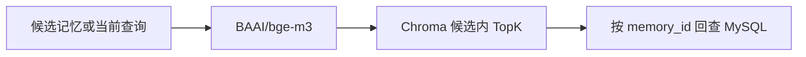

# Interview Documentation Alignment Implementation Plan

> **For agentic workers:** REQUIRED SUB-SKILL: Use superpowers:subagent-driven-development (recommended) or superpowers:executing-plans to implement this plan task-by-task. Steps use checkbox (`- [ ]`) syntax for tracking.

**Goal:** 修正面试与学习资料中的实现偏差，并新增一篇能够独立讲清长期记忆源码、数据流和故障边界的中文专题。

**Architecture:** 保留现有分文件学习结构，先校正所有跨文档共用的事实，再新增长期记忆专题，最后用全文检索和链接检查验证一致性。所有表述以提交 `fc056b9` 的源码为准，简历只写已经实现且能够解释边界的能力。

**Tech Stack:** Markdown、Mermaid、PowerShell、Python

**Spec:** `docs/superpowers/specs/2026-09-14-interview-docs-alignment-design.md`

## Global Constraints

- Harness 只表示项目的运行协议和模块边界，不使用 `HarnessGraph` 类名。
- 三种执行行为称为研究策略、研究模式或策略子图，不使用 Profile。
- Distributed 使用 MySQL 权威长期记忆与 Chroma 语义索引；Local 使用进程内 Memory Store 与本地 Chroma。
- Redis Streams、Pub/Sub 和取消键的职责分别表述。
- 不承诺任意外部副作用 exactly-once。
- 自动遗忘清扫、多租户认证和 Local 结构化长期记忆持久化均标为未实现边界。

---

### Task 1: 校正现有简历和面试资料

**Files:**
- Modify: `docs/resume/多模式深度研究Agent简历项目材料.md`
- Modify: `docs/resume/多模式深度研究Agent面试与学习资料/01-项目介绍与表达.md`
- Modify: `docs/resume/多模式深度研究Agent面试与学习资料/02-Harness总体架构.md`
- Modify: `docs/resume/多模式深度研究Agent面试与学习资料/03-项目目录与源码导读.md`
- Modify: `docs/resume/多模式深度研究Agent面试与学习资料/04-Harness核心机制.md`
- Modify: `docs/resume/多模式深度研究Agent面试与学习资料/05-面试高频问题与答案.md`

**Interfaces:**
- Consumes: `MemoryRecord.identity()`、`_build_memory_retriever()`、`SemanticMemoryRetriever.recall()`、`ResearchWorker.process()` 的当前行为。
- Produces: 六份使用相同 Local/Distributed、Redis、幂等和版本边界的面试材料。

- [ ] **Step 1: 记录修改前的冲突命中**

Run:

```powershell
rg -n "可多轮追问|恰好一次|Redis Streams 负责投递与实时通知|Redis Streams 承担任务投递、消费者恢复、唤醒和取消通知|CHROMA --> BGE|在 Worker 内懒加载|同主题版本链|唯一来源" docs/resume
```

Expected: 返回待修改的原句和行号。

- [ ] **Step 2: 修改简历材料**

使用以下事实替换旧表述。

```text
项目定义以统一 Agent Harness、三种策略、检索查证和按需报告为主，不单列多轮追问。
Redis Streams 投递任务，Pub/Sub 唤醒 SSE，取消键传播取消信号。
Checkpoint 与执行账本重放已提交结果并降低重复副作用；Provider 成功而账本未提交时仍可能重复。
版本更新只发生在 namespace、type、subject 三者相同的身份内；一条 Fact 可以引用多个 Evidence ID。
```

- [ ] **Step 3: 修改介绍、架构图和源码导读**

将 Mermaid 数据流改为下面的方向，并在相邻正文解释运行模式差异。



Local 的说明写明 API 执行进程懒加载 BGE-M3，结构化 Memory Store 不跨进程重启。Distributed 的说明写明只有 Worker 挂载并懒加载 BGE-M3，API 不加载模型。

- [ ] **Step 4: 修改核心机制和高频回答**

长期记忆回答先说明 Distributed 完整链路，再说明 Local 降级边界。版本问题使用以下规则。

```text
MemoryRecord 的逻辑身份由 namespace、type、subject 组成。相同身份且内容变化时，remember 创建新版本并 supersedes 旧版本。当前写入节点还没有实体归一化和冲突合并，所以不能声称语义相近的偏好或事实会自动更新为同一条记忆。
```

- [ ] **Step 5: 检查 Task 1**

Run:

```powershell
rg -n "可多轮追问|恰好一次|Redis Streams 负责投递与实时通知|Redis Streams 承担任务投递、消费者恢复、唤醒和取消通知|CHROMA --> BGE|在 Worker 内懒加载|同主题版本链|唯一来源" docs/resume
```

Expected: 没有旧能力承诺；允许在否定或风险说明中出现 exactly-once。

- [ ] **Step 6: Commit**

```powershell
git add docs/resume
git commit -m "docs: align interview materials with runtime"
```

### Task 2: 新增长期记忆源码与面试专题

**Files:**
- Create: `docs/resume/多模式深度研究Agent面试与学习资料/07-长期记忆源码与面试专题.md`
- Modify: `docs/resume/多模式深度研究Agent面试与学习资料/00-阅读目录.md`

**Interfaces:**
- Consumes: `MemoryWritePolicy.can_store()`、`remember()`、`should_recall()`、`SemanticMemoryRetriever`、`BgeM3EmbeddingGateway`、`ChromaMemoryVectorIndex`、`SqlAlchemyMemoryStore`。
- Produces: 一篇覆盖写入、召回、同步、更新、遗忘和故障边界的独立学习材料。

- [ ] **Step 1: 建立专题结构**

专题按以下顺序编写。

```text
先建立一条主线
数据归谁所有
偏好与事实怎样写入
召回为什么先过滤再向量检索
索引不一致时怎样恢复
版本更新与遗忘的真实边界
Local 与 Distributed 的差异
源码阅读顺序
面试问答和脱稿自测
```

- [ ] **Step 2: 加入写入和召回时序图**

Mermaid 至少覆盖两条路径。

```text
写入路径   顶层节点 → MemoryWritePolicy → MySQL 或 Local Store → BGE-M3 → Chroma
召回路径   意图判断 → 结构化候选过滤 → 内容哈希修复 → 查询向量 → candidate_ids 内 TopK → 权威 Store 回查 → 重排
```

- [ ] **Step 3: 加入故障和边界表**

表格必须包含以下场景。

```text
权威 Store 写入失败
权威 Store 成功但 Chroma 写入失败
Chroma 查询失败
Chroma 留有已删除或过期 ID
BGE-M3 目录缺失
Local API 重启
相似语义但 subject 不同
自动遗忘清扫尚未调度
```

- [ ] **Step 4: 更新阅读目录**

在 `00-阅读目录.md` 中加入第 07 篇，并让“长期记忆”快速入口指向该专题。

- [ ] **Step 5: 检查函数名**

Run:

```powershell
rg -n "class SemanticMemoryRetriever|class BgeM3EmbeddingGateway|class ChromaMemoryVectorIndex|class SqlAlchemyMemoryStore|def should_recall|async def remember|def _recall_memory|def _consolidate_memory|def _build_memory_retriever" backend/src/deeptrace
```

Expected: 专题引用的所有类和函数都能找到。

- [ ] **Step 6: Commit**

```powershell
git add docs/resume/多模式深度研究Agent面试与学习资料
git commit -m "docs: add long-term memory interview guide"
```

### Task 3: 全局一致性与可读性验证

**Files:**
- Modify: `docs/resume/多模式深度研究Agent简历项目材料.md` only if validation finds a contradiction
- Modify: `docs/resume/多模式深度研究Agent面试与学习资料/*.md` only if validation finds a contradiction

**Interfaces:**
- Consumes: Task 1 and Task 2 documentation.
- Produces: 链接有效、术语统一、没有已知能力过度承诺的最终材料。

- [ ] **Step 1: 扫描旧术语与能力承诺**

Run:

```powershell
rg -n -i "HarnessGraph|Research Profile|Profile 子图|Basic|Deep|Evidence 与工具调用恰好一次|Redis Streams 负责.*唤醒" docs/resume
```

Expected: 没有把旧术语或旧模式当成当前实现；历史说明和否定句可以保留。

- [ ] **Step 2: 验证 Markdown 相对链接**

Run:

```powershell
$root = (Resolve-Path docs/resume).Path
$broken = @()
Get-ChildItem -LiteralPath $root -Recurse -Filter *.md | ForEach-Object {
    $source = $_
    $text = Get-Content -Raw -LiteralPath $source.FullName
    [regex]::Matches($text, '\[[^\]]+\]\(([^)#]+)(?:#[^)]+)?\)') | ForEach-Object {
        $target = $_.Groups[1].Value
        if ($target -notmatch '^(https?://|codex://)' -and
            -not (Test-Path -LiteralPath (Join-Path $source.DirectoryName $target))) {
            $broken += "$($source.FullName) -> $target"
        }
    }
}
if ($broken) { $broken; exit 1 }
```

Expected: 没有输出，退出码为零。

- [ ] **Step 3: 执行中文写作检查**

Run:

```powershell
python C:/Users/defaultuser0.DESKTOP-8HBNEFK/.agents/skills/human-writing/scripts/check_prose.py docs/resume/多模式深度研究Agent简历项目材料.md
python C:/Users/defaultuser0.DESKTOP-8HBNEFK/.agents/skills/human-writing/scripts/check_prose.py docs/resume/多模式深度研究Agent面试与学习资料/07-长期记忆源码与面试专题.md
```

Expected: 禁用项为零。技术字段、URL、代码块和 Mermaid 语法不作为普通散文改写。

- [ ] **Step 4: 检查差异和工作树**

Run:

```powershell
git diff --check
git status --short
```

Expected: 没有空白错误，只有本任务计划内文件发生变化。

- [ ] **Step 5: Commit**

```powershell
git add docs/resume
git commit -m "docs: finalize harness interview guide"
```
