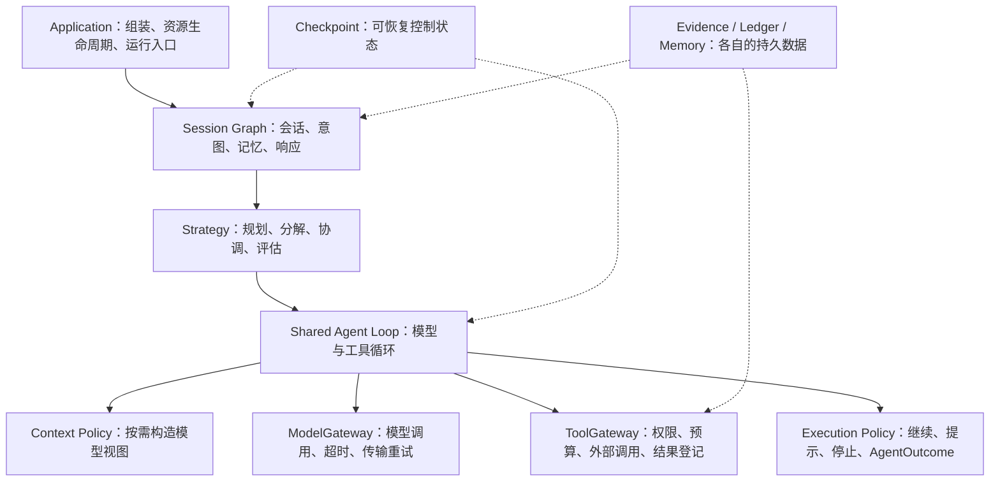

# Harness 架构收敛设计

日期：2026-10-01。状态：用户确认后已完成 Harness 收敛与记忆模块优化。实际架构见 `docs/architecture/agent-harness.md` 与 `docs/architecture/memory.md`；实施验收见对应 plan。

## 目标

将现有 Harness 整理成职责清晰、状态最小、策略可替换的标准工程结构。优先复用当前 LangGraph、Gateway、Checkpoint 和 Outcome，减少重复代码与反向依赖。

这里的“标准”指常见且明确的职责分离和执行语义，不代表业界存在一份统一的 Harness 标准，也不代表必须使用某个 SDK。

## 实施前已核实的现状

当前已经具备正确的基础分层：Session Graph → 三种研究策略 → Shared Agent Loop → ModelGateway / ToolGateway。

需要调整的是具体依赖和状态归属：

| 位置 | 当前情况 | 本次调整 |
| --- | --- | --- |
| `harness/agent_state.py`、`agent_executor.py` | 原始消息与推导出的 `model_messages` 同时进入图状态 | 模型请求消息在调用前构造，持久化状态以原始事实为主 |
| `strategies/plan_execute/nodes.py`、`multi_agent/nodes.py` | 从 `workflow/nodes.py` 导入 `filter_findings`、`topic_error_gaps` | 公共处理移入策略共享模块，各策略之间不相互依赖 |
| `harness/graph.py` | 从 `strategies/model_io.py` 导入 `payload_text` | 模型响应解析归属共享模型边界；策略只提供业务提示与解析目标 |
| 三种策略的分支节点 | 重复调用子图、验证 Outcome、传播取消和构造通用结果 | 共用一个分支执行函数，策略只映射自身状态字段 |
| 三种策略的 finalize | 重复检查 AgentOutcome，降级外层完成状态 | 统一结果合并规则；保留策略特有的重规划/补充研究规则 |
| `policies/execution.py` | 停止决策与研究主题输出包装混在一起，核心方法缺少明确类型 | Policy 输出 AgentOutcome；Executor 完成 ResearchTopicOutcome 包装 |

2026-10-01 相关确定性测试基线：

```powershell
cd backend
.\.venv\Scripts\python.exe -m pytest tests/harness tests/strategies tests/tools tests/persistence -m "not real" -q
```

结果：`283 passed in 12.08s`。这是本次相关目录的基线，不是全仓库或真实 Provider 验收结果。

## 三个可选方向

| 方向 | 好处 | 代价 | 判断 |
| --- | --- | --- | --- |
| A：在现有 LangGraph 上收敛职责与公共协议 | 变化可控，保留现有恢复和工具治理；最容易验证 | 仍需要维护当前轻量循环 | 推荐，最符合简单、标准的要求 |
| B：改为现成 Agent SDK / `create_agent` | 通用工具循环可交给框架 | 当前 URL 授权、Ledger、取消与部分完成语义需要重新适配 | 作为将来选型对照，本次不迁移 |
| C：自建插件、中间件和通用运行时框架 | 扩展面广 | 引入更多生命周期、配置和注册概念 | 当前项目需求不足以支撑这项复杂度 |

本次选择 A，保持现有接口和业务能力，用已有测试约束重构。

## 目标架构



图中是职责，不要求每个方框新增一个类或文件。

### Session

负责一轮会话的上下文整理、意图、记忆、策略路由和响应生成。保留当前顶层图及 Conversation / Turn 状态。Session 使用共享模型解析函数，不依赖某种策略的节点实现。

### Strategy

三种策略继续保留。Strategy 决定任务怎样拆解、是否重规划、何时补充研究和怎样评估；使用相同分支调用边界与结果规则。

公共函数放在 `strategies/common.py`，只放本次已有多个消费者的能力：

- 研究输入由 State 构造；
- 分支子图调用、结果验证与取消传播；
- 引用合法性过滤与主题错误转缺口；
- 外层结果不能将未完成 Agent 报为完成的规则。

共享分支函数返回已验证的 `ResearchTopicOutcome` 或受控的普通执行失败描述；取消通过 `CancelledError` 传播。使用既有类型与简单返回值，不新增执行器基类、插件注册或结果继承体系。

Workflow、Plan-and-Execute、Multi-Agent 仍分别拥有 `completed_tasks`、`dispatched_queries`、`topic_outcomes` / `researcher_outcomes` 等策略状态，公共函数不写这些字段。

### Agent Loop

保留现有节点与恢复边界：

```text
prepare_context → call_model → execute_tools / observe
                                  ↓
                         observe → nudge / 下一轮 / finalize
```

`prepare_context` 保留停止检查与可恢复节点名称；`call_model` 在调用 Provider 前从原始 State 构造消息视图。视图包括固定指令、原始任务、当前约束、计划、证据引用及完整工具交换。

原始 `messages` 不原地裁剪；模型视图不作为新 Checkpoint 的权威数据。超出上下文预算时，在实际模型调用和计数递增前生成受控退出。

`execute_tools → observe` 的 Checkpoint 边界继续保留，避免将外部动作执行与后续决策绑成一个必须整体重放的节点。

### Policy 与 Outcome

Execution Policy 是纯逻辑，接收明确的 Agent State，返回停止原因或 AgentOutcome；不调用模型、工具、存储。

`domain/agent.py` 定义共享的状态与停止原因类型别名，State、Policy 和 Outcome 使用同一类型来源。使用 Literal 类型，不引入额外状态机框架。

Agent Executor 将 AgentOutcome 包装成现有 ResearchTopicOutcome。策略再形成 ResearchOutcome；这三层分别表达单个 Agent、单个研究分支和整次研究的结果。

### Gateway 与持久化

ModelGateway 继续拥有传输重试、角色参数和模型协议校验。ToolGateway 继续拥有授权、预算预留、缓存、Ledger 与 Evidence。普通工具失败作为配对 ToolMessage 返回，Agent 决定是否换参数或来源。

Runtime Context 保存进程依赖，Checkpoint 保存控制事实，Store 保存证据、执行确认和长期记忆。维持各自边界。

## 具体改动范围

预计新增两个共享模块：

1. `backend/src/deeptrace/harness/model_io.py`：现有模型响应文本提取与 JSON 对象解析。
2. `backend/src/deeptrace/strategies/common.py`：上文列出的公共策略边界和结果处理。

修改既有 Agent State、Executor、Execution Policy、Domain Agent 类型、三个策略节点及相关 imports。`strategies/model_io.py` 保留业务上下文/提示词组装；已有外部消费者所用的解析入口通过直接导入维持兼容，不复制实现。

更新 `docs/architecture/agent-harness.md`，以最终代码为依据解释职责、循环和状态所有权。

Gateway、数据库 schema、API、前端、Provider 配置与依赖版本本次保持兼容。现有 `strategies/topic` 确定性研究子图有测试和公开入口，保留其用途。

## 兼容性要求

- 维持三种 ResearchMode 和现有图构造入口；
- 维持 AgentOutcome、ResearchTopicOutcome 和 ResearchOutcome 的序列化字段与含义；
- 原有节点名和工具后的恢复边界保持有效；
- 新执行不以 `model_messages` 为持久化事实；从旧快照恢复时重新构造视图；
- 对旧快照多余字段的行为先用测试核实；必要时采用局部读取归一化，不引入全局状态迁移框架；
- 公共模块直接提供一份实现，已公开的导入路径仅在确有消费者时保留；
- 保留当前未提交的评测、引用处理、配置和文档改动，使用显式路径管理本次变更。

## 验证与验收

优先验证行为，再检查模块边界。新增测试只覆盖此次改变或已有回归测试未覆盖的风险。

1. 中断于 `prepare_context` / `call_model` 附近后重建图，恢复时从原始状态获得完整上下文；Provider 调用不读取旧模型视图。
2. 上下文超限时不调用模型，迭代计数与现有语义一致。
3. 三种策略共享分支行为：结果验证、普通失败形成缺口、取消继续传播、兄弟分支证据保留。
4. 分支有证据但达到限制、未完成计划或失败时，外层不得将它误报为 completed。
5. 既有工具消息配对、并发顺序、URL 授权、预算与 Ledger 重放测试继续通过。
6. 公共模型解析支持当前 Gateway 的真实消息对象和已有文本测试替身；策略使用同一解析入口。
7. 核心 State / Policy 接口具有明确类型；Plan-and-Execute / Multi-Agent 不再导入 Workflow 节点中的公共函数。
8. 执行相关测试目录，再运行全仓库 `not real` 确定性测试；已有用户评测改动如暴露无关失败，分开说明其证据。

完成标准：公共行为只有一个明确所有者，新增共享模块均有多个实际消费者，当前接口与运行不变量保持成立，架构文档可对照代码阅读。

## 参考与采用理由

- [LangGraph：Thinking in LangGraph](https://docs.langchain.com/oss/python/langgraph/thinking-in-langgraph)：从原始 State 按需构造提示，按职责和故障边界划分节点。采用状态与模型视图分离、保留必要节点边界的思路。
- [LangGraph：Persistence](https://docs.langchain.com/oss/python/langgraph/persistence)：区分线程图状态与跨线程 Store。沿用当前 Context、Checkpoint、Evidence / Memory / Ledger 的所有权。
- [Pi Agent Core 官方 README](https://github.com/earendil-works/pi/blob/main/packages/agent/README.md)：在模型请求前准备上下文，工具结果形成后做继续/结束决策。借鉴生命周期位置，不引入其 TypeScript 运行时。
- [LangChain：Middleware overview](https://docs.langchain.com/oss/python/langchain/middleware/overview)：明确模型前后与工具调用的扩展位置。当前项目已有这些边界，采用其职责划分而保留直接函数调用。

上述参考提供设计原则，本次不复制整套 SDK，也不因参考项目功能丰富而扩大需求。

## 记忆模块重点设计

采用三个职责，而不新增独立记忆 Agent 或后台任务平台：

1. 工作记忆：当前线程消息、结构化摘要、计划和证据 ID，归属 State / Checkpoint。
2. 用户偏好：用户明确要求长期记住的信息，归属用户 namespace。
3. 研究事实：仅从有已登记证据支撑的结论整理，归属 workspace namespace。

长期记忆使用现有 MemoryRecord collection、SQL 权威 Store、Chroma 检索索引。主执行只使用 PREFERENCE / FACT；EPISODE 等既有类型保留兼容，不扩展自动写入用途。

### 写入与更新

- 写入入口强制执行 source 与证据策略。事实的引用必须属于当前研究结果且在 Evidence Store 存在。
- 常见偏好采用稳定 subject，如语言、详细程度和输出形式；未知显式记忆采用内容摘要键。研究事实以内容摘要键去重，避免模型随意生成的 finding ID 覆盖无关事实。
- 同身份、同内容的 ACTIVE 记录为 NOOP；内容改变时生成新版本并标记前版 SUPERSEDED；非 ACTIVE 的同内容不能误作 NOOP。
- Store 提供原子的 versioned upsert，旧版失效与新版写入在同一事务内。SQL 对已有身份使用行锁，新身份并发冲突采用有限重试；内存适配器使用单锁。
- 用户偏好默认长期有效；自动研究事实默认 30 天有效。TTL 表示本系统的重验证周期，不意味着世界事实一定在 30 天后改变。
- 显式写入失败应告知未保存；自动整理和索引失败应降级，并保留研究结果。

### 召回与注入

- 先按 namespace、type、ACTIVE 状态和有效期过滤，再检索排序。
- 通用偏好使用直接读取；研究事实使用语义检索，失败时回退确定性排序。向量命中必须回查权威 Store 并再次过滤，防止并发失效或过期索引恢复旧事实。
- 中文 fallback 支持文字片段匹配；无相关性的事实不因 top-k 配额而硬塞进上下文。
- 注入受条数和 token 双重预算限制，附带记忆 ID、版本、来源和时间。历史偏好不能覆盖当前用户要求，历史事实作为待核验背景而非最新证据。
- 自动整理以至多 20 条 finding 为边界，不依赖后台队列；以后如需减少延迟再迁移后台。

### 遗忘与一致性

- 现有 forget 接口继续提供逻辑删除/物理删除。逻辑删除覆盖同身份所有版本，防止旧 ACTIVE 版本重新被召回。
- 权威记录的状态决定是否可见，索引不是权威事实；索引过时不会使已删除或被替代版本重新生效。
- 系统提示、运行日志与网页正文仍分别归属代码、Trace、Evidence；不把它们全部复制到 Memory。

### 重点验收

补充版本 NOOP / UPDATE / REACTIVATE、写入策略强制执行、并发原子更新、tombstone 全版本处理、证据引用有效性、自动整理降级、语义命中回查、中文 fallback 和 token 预算测试；使用 SQLite 和内存适配器交叉验证。

### 记忆参考

- [LangGraph Memory overview](https://docs.langchain.com/oss/python/concepts/memory)：借鉴短期/长期、namespace 与小粒度 collection 的组织方法。
- [LangMem Core concepts](https://langchain-ai.github.io/langmem/concepts/conceptual_guide/)：借鉴记忆提取、整理和上下文使用的职责划分。
- [Mem0 Add Memory](https://docs.mem0.ai/core-concepts/memory-operations/add) 与 [Update Memory](https://docs.mem0.ai/core-concepts/memory-operations/update)：借鉴 ADD / UPDATE / NOOP 与历史追踪，保持本项目确定性策略及现有存储。
